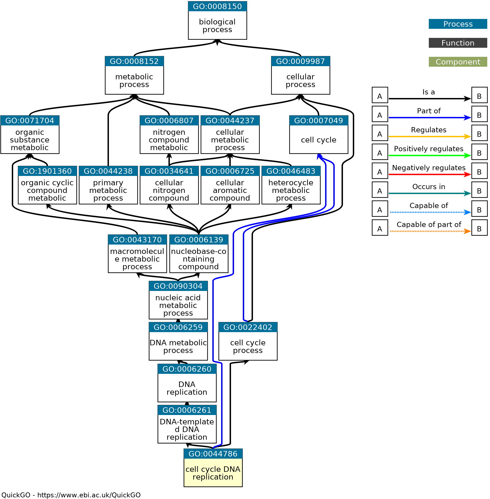
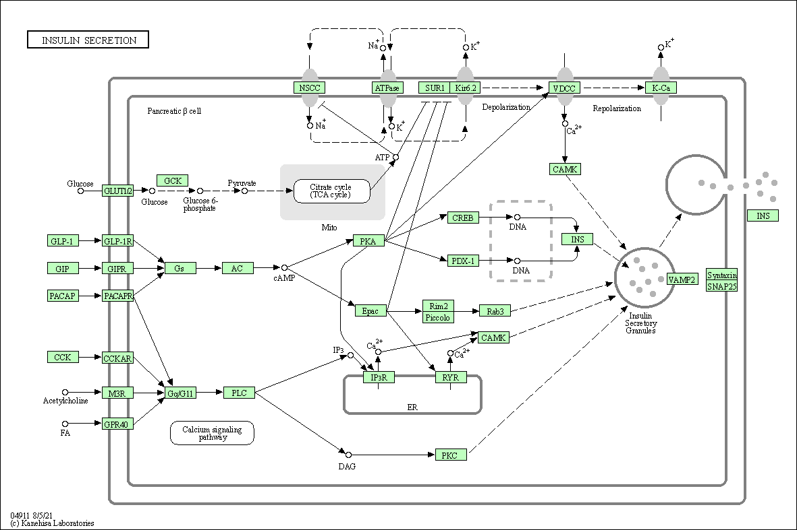
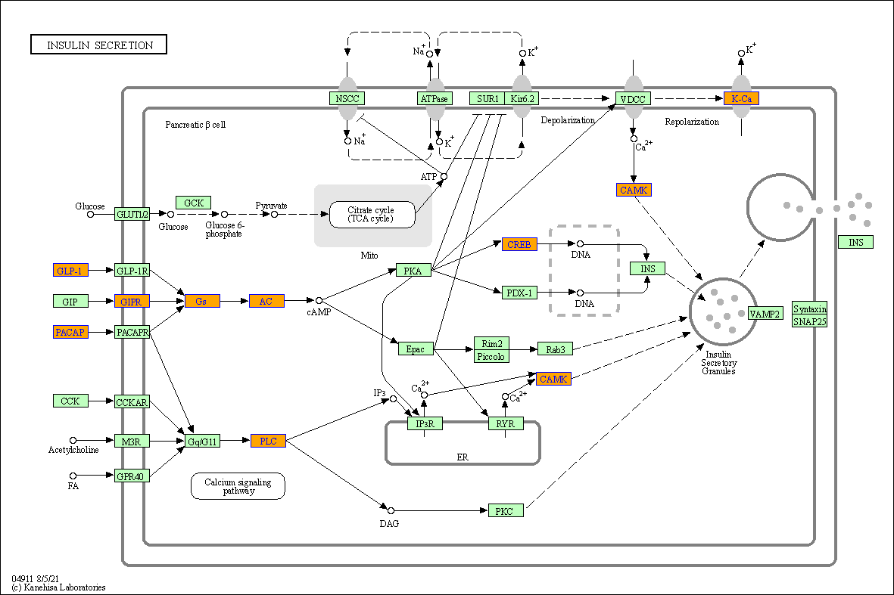

# Gene Set Databases

## Overview

Gene set enrichment analysis evaluates the associations of a list of genes of
interest to a collection of pre-defined gene sets, where each gene set
represents a specific biological function. Once genes are significantly
enriched in a gene set, the conclusion is made that the corresponding
biological function is significantly affected. Thus, choosing a proper
collection of gene sets focusing on specific topics is important for the
functional interpretations. The definition of a gene set is very flexible and
the construction of gene sets is straightforward. In most cases, gene sets are
from public databases where huge efforts from scientific curators have already
been made to carefully categorize genes into gene sets. Nevertheless, the gene
sets can also be self-defined from individual studies, such as a set of genes
in a network module from a co-expression network analysis, or a set of genes
that are up-regulated in a certain disease. In this chapter, I will introduce
several major gene set databases and I will demonstrate how to access the gene
set data in R.

## Gene Ontology


### The GO database

Gene Ontology (GO, http://geneontology.org/) is perhaps the most used gene set
database in current studies. The GO project was started in 1999. It aims to
construct biological functions in a well-organized form, which is both
effcient for human-reading and machine-reading. It also provides annotations
between biological terms and genes for a large number of
organisms, which gives a comprehensive knowledge for functional studies.

GO has three namespaces^[Sometimes they are also called "domains" or
"ontologies" in current literatures.], which are biological process (BP),
cellular componet (CC) and molecular function (MF). They describe a gene or
its product protein from the three different aspects. Biological process
describes how a gene performs its functions in the biological system. Cellular
component describes the location in the cell where the gene performs its
function. Molecular function describes the molecular-level activity of a gene.
Under each namespace, GO terms are organized in a hierarchical way, in a form
of so-called directed acyclic graph (DAG). In this structure, a parent term
can have multiple child terms and a child term can have multiple parent terms,
but there is no loop. More on the top of the GO tree, more general the
corresponding term is.


```{r, echo = FALSE, out.width = "60%"}

```

GO is a structural representation of biological vocabularies, which itself is organism-independent. 
However, the vocabulary is from the functional description of genes or proteins, thus, GO also
provides mappings between GO terms to genes. In current version (2022-07-01),
there are 43,558 GO terms, with more than 7 million annotations to more than
5000 organisms. This provides a powerful resouces for studying not only model
organisms, but a huge number of other organisms, which normally other gene set
databases do not support.

In many gene set enrichment anlaysis, GO gene sets are simply treated as lists
of genes. However, in some other analysis, the DAG structure of GO is also
taken into consideration, which helps to merge GO terms with similar
biological descritions, thus to reduce the redundancy of significant GO terms.

In Bioconductor, there are two categories of packages for GO data. The first
contains data only for the GO terms, i.e. their descriptions and relations.
The second category contains GO annotation to specific organisms. In the
following sections, I will demonstrate how to manipulate GO data and how to
extract GO gene sets for speicific organisms with Bioconductor packages.

### The **GO.db** package

The first package I will introduce is the **GO.db** package. It is maintained
by the Bioconductor core team and it is frequently updated in every
Bioconductor release. Thus, it always stores up-to-date data for GO and it can
be treated as the standard source to read and to process GO data in R. **GO.db**
contains detailed information of GO terms as well as the hierarchical
structure of the GO tree. The data in **GO.db** is only focused on GO terms
and their relations, and it is independent to specific organisms.

First let's load the **GO.db** package.

```{r, message = FALSE}
library(GO.db)
```

#### use `GO.db` as a database object

**GO.db**, as its name tells, is a database package specifical for GO data.
Internally it is constructed by the low-level package **AnnotationDbi**, which
defines a general database interface for storing and precessing biological
annotation data. Internally the GO data is represented as an SQLite database
with multiple tables. A large number of low-level functions defined in
**AnnotationDbi** can be applied to the objects in **GO.db** to get customized
filtering on GO data. Expericenced readers may go to the documentation of
**AnnotationDbi** for more information.

There is an object `GO.db` which has the same name as the package. 
Simply printing the object `GO.db` gives you the basic information of the package.
In the output, the two most important fields are the source file
(`GOSOURCEURL`) and the date (`GOSOURCEDATE`) to build the package, which
tells you the source and the version of the GO data.

```{r}
GO.db
```

`GO.db` is a database object created by **AnnotationDbi**, thus, the general
method `select()` can be applied to retrieve the data by specifying a vector
of "keys" which is a list of GO IDs, and a group of "columns" which are the
fields where the values are retrieved. Just imagine the `GO.db` database as a
virtual table where there is a column for GO IDs which are used as primary
keys, and there are other columns of GO names, namespaces and long
descriptions. The `select()` function gets corresponding values for these
columns by filtering with a specific set of GO IDs. In the following code, I
extract the values of the `"ONTOLOGY"` and `"TERM"` columns for two GO IDs.

```{r}
select(GO.db, keys = c("GO:0000001", "GO:0000002"), 
    columns = c("ONTOLOGY", "TERM"))
```

You may wonder what are the valid names for the "columns" in this virtual table.
They can be obtained by `columns(GO.db)`.

```{r}
columns(GO.db)
```

`GOID` is the GO identifier, `ONTOLOGY` is the namespace of the GO term,
`TERM` is the short name of the GO term, and `DESCRIPTION` is the long
description of the GO term.

#### Objects in the **GO.db** package

`select()` is a low-level function which can be used in any package that is
built with **AnnotationDbi**. However, specific for **GO.db**, we don't really
need to use the low-level function `select()` to retrieve the data. In
**GO.db**, there are several tables that have already been compiled and can be
used directly. These tables are represented as objects available in the
package. The following command prints all the objects that are exported from
**GO.db**. Note, in the interactive R terminal, users can also see the objects
by typing `GO.db::` and quickly clicking the tab-key twice^[In Rstudio, the
list of objects automatically appears after typing `GO.db::` in the R terminal
panel.].

```{r, echo = FALSE}
ls = function(x, ...) {
    setdiff(base::ls(x, ...), "datacache")
}
```

```{r, echo = 1}
ls("package:GO.db")
```


Before I introduce the pre-compiled GO-related objects, I first briefly
introduce the following four function objects `GO_dbInfo()`, `GO_dbconn()`,
`GO_dbfile()` and `GO_dbschema()` in **GO.db**. These four functions can be
executed without argument. They provides information of the internal SQLite
database. For example, `GO_dbfile()` returns the path of the database file.

```{r}
GO_dbfile()
```

If readers are interested, they can use external tools to view the `GO.sqlite`
file to see the internal representation of the database tables. However, for
other readers, the internal representation of data is less important.
**GO.db** provides an easy interface for processing the GO data, convert it
into data frames or lists.

#### The `GOTERM` object

First let's look at the variable `GOTERM`. It contains basic information of
every individual GO term, such as GO ID, the namespace and its definition. Let's
directly print the `GOTERM` object.

```{r}
GOTERM
```

The output does not provide too much useful information. The only useful thing
is `GOTERM` is an object of class `GOTermsAnnDbBimap`. By querying the
documentation of `GOTermsAnnDbBimap`^[With the command `?GOTermsAnnDbBimap`],
we can find it is actually a child class of a more general class `Bimap`
defined in `AnnotationDbi`. The `Bimap` class is a low-level class defined for
mappings between two types of information. Thus, many low-level functions
defined in **AnnotationDbi** can be directly applied to `GOTERM` (see the
documentation of `Bimap`).

In the Bioconductor ecosystem, it is very often to see many different and
complex class definitions. Dont' be panic of that. Many Bioconductor core and
extension packages are implemented in an object-oriented way. Therefore, it is
natural to have a large number class definitions to make the ecosystem
structural and easy to extend. However, as end-point users, you rarely need to
touch these classes directly. There are always easy and common ways to process
these complex Bioconductor objects.


As suggested in the documentation of `GOTERM`^[You can see its documentation
by executing the command `?GOTERM`.], we do not need to directly work with the
`GOTermsAnnDbBimap` class, instead we can just simply convert it to a list.

```{r}
gl = as.list(GOTERM)
```

Now `gl` is a normal list of GO terms. We can check the total number of GO
terms in current version of **GO.db**^[Actually the number of all GO terms is
`r as.integer(length(gl) - 1)`. Later in this section I will show you there is
an additional pseudo term in `GOTERM`.)].

```{r}
length(gl)
```

We can get a single GO term by specifying the index.

```{r}
term = gl[[1]]  ## also gl[["GO:0000001"]]
term
```

The output after printing `term` includes several fields and corresponding
values^[You can try the command `str(term)` to see its internal
representation.]. Although `gl` is a normal list, its elements are still in a
special class `GOTerms`. Let's check the class of `term`.

```{r}
class(term)
```

The object `term` is in a special class `GOTerms`. As I have explained, once
we have encounted a new class, we can always go to its documentation to see
its details. The `GOTerms` class is a simple class for storing information of
individual GO terms. There are several "getter" functions to extract values in
the corresponding fields. The most important functions are `GOID()`, `Term()`,
`Ontology()`, and `Definition()`^[As you may have discovered, these functions
have the same names as the "fields". This is a common design of Bioconductor
packages for the "getter functions".]. Other information on the `GOTerms`
function can be found from its documentation by `?GOTerms`.

```{r}
GOID(term)
Term(term)
Ontology(term)
Definition(term)
```

Then, to get the namespaces of all GO terms, we can do apply `Oncology()`
function on every element in `gl`.

```{r}
ol = sapply(gl, Ontology)
head(ol)
```

The key feature of R programming language is vectorization. Besides working on
individual GO terms, the getter functions can be directly applied to the
global `GOTERM` object to extract information of all GO terms simultaneously.

```{r all_go}
head(GOID(GOTERM))
head(Ontology(GOTERM))
```

Now let's go back to the object `GOTERM`. It stores data for all GO terms, so
essentially it is a list of elements in a certain format. `GOTERM` or its
class `GOTermsAnnDbBimap` allows subsetting to obtain a subset of GO terms.
There are two types of subset operators: single bracket `[` and double
brackets `[[`. They have different behaviors.

Similar as the subset operators for the normal list, the single bracket `[` returns a
subset of data but still keeps the original format. Both numeric and character
indices are allowed, but more often, character indices as GO IDs are used.

```{r}
# note you can also use numeric indices like GOTERM[1:10]
GOTERM[c("GO:0000001", "GO:0000002", "GO:0000003")]
``` 

So, if you want to get the namespaces of a subset of GO terms, you can do like:

```{r}
go_id = c("GO:0000001", "GO:0000002", "GO:0000003")
Ontology(GOTERM[go_id])
``` 

The double-bracket operator `[[` is different. It degenerates the original
format and directly extracts the element in it. Note here only a single
character index is allows:

```{r}
# note numeric index is not allowed
GOTERM[["GO:0000001"]]
```

This behaves the same as `gl[["GO::0000001"]]` but you don't need to
explicitly convert `GOTERM` to the list in advance.

Above are the main functions for extracting inforamtion from the `GOTERM`
object. Now we can calculate some simple statistics on the GO terms. For
example, to calculate the number of terms, we can directly applying
`Ontology()` on `GOTERM`.

```{r}
table(Ontology(GOTERM))
```

Interesting, besides the three namespaces `"BP"`, `"CC"` and `"MF"`, there
is an additional namespace `"universal"` that only contains one term. As
mentioned before, the three GO namespaces are isolateted. However, some tools
may require all GO terms are connected to form a connected
graph. Thus, one pseudo "universal root term" is added as the parent of root
nodes in the three namespaces. In **GO.db**, this special term has an ID
`"all"`.

```{r}
which(Ontology(GOTERM) == "universal")
GOTERM[["all"]]
```

#### Term relations in GO.db

**GO.db** also provides objects that contain relations between GO terms.
Taking biological process namespace as an example, there are the following
four objects (similar for other two namespaces, but with `GOCC` and `GOMF`
prefix).

- `GOBPCHILDREN`
- `GOBPPARENTS`
- `GOBPOFFSPRING`
- `GOBPANCESTOR`


`GOBPCHILDREN` and `GOBPPARENTS` contain parent-child relations.
`GOBPOFFSPRING` contains all offspring terms of GO terms (i.e., all downstream
terms of a term in the GO tree) and `GOBPANCESTOR` contais all ancestor terms
of a GO term (i.e., all upstream terms of a term). The information in the four
objects are actually redudant, e.g., all the other three objects can be
constructed from `GOBPCHILDREN`. However, these pre-computated objects will
save time in downstream analysis because traversing the GO tree is
time-consuming.

The four objects are in the same format (objects of the `AnnDbBimap` class,
also inherts from the `Bimap` class). Taking `GOBPCHILDREN` as an example, as
its documentation suggests, we can directly convert it into a list.

```{r}
lt = as.list(GOBPCHILDREN)
head(lt)
```

The variable `lt` is a simple list of vectors where each vector contains child
terms of a specific GO term, e.g., `GO:0000002` has a child term `GO:0032042`.
The element vectors in `lt` are also named and the names correspond to the
relations of the child terms to the parent term, i.e. `is-a` or
`part-of` relations. When the element vector has a value `NA`, e.g.
`GO::0000001`, this means the GO term is a leaf in the GO tree, and it has no
child term.

Some downstream analysis, e.g., network analysis, may expect the relations to
be represented as in two columns in a table. In this case, we can use the general
function `toTable()` defined in **AnnotationDbi** to convert `GOBPCHILDREN` to
a data frame^[`toTable()` can also be applied to `GOTERM`. Readers can try to
see what is the output from `toTable(GOTERM)`.].

```{r}
tb = toTable(GOBPCHILDREN)
head(tb)
```

Unfortunately, the first two columns in `tb` have the same name. A good idea
is to add meaningful column names to it. Users should carefully check which
column in the table contains parent terms and which column contains child
terms. After double checking with the output from the previous object `lt`, we
can be sure that the first column corresponds to child terms and the second
column corresponds to parent terms.

```{r}
colnames(tb)[1:2] = c("child", "parent")
```

With `tb`, we can calculate the fraction of different relations of GO terms.

```{r}
tb = toTable(GOBPCHILDREN)
table(tb[, 3])
```

The four objects also support the subset operator. E.g. to obtain all the
child terms of `GO:0000003`, you do not need to explicitely convert
`GOBPCHILDREN` to a list, but instead you can directly use `[[`:

```{r}
GOBPCHILDREN[["GO:0000003"]]
```

We can also perform some exploratory analysis on the relations of GO terms.
The following code analyzed the distribution of the number of offspring terms.
The following plot shows it follows a power-law distribution.

```{r}
lt = as.list(GOBPOFFSPRING)
tb = table(sapply(lt, length))
x = as.numeric(names(tb))
y = as.vector(tb)

library(ggplot2)
ggplot(data.frame(x = x, y = y), aes(x = x, y = y)) +
    geom_point() +
    scale_x_continuous(trans='log10') +
    scale_y_continuous(trans='log10') +
    labs(x = "Number of offspring terms (in log10 scale)", 
         y = "Counts (in log10 scale)") + 
    ggtitle("GOBPOFFSPRING")
```

We also visualize the distribution of the number of ancestor terms. This can
be approximated as a Possion distribution.

```{r}
lt = as.list(GOBPANCESTOR)
lt = lt[names(lt) != "GO:0008150"]
lt = lapply(lt, function(x) setdiff(x, "all"))
tb = table(sapply(lt, length))
x = as.numeric(names(tb))
y = as.vector(tb)

ggplot(data.frame(x = x, y = y), aes(x = x, y = y)) +
    geom_point() +
    scale_y_continuous(trans='log10') +
    labs(x = "Number of ancestor terms", 
         y = "Counts (in log10 scale)") + 
    ggtitle("GOBPANCESTOR")
```

#### Graph analysis of GO tree

Relations in `GOBPCHILDREN` or `GOBPPARENTS` can be used to construct
the GO tree as a "graph" or a "netowrk" object. In this section, I will
demonstrate some exploratory analysis to show interesting attributes of
the GO from the aspect of being a graph.

Remember `toTable()` returns the relations between GO terms as a data frame,
thus, it can be used as "edge list" (or adjacency list) for constructing the
graph. In the following code, I use the **igraph** package for the graph
analysis. The function `graph.edgelist()` construct a graph object from a
two-column matrix where the first column is the source of the link (the parent
terms) and the second column is the target of the link (the child terms).

```{r}
library(igraph)
tb = toTable(GOBPCHILDREN)
# It is very important to know in `tb` which column contains parent terms
# and which column contains child terms
g = graph.edgelist(as.matrix(tb[, 2:1]))
g
```

The output shows the graph is directed, with 28140 nodes and 65107 edges. I
first extract GO term with the highest in-degree, where in-degree measures
number of nodes that point to a node, i.e. the number of parent terms.
In-degree is a local measurement and it can also be obtained from
`GOBPPARENTS`. In the following code, please note `which.max()` does not
ensure the returned index corresponds to the only maximal element. If there
are several elements having the same maximal value, `which.max()` only returns
the index of the first one.


```{r}
d = degree(g, mode = "in")
d_in = d[which.max(d)]
d_in
# Numeric index is not allowd here, so we use the GO ID as the character index
GOTERM[["GO:0106110"]]
```

The result shows GO term `GO:0106110` has 11 parent terms^[Think how can you
get the list of its 11 parent terms? Answer: `GOBPPARENTS[['GO:0106110']]`].
Similarlly, we can calculate GO term with the highest out-degree, which
measures the number of child terms. Note this value can also be get from the
object `GOBPCHILDREN`.

```{r}
d = degree(g, mode = "out")
d_out = d[which.max(d)]
d_out
GOTERM[[ names(d_out) ]]
```

Wow, this GO term `"GO:0048856"` has 201 child terms!

By using other functions in the **igraph** package, we can explore some
long-disatnce attributes of the GO tree, such as the distance from the root
term to every term in the namespace. The distance can be thought as the depth
of a term in the GO tree.

In the graph, the distance between two nodes is the length of the shortest
path between them in the graph. Since the GO tree is directed, the distance is
calculated with the path from a upstream node to a downstream term. In the
following code, we calculate the distance from the GO term `GO:0008150` which
is the root node "Biological Process" to all the terms in the BP namespace.

```{r}
# based on the paths going out from GO:0008150
dist = distances(g, v = "GO:0008150", mode = "out")
plot(table(dist), xlab = "Depth", ylab = "Count")
```

The plot shows around 95% of the terms having depth between 3 to 7. We also
find there are several GO terms that locate extremely deep in the GO tree with
depth of 11. We can also try to extract the longest path from the root term to
the leaf terms.

In the following code, I first extract a vector of leaf terms. Leaf terms locate
at the end of the GO tree with zero out-degree. 

```{r}
d = degree(g, mode = "out")
leave = names(d[d == 0])
```

Similar to `distance()`, here we use the function `shortest_paths()` which
returns a list of shortest paths from "GO:0008150" to each of the leaf node. The object
`sp` contains the complete result from the shortest path analysis. Here we
only need its `vpath` element which contains the paths information.
Variable `i` contains the index of the leaf node which has the largest
distance to the root node^[Again note, if there are several leaf nodes having
the same max distance, `which.max()` only returns the first one.]. Object `path`
contains the longest shortest path from "GO:0008150" to the leaf node,


```{r}
sp = shortest_paths(g, from = "GO:0008150", to = leave, mode = "out")
i = which.max(sapply(sp$vpath, length))
path = sp$vpath[[i]]
path
```

`sp` is in a special data format, we can use the function `names()` to obtain the vector
of GO IDs. Finally, we subset the object `GOTERM` and apply `Term()`
to obtain the names of GO IDs in this longest path.

```{r}
Term(GOTERM[names(path)])
```


### Link GO terms to genes

As introduced in the previous section, **GO.db** only provides data solely for
GO terms, and there is no organism-specific information. Since GO volcabulary
is mainly collected from gene function descriptions, the GO project also
provides gene annotations to GO terms. The annotation is done by manual
curation or by computational prediction. Such annotations are represented as
mappings between GO IDs and various gene IDs from external databases, which
are usually synchronized between major public databases such as NCBI and
Ensembl.

In Bioconductor, there are a group of standard packages with the name
convension **org.\*.db** which contain various database ID mappings for a
specific organism. In this section, I will demonstrate how to get gene-GO
mappings from these packages. Currently there are the following organisms
supported:

```{r, echo = FALSE}
tb = read.table(textConnection(
"org.Hs.eg.db    Human   org.Ss.eg.db    Pig
org.Mm.eg.db    Mouse   org.Gg.eg.db    Chicken
org.Rn.eg.db    Rat org.Mmu.eg.db   Rhesus_monkey
org.Dm.eg.db    Fruit_fly   org.Cf.eg.db    Canine
org.At.tair.db  Arabidopsis org.EcK12.eg.db E_coli_strain_K12
org.Sc.sgd.db   Yeast   org.Xl.eg.db    African_clawed_frog
org.Dr.eg.db    Zebrafish   org.Ag.eg.db    Malaria_mosquito
org.Ce.eg.db    Nematode    org.Pt.eg.db    Chimpanzee
org.Bt.eg.db    Bovine  org.EcSakai.eg.db   E_coli_strain_Sakai
"))
```

```{r, echo = FALSE}
tb[, 1] = paste0("`", tb[, 1], "`")
tb[, 3] = paste0("`", tb[, 3], "`")
tb[, 2] = gsub("_", " ", tb[, 2])
tb[, 4] = gsub("_", " ", tb[, 4])
knitr::kable(tb, col.names = c("Package", "Organism", "Package", "Organism"))
```

In the next section, I will take **org.Hs.eg.db** as an example. The use for
other organism packages is completely the same.

#### The **org.Hs.eg.db** package

The **org.Hs.eg.db** package provides a standard way for mappings from Entrez
gene IDs to a variaty of other databases for human. First let's load the
package.

```{r}
library(org.Hs.eg.db)
```

**org.Hs.eg.db** is also built by **AnnotationDbi**, thus low-level functions
such as `select()` can be applied to get information from the database.
Similar to **GO.db**, there is also an object `org.Hs.eg.db` with the same
name as the package, which is the database object for the use with `select()`.
I will introduce how to use `select()` on `org.Hs.eg.db` later in the next
section, because in **org.Hs.eg.db**, there is more convinient way to retrieve
GO-gene mappings.

Similar to **GO.db**, there are also many pre-compiled objects in the
package^[A full list of objects can be obtained by `ls("package:org.Hs.eg.db`.
I will introduce some of the other objects later when introducing converting
different gene ID types.]. Among them, there are the following two objects for
mapping between GO IDs and genes:

- `org.Hs.egGO2EG`
- `org.Hs.egGO2ALLEGS`

The difference between the two objects is `org.Hs.egGO2EG` contains genes that
are *directly annotated* to every GO term, while `org.Hs.egGO2ALLEGS` contains
genes that directly assigned to the GO term, *as well as genes assigned to all
its ancestor terms*. For example if term A is a parent of term B where A is
more general, genes with function B should also have function A. Thus
`org.Hs.egGO2ALLEGS` is the proper object for GO gene
sets^[`org.Hs.egGO2ALLEGS` actually can be generated from `org.Hs.egGO2EG` and
`GOBPANCESTOR` (if only looking at BP namespace). Think how to implement the
code.].

Again, `org.Hs.egGO2ALLEGS` is a database object in a special format
`Go3AnnDbBimap`. We do not need to directly work with this class. There are
two ways to obtain gene annotations to GO terms. The first is to convert
`org.Hs.egGO2ALLEGS` to a list of gene vectors.

```{r}
lt = as.list(org.Hs.egGO2ALLEGS)
lt = lapply(lt, unique)
 # lt[[2]] is too long to print, so we orint the third and the fourth
lt[3:4]
```

In `lt`, each element vector actually is a GO gene set. Note here the genes
are in digital Entrez IDs but represented in character mode. This is
important to save the Gene IDs explicitly as characters to get rid of
potential error due to indexing. We will emphasize it again in later text.

The gene ID vector have names. They are evidence codes of assigning genes to
GO terms.

`org.Hs.egGO2ALLEGS` is a database object (also inherts from the `Bimap`
class), thus `toTable()` can be directly applied to convert it as a table.

```{r}
tb = toTable(org.Hs.egGO2ALLEGS)
head(tb)
```

Now there is an additional column `"Ontology"`. This is convinient for
subsetting `tb` to a certain GO namespace. `org.Hs.egGO2ALLEGS` contains GO
terms from the three namespaces and the `as.list()` method cannot distinguish
the different namespaces. To restrict `lt` only to BP GO terms, extra steps
need to be applied with the object `GOTERM` and the function `Ontology()`.
Also note in `tb`, the first column `gene_id` is in "character" mode.

With `tb`, we can look at the distribution of number of genes in GO gene sets.
The following plot shows it approximately follows a power-law distribution.

```{r}
tb = tb[tb$Ontology == "BP", ]
t1 = table(table(tb$go_id))
x1 = as.numeric(names(t1))
y1 = as.vector(t1)
ggplot(data.frame(x = x1, y = y1), aes(x = x, y = y)) +
    geom_point() +
    scale_x_continuous(trans='log10') +
    scale_y_continuous(trans='log10') +
    labs(x = "Number of annotated genes (in log10 scale)", 
         y = "Counts (in log10 scale)") + 
    ggtitle("GOBP")
```

And the distribution of number of GO gene sets that a gene is in. This appriximately

```{r}
t2 = table(table(tb$gene_id))
x2 = as.numeric(names(t2))
y2 = as.vector(t2)
ggplot(data.frame(x = x2, y = y2), aes(x = x, y = y)) +
    geom_point() +
    scale_x_continuous(trans='log10') +
    scale_y_continuous(trans='log10') +
    labs(x = "Number of gene sets (in log10 scale)", 
         y = "Counts (in log10 scale)") + 
    ggtitle("GOBP")
```

#### OrgDb objects for other organisms

There are only a few organism packages available on Bioconductor. Massive more
organisms are available on the official Bioconductor cloud and they can be
accessed with the **AnnotationHub** package. **AnnotationHub** not only hosts
`OrgDb` objects but also a wide range of other genomic annotation datasets. In
this section, I will demonstrate how to query and obtain the `OrgDb` object
for a non-model organism.

To use **AnnotationHub**, the first step is to create a new `AnnotationHub`
instance. In this step, a local cache folder is created so that the same data
will be directly read from cache and will not be repeatedly downloaded from
remote cloud server.


```{r}
library(AnnotationHub)
# If it is the first time, it may take several seconds
ah = AnnotationHub()
```

The next step is to look for a the `OrgDb` object for a specific organism.
Here I take the dolphin as an example. When using **AnnotationHub**, it is
more suggested to use the organism's Latin name, because it is always ensured
that Latin names are stored in the hub database while sometimes it is
difficult to find the correct results if using the common names^[Readers can
try to run the example query but with "dolphine" as the query strings.]. To
look for the `OrgDb` object for dolphin, I provide both organism name
("Tursiops truncatus") and the data class ("OrgDb") as the query keywords in
the function `query()`.


```{r}
query(ah, c("Tursiops truncatus", "OrgDb"))
```

The output shows there is exactly one hit after the query. After reading the
output, we are pretty sure this is the correct result we are looking for. In
the output, we need the ID "AH108106" to finally extract the `OrgDb` object.

In the previous example, in `query()`, I searched both the organism name and
the data type. We can also first restrict `ah` only in the `OrgDb` data types
before query.

```{r, eval = FALSE}
ah = ah[ah$rdataclass == "OrgDb"] # pre-filtering
query(ah, c("Tursiops truncatus"))
```

In this example, we are lucky because `query()` returns one single hit.
Actually in many other circustances, `query()` may return more than one hits,
which makes it difficult to find the correct one. Luckily, **AnnotationHub**
provides a `display()` function which will create a master table in a web page
that allows you to select it interactively^[The use of the interactive table
is very straightforward. I encourage readers to run the code and try to filter
the table by themselves.].

```{r, eval = FALSE}
display(ah)
```

Now with the hub ID "AH108106", we can download the `OrgDb` object from
Biocoductor cloud by specifying the ID as an index of `ah`. The dataset will
be downloaded and cached locally. Let's print the `org` object.

```{r}
# try to run this line twice
org = ah[["AH108106"]]
org
```

As I have already introduced in previous sections, the Bioconductor organism
packages also contain pre-compiled objects which facilitate the use. However,
the object retrieved from AnnotationHus is in the "raw" `OrgDb` class, which we
need to use the low-level `select()` function to obtain data from this database
object.

The `OrgDb` object contains ID mappings for various databases. Just imagine it
is a huge table. The function `columns()` returns all columns that can be
queried. In this table, not all columns can be primariy query keys,
`keytypes()` returns a subset of columns that can be the primariy keys^[If you
compare the two results, it is obvious that `CHR` is not a proper candidate to
be primary keys.].


```{r}
columns(org)
keytypes(org)
```

To get the the mapping between gene ID and GO ID, first we need to obtain a
vector of all genes in Entrez IDs. This is done by calling `keys()` with
specifying the `keytypye` argument. There is always a default keytype, but it
is a good idea to explicitly to specify it.

Now we can use the `select()` function to find GO IDs mapping to evey gene
with Entrez ID. Since this is a mapping between two types of IDs, it is enough
to`columns` to a single column value which is `GOALL`^[For a GO term, `GOALL`
include genes for all its offspring terms.]. Remember again we need to set
`keytype` argument to `"ENTREZID"`.

There is an additional line of code where I explicitly removed rows in `tb` where
an Entrez ID cannot be mapped to GO IDs.

```{r}
keys = keys(org, keytype = "ENTREZID")
tb = select(org, columns = "GOALL", 
    keys = keys, keytype = "ENTREZID")
tb = tb[!is.na(tb[, 2]), , drop = FALSE]
head(tb)
```

In the `org` object, we can see there is also a column `"ONTOLOGYALL"`. Together
with `"ONTOLOGYALL"`, we can also get the namespace of GO terms^[Note `"ONTOLOGYALL"`
should always be used with `"GOALL"`. Quiz, without using the `"ONTOLOGYALL"` column, 
how do you get the ontology information by using `GOTERM` and `Ontology()`?].

```{r}
keys = keys(org, keytype = "ENTREZID")
tb = select(org, columns = c("GOALL", "ONTOLOGYALL"),
    keys = keys, keytype = "ENTREZID")
tb = tb[!is.na(tb[, 2]), , drop = FALSE]
head(tb)
```

Now `tb` contains GO gene sets for dolphin.

#### GO gene sets from BioMart

In the previous sections, GO gene sets are retrieved from `OrgDb` packages or
objects, where the annotation data is gathered from the NCBI database.
Ensembl, as one of the major databases for biology data, also provides data
for GO gene sets. Ensembl provides a web-based service called "BioMart"
(https://www.ensembl.org/info/data/biomart/index.html) which has integrated a
huge amount of gene-level information. The companion Bioconductor package
**biomaRt** provides a programmatic interface to the BioMart web service.
BioMart contains gene-level information for a large number of verbarates.
Together with its sister databases: Ensembl Fungi, Ensembl Protists, Emsembl
Plants and Ensembl Metazoa, it provides a rich resource for GO gene sets.

In the following part of this section, I will first introduce how to retrieve
GO gene sets manually with the **biomaRt** package. then I will introduce the
**BioMartGOGeneSets** package which provides pre-compiled GO gene sets from
BioMart for hundrends of organisms.

Let's load the **biomaRt** package.

```{r}
library(biomaRt)
```

First we need to create a "Mart" object which is like a connection to the
BioMart web service. Because this is a gene-related relation, we set argument
`biomart` to `"genes"`^[BioMart also provides information for other genomic
entities such as SNPs.].

```{r}
ensembl = useEnsembl(biomart = "genes")
```

Next we need to select an organism. In BioMart, an organism is called a
“dataset”. To get a proper value of an organism dataset, we use the function
`listDatasets()` to get the full list of supported datasets on BioMart.


```{r}
datasets = listDatasets(ensembl)
dim(datasets)
head(datasets)
```

You can see there are quite a large number of organisms supported on BioMart.
The first column in the object `datasets` contains valid values for dataset
which will be used in later functions. Sometimes it is not easy to find the
correct dataset of your organism, especially when the organism is not a model
organism. The second column in `datasets` contains description of the
organism. We can search in these two columns.

In this example, I will try to use the dataset for giant panda (panda for short).
The valid dataset name can be found by searching "panda" in the "description" column
in `dataset`.

```{r}
datasets[grep("panda", datasets$description), , drop = FALSE]
```

Now we know the correct dataset name for panda is `"amelanoleuca_gene_ensembl"`.
Next, we set it to the `dataset` argument in the function `useDateset()`, which is
like adding a flag of which dataset to use.

```{r}
ensembl = useDataset(dataset = "amelanoleuca_gene_ensembl", mart = ensembl)
```

The dataset is like a giant table with a huge number of columns which provide
massive additional information for genes. Here we are only interested in
GO-related information. In the dataset, the table columns are called
"attributes". There are a huge number of supported attributes in a dataset.
The complete list of attributes can be obtained by the function
`listAttributes()`.

```{r}
all_at = listAttributes(mart = ensembl)
dim(all_at)
head(all_at)
```

To get proper values for the attributes, we need to go through the long table
and sometimes this is not an easy task. The three attributes of GO-gene
relations are `c("ensembl_gene_id", "go_id", "namespace_1003")`^[It takes me
several minutes to find out the namespace attributes.]. Here we use
`ensembl_gene_id` as the gene ID because it is the primiary ID type for genes
on Ensembl database^[The attribute for Entrez ID is "entrezgene_id".].

Now everything is ready and we can use the
core function `getBM()` to obtain the GO-gene relation table.


```{r}
at = c("ensembl_gene_id", "go_id", "namespace_1003")
tb = getBM(attributes = at, mart = ensembl)
head(tb)
```

Before we go further, let's restrict the GO gene sets only in BP namespace,
and let's split the data frame `tb` into a list of vector.


```{r}
tb = tb[tb$namespace_1003 == "biological_process", , drop = FALSE]
gs = split(tb$ensembl_gene_id, tb$go_id)
```


Is `gs` the final GO gene sets? Unfortunately the gene sets are not complete
in `gs`. As has been explained, GO has a tree structure where a parent term
includes all genes annotated to its child terms. For every GO terms in `gs`,
we need to merge genes from all its child or offspring terms to form a
complete gene set for this GO term.

As I have already explained, the hierarchical structure of GO terms is stored
in the **GO.db** package. In the following code, `bp_terms` contains a vector
of GO terms only in the BP namespace. The variable `GOBPOFFSPRING` is simply a
list where each element vector contains all offspring terms of a GO term.


```{r}
bp_terms = GOID(GOTERM)[Ontology(GOTERM) == "BP"]
GOBPOFFSPRING = as.list(GOBPOFFSPRING)
```

Now it is quite easy to merge genes from offspring terms. Just note as the
final step, empty GO gene sets should be removed.

```{r}
gs2 = lapply(bp_terms, function(nm) {
  go_id = c(nm, GOBPOFFSPRING[[nm]]) # self + offspring
  unique(unlist(gs[go_id]))
})
names(gs2) = bp_terms
gs2 = gs2[sapply(gs2, length) > 0]
```

As I have demonstrated in this section, manually retrieving GO gene sets from
BioMart and merging to the offspring terms is a long and complex process.
Since the data is retrieved from a web service, due to the limitation of
BioMart which limits the connection time to maximal 5 minutes, if you have low
internet connection, you are probabily not able to successfully get the
complete data, especially the GO-gene table is normally large.

To facilitate the use of BioMart GO gene sets, I have built a Bioconductor
package **BioMartGOGeneSets** which has already compiled GO gene sets for more
than 600 hundreds organisms. The GO gene sets can be easily obtained by a single
function:

```{r}
library(BioMartGOGeneSets)
gs = getBioMartGOGeneSets("amelanoleuca_gene_ensembl", ontology = "BP")
```

The input of `getBioMartGOGeneSets()` should be a valid name of BioMart
dataset name. Other query strings such as "human" or "panda" is also allowed.
It supports three gene ID types of Ensembl ID, Entrez ID or official gene
symbols. The full list of supported organisms and corresponding dataset names
can be found with the function `supportedOrganisms()`.


## Gene set format in R

Before we continue to the next gene set database, now we can summarize the
general gene set formats in R, which we have already touched in previous
sections. In most analysis, a gene set is simply treated as a vector of genes.
Thus, naturally, a collection of gene sets can be represented as a list of
vectors. In the following example, I created two gene sets with 2 and 3 genes
respectively, where one gene is in both gene sets.


```{r}
gs1 = list(
    gene_set_1 = c("gene_1", "gene_2"), 
    gene_set_2 = c("gene_1", "gene_3", "gene_4")
)
gs1
```

It is also very common to store the relations of gene sets and genes as a
two-column data frame, demonstrated in the following code. The order of gene
set column and gene column, i.e. which column locates as the first column, are
quite arbitrary. Different tools may require it differently, but they can be
very easily converted.

```{r}
gs2 = data.frame(
    gene_set = c("gene_set_1", "gene_set_1", "gene_set_2", "gene_set_2", "gene_set_2"),
    gene     = c("gene_1", "gene_2", "gene_1", "gene_3", "gene_4")
)
gs2
```

The two formats of the list and the data frame can be easily converted from
one to the other. From the list `gs1` to the data frame:

```{r, eval = FALSE}
data.frame(gene_set = rep(names(gs1, times = sapply(gs1, length))),
           gene = unlist(gs1))
```

Or from the data frame `gs2` to the list, use the following code:

```{r, eval = FALSE}
split(gs2$gene, gs2$gene_set)
```

Not very often, gene sets are represented as a matrix where one dimension
corresponds to gene sets and the other dimension corresponds to genes. The
values in the matix are binary where a value of 1 represents the gene is a
member of the corresponding gene sets. In some methods, 1 is replaced by
$w_{ij}$ to weights the effect of the genes in the gene set.

```{r, echo = FALSE}
m = matrix(0, nrow = 4, ncol = 2)
rownames(m) = c("gene_1", "gene_2", "gene_3", "gene_4")
colnames(m) = c("gene_set_1", "gene_set_2")
m[1, 1] = m[2, 1] = m[1, 2] = m[3, 2] = m[4, 2] = 1
print(t(m))
```

For some specific gene set databases, there might be additional information
that will be used in gene set enrichment analysis. One typical case is the
pathway topology information is used in pathway enrichment analysis. We will
come to this topic in Chapter x.

In the following part of the book, we will use either the list or the data
frame to reprensent gene sets, depends on the specific scenarios.

## KEGG pathways

Kyoto Encyclopedia of Genes and Genomes (KEGG) is a comprehensive database of
genomic and molecular data for variaty of organisms, started from 1995. Its sub-database the
pathway database is a widely used gene set database used in current studies.
In KEGG, pathways are manually curated and the numbers of genes in pathways are
intermediate, which makes it easy to interprete. KEGG pathways are mainly related to metabolism,
but there are also many other types of pathways.

```{r, echo = FALSE}
ln = readLines("data/kegg_ko_hierarchy.txt")
ln = ln[!grepl("^\\s*$", ln)]
ind = grep("^\\w", ln)
lt = list()
for(i in seq_along(ind)) {
    if(i < length(ind)) {
        lt[[ ln[ind[i]] ]] = ln[seq(ind[i]+1, ind[i+1] - 1)]
    } else {
        lt[[ ln[ind[i]] ]] = ln[seq(ind[i]+1, length(ln))]
    }
}
lt = lapply(lt, function(x) {
    x = x[grepl("\\d\\d\\d\\d\\d", x)]
    gsub("^.*(\\d\\d\\d\\d\\d).*$", "\\1", x)
})
par(mar = c(4, 18, 1, 1))
barplot(sapply(lt, length), horiz = TRUE, las = 1, xlab = "Number of KEGG pathways")
```

Keep in mind, KEGG pathways are only free for academic users. If you use it for commercial purposes,
please contact the KEGG team to get a licence.

### KEGG API

KEGG provides its data via a REST API (https://rest.kegg.jp/). There are
several commands that can be used to retrieve specific types of data. The URL form of the request is 

```
https://rest.kegg.jp/<operation>/<argument>[/<argument2[/<argument3> ...]]
```

To get the KEGG pathway gene sets, we will use the operations `link` and `list`.

The `link` operator returns the mapping between two sources of information. We can use
the following command to get the mappings between pathways and genes for human.


```{r}
df1 = read.table(url("https://rest.kegg.jp/link/pathway/hsa"), 
    sep = "\t")
head(df1)
```

In the example code, function `url()` constructs a connection that directly
transfers data from the remote URL. In the request URL, `"hsa"` is the KEGG
organism code for human. In the output, the first column contains Entrez gene
IDs and the second column contains KEGG pathways IDs. The prefix `"hsa:"` and
`"path:"` should be removed for further analysis.

```{r}
df1[, 1] = gsub("hsa:", "", df1[, 1])
df1[, 2] = gsub("path:",  "", df1[, 2])
```

However, in `df1`, there are only pathway IDs for pathways, which is not human readable. 
To get the full name of pathways, use the `list` operator.

```{r}
df2 = read.table(url("https://rest.kegg.jp/list/pathway/hsa"), 
    sep = "\t")
head(df2)
```


### The KEGGREST package

There is a **KEGGREST** package which implements a full interface to access
KEGG data in R. All the APIs from KEGG REST service are suppoted in
**KEGGREST**. The names of functions in **KEGGREST** are consistent to the
operators in the KEGG API. For example, to get the mapping between genes and
pathways, the function `keggLink()` can be used.

```{r}
library(KEGGREST)
gene2pathway = keggLink("pathway", "hsa")
head(gene2pathway)
```

The returned object `gene2pathway` has a different format from the previous
data frame `df1`, which is now in a form of a named vector. In the vector,
names correspond to gene IDs and values correspond to pathway IDs. Readers can
try to execute `keggLink("hsa", "pathway")` to compare the results.

This named vectors are not common for downstream gene set analysis. A more
used format is a data frame. We can simply converted `gene2pathway` to a data frame.

```{r}
df3 = data.frame(
    gene_id    = gsub("hsa:", "", names(gene2pathway)),
    pathway_id = gsub("path:", "", gene2pathway)
)
head(df2)
```

Similar as the list operator in KEGG API, `keggList()` function can be used to retrieve
pathway IDs and their names. The function returns a named vector.

```{r}
head(keggList("pathway", "hsa"))
```

KEGG database provides image representation of pathways, which is sometimes of
interest. The image for a specific pathway can be obtained by the function
`keggGet()`, by specifying the second argument `option` to `"image"`.

```{r}
image = keggGet("hsa04911", option = "image")
```

The returned object `image` is a matrix representation of RGB colors of pixels
of the image. To save the image object into an image file, we need to use the **png**
package.


```{r}
library(png)
writePNG(image, "hsa04911.png")
```

```{r, echo = FALSE}

```

In a second use case, readers may want to highlight some genes in the path way
image, e.g. to highlight differentially expressed genes. The function
`color.pathway.by.objects()` in **KEGGREST** accepts a vector of genes and
assigns them with a set of colors. In the following example, I randomly picked
10 genes from the pathway `"hsa04911"`.

Being different from `keggGet(..., option = "image")`,
`color.pathway.by.objects()` does not directly returns an image object. KEGG
supports generating a colored KEGG image on the server side by specifying a
customized set of parameters provided in a URL. And the colored KEGG image is
available in a temporary URL. What `color.pathway.by.objects()` does is it
first formats and sends the request URL to KEGG, and retrieves the temporary
URL back from KEGG.

```{r}
genes = names(gene2pathway[gene2pathway == "path:hsa04911"])
diff_genes = sample(genes, 10)
url = color.pathway.by.objects("path:hsa04911",
    object.id.list = diff_genes, 
    fg.color.list = rep("blue", 10), 
    bg.color.list = rep("orange", 10))
url
```

Then we need to manually download the image.

```{r}
download.file(url, destfile = "hsa04911_colored.png")
```

```{r, echo = FALSE}

```

KEGG supports a huge amount of organisms. The complete list of all organisms
can be obtained with the `keggList()` function by specifying the argument to
`"organism"`.


```{r}
all_organisms = keggList("organism")
head(all_organisms)
```

The second column contains organism code which can be used in `keggLink()` to
get the pathway gene sets. For example, to search for the organism code for
panda, we can try to search "panda" in the `"species"` column. Note here we 
also set `ignore.case = TRUE` to let the search case insensitive.

```{r}
# note `all_oragnisms` is a matrix, not a data frame
grep("panda", all_organisms[, "species"], ignore.case = TRUE)
```

We find the organism code for panda is `"aml"` and we can use it to retrieve 
the corresponding pathway data.

```{r}
all_organisms[59, ]
```


## The MSigDB database

Molecular signature database (MSigDB,
https://www.gsea-msigdb.org/gsea/msigdb/) is a mauanlly curated gene set
database. Initially, it was proposed as a supplementary dataset for the
original GSEA paper. Later it has been separated out and developed
independently. In the first version in 2005, there were only two gene set
collections and in total 843 gene sets. Now in the newest version of MSigDB
(v2023.1.Hs), it has grown into nine gene set collections, covering in total
33591 gene sets. It provides gene sets on a variety of topics.

MSigDB defines a general data format for gene sets, which is called the "gmt"
format. The gmt format is a plain text-based format, where each row correspond
to one gene set. In each row, elements are separated by tabs. The first
element is the unique ID for the gene set, and the second element is a full
description of the corresponding gene set. If the description is not
available, empty string can also be used. From the third element to the end of
the line there are genes in the gene set. An example content of the gmt format
file is as follows:

```
gene_set_1  gene_set_description_1    gene_1   gene_2
gene_set_2  gene_set_description_2    gene_1   gene_3   gene_4
... other lines
```

To read the gmt file is straightforward. We first read the gmt file by lines,
then split each line by tabs, finally remove the first two elements in each
line. The following four lines of code reads a gmt file and save the gene sets
as a list of vectors. The file `h.all.v2023.1.Hs.entrez.gmt` corresponds to
the hallmark gene sets in MSigDb which we will introduce later.

```{r}
ln = readLines("data/h.all.v2023.1.Hs.entrez.gmt")
ln = strsplit(ln, "\t")
# remove the first two elements which are gene set name and description
gs = lapply(ln, function(x) x[-(1:2)])
# The first element in each line is the gene set name
names(gs) = sapply(ln, function(x) x[1])
```

MSigDB categorizes gene sets into nine collections where each collection
focuses on a specific topic. For some collections, they are additionally split
into sub-collections. The complete list of MSigDB collection is in the following table.

```
h hallmark gene sets
c1 positional gene sets
c2 curated gene sets
c2:CGP chemical and genetic pertubations
c2:CP canonical pathways
C2:CP BioCarte BioCarte pathways
C2:CP:KEGG KEGG pathways
C2:CP:PID PID pathways
C2:CP:Reactome Reactome pathways
C2:CP:WikiPahtways WikiPathways
C3 regulatory target gene sets
C3:MIR microRNA targets
C3:MIR:miRDB 
C3:MIR:MIR_legancy
C3:TFT
C3:TFT:GTRD
C3:TFT:TFT legacy
C4
C4:CGN
C4:CM
C5
C5:GO
C5:GO:BP
C5:GO:CC
C5:GO:MF
C5:HPO
C6
C7
C7:ImmuneSigDB
C7:VAX
C8
```

MSigDB provides a gmt file for each collection as well as its sub-collections.
Readers can use the previously mentioned four lines of code to read the gmt
files and import it in R.

Among the nine gene set collections, the hallmark gene sets are especially useful.

MSigDB provides gene set data for human. From 2022, MSigDB also provides gene sets for mouse. However,
there are only 6 gene set collections with in total 16063 gene sets.

Having MSigDB gene sets into R is rather simple. I also implemeted several
"helper" functions which facilitate readers to read the specific gene sets
from specific versions. MSigDB has been envolving, it provides data for
different versions. `list_msigdb_versions()` gives the current versions and
history versions. Note it includes versions for both human and mouse. The
newest version for human is `"2023.1.Hs` and the newest version for mouse is
`"2023.1.Mm"`.

```{r}
list_msigdb_versions()
```

Next by selecting a specific version, we can see the list of gene set collections. In `list_msigdb_collections()`
the value of version should be provided.

```{r}
list_msigdb_collections("2023.1.Hs")
list_msigdb_collections("2023.1.Mm")
```

With a speicfic version and a specific collection name, we can get the gene sets from MSigDB.


```{r}
lt = get_msigdb(version = "2023.1.Hs", collection = "h.all")
```

If `as_table` is set to `TRUE`, `get_msigdb()` returns a data frame.

```{r}
df = get_msigdb(version = "2023.1.Hs", collection = "h.all", as_table = TRUE)
```

If no argument is provided for `get_msigdb()`, the function allows to interactively select the versions
and collections.


## Reactome pathways

Reactome is another popular pathway database. It organizes pathways in an
hierarchical way, which contains pathways and sub pathways or pathway
components. There is a **reactome.db** on Bioconductor. Similar as other
annotation packages, there are also pre-compiled objects in the package. 
The two important objects related to gene sets are:

- `reactomePATHID2EXTID` contains mappings between reacotme pathway IDs and
  gene Entrez IDs.
- `reactomePATHID2NAME` contains pathway names.


The two objects are generated by **AnnotationDbi**, so we use the function
`toTable()` to retrieve the data as data frames. We can also apply `as.list()`
to convert the two objects into lists. Readers may try `as.list()` on the two
objects and compare the output by themselves.

```{r}
library(reactome.db)
tb = toTable(reactomePATHID2EXTID)
head(tb)
p2n = toTable(reactomePATHID2NAME)
head(p2n)
```

Organism information is encoded in the pathway IDs in the second section of
the ID string. E.g. in previous output, the code `"BTA"` corresponds to cattle
(Latin name "Bos taurus"). We can check numbers of pathways for all supported
organisms.


```{r}
table( substr(p2n[, 1], 3, 5) )
```


## UniProt keywords

The UniProt database provides a controlled vocabulary to describe gene
functions, called the "UniProt Keywords"
(https://www.uniprot.org/help/keywords). Being different from Gene Ontology,
the gene descriptions from UniProt Keywords are short and compact, which
provides an easy and fast way to explore the data. The UniProt Keywords are
classified into 10 categories:

- Biological process, e.g. Cell cycle.
- Cellular component, e.g. Transmembrane.
- Coding sequence diversity, e.g. Alternative splicing.
- Developmental stage, e.g. Heterocyst.
- Disease, e.g. Alzheimer disease.
- Domain, e.g. Zinc-finger.
- Ligand, e.g. GTP-binding.
- Molecular function, e.g. Kinase.
- Post-translational modification, e.g. Methylation.
- Technical term, e.g. Genetically modified food.


Like Gene Ontology, the keywords are also organized in a hierarchical way. I
have built a package **UniProtKeywords** which includes keywords gene sets for
26 organisms). To get the gene sets, use the function
`load_keyword_genesets()` by providing the corresponding taxon ID of the
organism. The taxon ID is the primary ID from NCBI taxon database. You may
need to search from there to find out the taxon ID of your organism. The gene
ID in the gene sets is always Entrez ID.

```{r}
library(UniProtKeywords)
gl = load_keyword_genesets(9606)
gl[7:8]
```

To make it easy to use, the first argument in `load_keyword_genesets()` can
also be an organism's Latin name or common name. Categories can be set with
the `category` argument and argument `as_table` controls whether to return the
gene sets in a list or in a two-column data frame.

We can check the number of characters:

```{r}
plot(table(nchar(names(gl))), 
    xlab = "Number of characters in keywords",
    ylab = "Number of keywords"
)
```

We can see most of the keyword names are short, which might facilitate to get
a quick overview of the data.

## Gene ID mapping

To perform gene set enrichment analysis, there are always two types of data.
The first one is the genes. In the over-representation analysis which will be
introduced in Chapter x, it is represented as a vector of genes; and in the gene
set enrichment anlaysis introduced in Chapter x, genes are represented as row names of the
expression matrix. The second one is the gene sets. The gene ID types in the two
data sources may not be the same since they may come from different sources.
Thus it is a common task to convert gene ID to make them consistent.

In the old days when microarray was the major technology for high-throughput
gene expression profiling, there are a large number of microarray platforms
and each one has its own probe ID sets, which makes it difficult to find the
correct platform and to convert probe IDs to more standard gene IDs. From the last decade,
technology has been envolved to high-throughput sequencing, where the analysis replies
on gene annotations from public databases, such as Ensembl or NCBI. This makes
the use of gene ID types in a more standard way. The following
four genes ID types are very commonly used:

- Entrez IDs. The primary gene ID in NCBI gene database. The IDs are represented as a list of digits.
- Ensembl IDs. The primary gene ID in Ensembl gene database. The Ensembl ID consists of five parts: `ENS(species)(object type)(identifier).(version).`.
  Taking an ID `ENSG00000075336` as an example, `ENS` identifies the ID is from Ensembl database, `G` tells it is an ID for genes. The following digits are
  the idenfitier. An Ensemble ID is normally with an version number, e.g. `ENSG00000075336.1`, but sometimes it is ommited. For non-human organisms,
  a species code in also available in the ID, e.g. `ENSMUSG00000017167.6`.
- Gene Symbols. Human readable code for genes, such as "TP53". This is normally used in papers.
- RefSeq IDs. The primary ID in RefSeq database. But not it is 

Thanks to the Bioconductor annotation ecosystem, the **org.\*.eg.db** packages provide annotation sources of genes
from various databases, take **org.Hs.eg.db** package as an example, we first check all the "columns" supported.

```{r}
keytypes(org.Hs.eg.db)
```

The columns for genes are `ENSEMBL`, `ENREZID`, `REFSEQ` and `SYMBOL`. We use the `select()` interface to obtain the mapping 
from one ID type to the other. E.g. to convert from Entrez ID to Ensembl.

```{r}
entrez_gene = c("80325", "9662", "29090", "4678")
select(org.Hs.eg.db, keys = entrez_gene, columns = "ENSEMBL", keytype = "ENTREZID")
```

BioMart also provides rich information on gene-levels, thus, we can also use
the **biomart** package to convert gene IDs. The following code demonstrates
how to get the mapping between Entrez ID and Ensembl ID for a selected four
genes. In this example, in `getBM()`, since we already have a subset of genes,
we specify the ID type with the `filters` argument (like the `keytype` in
`select()`) and we provide the gene vector (like the `keys` in `select()`).

```{r}
ensembl = useEnsembl(biomart = "genes")
ensembl = useDataset(dataset = "hsapiens_gene_ensembl", mart = ensembl)
getBM(attributes = c("entrezgene_id", "ensembl_gene_id"), mart = ensembl, 
    filters = "entrezgene_id", values = entrez_gene
)
```


## Generate gene sets for other organisms by mapping to orthologues

In the Bioconductor ecosystem, there are already a huge number of gene set
resources for a large number of organisms. However, there can still be cases
where a poor-studied organism does not have a well-annotated gene set
resource. Human, of course, is the most studied organism and it has the richest
annotation resources. For other organisms, we can built similar gene sets by
mapping to orthologues to human genes.


The hallmark gene sets is a useful resource for exploring the biological
functions. But natively, MSigDB only provides data for human and mouse, but
still a large number of other organisms are missing. In the following part of
this section, I will demonstrate how to construct hallmark gene sets for
panda.


Let me first demonstrate how to obtain the mapping from human genes to panda
genes. In Biocoductor, there is a standard package **Orthology.eg.db** which
provides orthologue mappings for hundreds of organisms. Let's first load the
package.

```{r}
library(Orthology.eg.db)
```

Similarly, there is a database object `Orthology.eg.db` which has the same
name as the package.

```{r}
Orthology.eg.db
```

The orthology database can be thought as a table where columns are different
organisms, and rows are groups of orthologues genes. All supported organisms
can be obtained by the function `columns()`.


```{r}
cl = columns(Orthology.eg.db)
length(cl)
head(cl)
```

The column names correspond to organism's Latin names, separated by a dot
character. Remember to use the `select()` interface, we also need to check
which column can be used for the keys. In `Orthology.eg.db`, all columns can
be used as key columns, which means, we can map between any two organisms We
can valiadte it by:

```{r}
kt = keytypes(Orthology.eg.db)
identical(cl, kt)
```

We check whether the panda organism is supported in **Orthology.eg.db** by
searching its Latin name "Ailuropoda melanoleuca".

```{r}
kt[grep("Ailuropoda", kt, ignore.case = TRUE)]
```

Yes, it is supported. For converting between two types of IDs, I will first
create a global mapping vector, where human genes are the names of the vector
and panda genes are the values.

I first extract all the human genes, which will be the primary keys for the
orthology mapping. Remember the value for `keytype` argument should be a valid
value in `keytypes(Orthology.eg.db)`.

```{r}
keys = keys(Orthology.eg.db, keytype = "Homo.sapiens")
```

Now we can apply `select()` function on the `Orthology.eg.db` database object and generate the mapping.

```{r}
map_df = select(Orthology.eg.db, keys, 
    columns = "Ailuropoda.melanoleuca", keytype = "Homo.sapiens")
head(map_df)
```

Now `map_df` is a two-column data frame where the first column includes the
genes for human and the second column includes genes for panda. If there is no
orthologue mapping, the corresponding value for panda is `NA`. We see the gene IDs
are integers, but what is exactly the ID type of it? We have to go through the documentation
of the **Orthology.eg.db** package, it tells the internal IDs are Entrez IDs.


Before we move on, we have to double check how Entrez IDs are saved in `map_df`.

```{r}
class(map_df[, 1])
class(map_df[, 2])
```

Unfortunately they are in integer mode, we have to convert them to characters.


```{r}
map_df[, 1] = as.character(map_df[, 1])
map_df[, 2] = as.character(map_df[, 2])
```

Now we can safely constrcut the mapping vector where human genes are names and
panda genes are values.

```{r}
map_vec = structure(map_df[, 2], names = map_df[, 1])
# or we can do it in two lines
map_vec = map_df[, 2]
names(map_vec) = map_df[, 1]
```


We have the mappings from human to panda, now we can construct the hallmark
gene sets for panda. First let's obtain the hallmark gene sets for human. The 
`get_msigdb()` function is from the **GSEAbook** package.

```{r}
gs_human = get_msigdb(version = "2023.1.Hs", collection = "h.all")
```


Next we perform the conversion by providing the human genes are character
indicies. Note if the human gene is not mapped to panda gene, the
corresponding value will be `NA`, which we need to remove it. Using the
`unname()` function is optional. The reason is `x2` is constructed from
`map_vec` which has names attached. Here I removed the name attributes of `x2`
to make `gs_panda` easy to read.

```{r}
gs_panda = lapply(gs_human, function(x) {
    x2 = map_vec[x]
    unname(x2[!is.na(x2)])
})
```

And finally to remove empty gene sets. Now `gs_panda` contains hallmark gene
sets for panda.

```{r}
gs_panda = gs_panda[sapply(gs_panda, length) > 0]
```

## Summary

In this chapter, I introduced several widely used gene set databases. Bioconductor
provides a rich resource of gene sets, together with outer cloud and API to external databases,
additionally with mapping to orthologue genes. 


