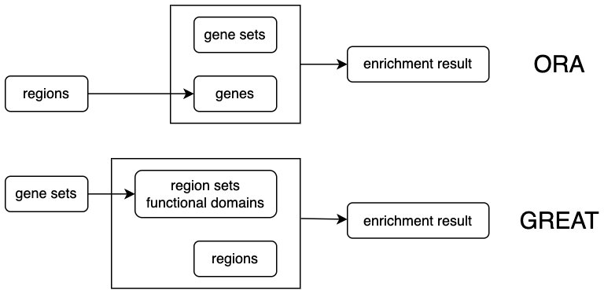

# GSEA in Genomics

## Overview

Genomics and epigenomics studies always generate may lists of genomic regions
of interest. For example, single-nucleotide variants (SNVs) or small insertion and deletions
(InDels) from whole genome sequencing or exon sequencing, peak regions of a certain
chromatin modifications or TFBS from ChIP-Sequencing data, or differetially methylated
regions fro whole genome bisulfite sequencing. Once the regions are obtained, the next
step is always functional intepretation. In this chapter, I will introduce the method
that specifically applies on genomic regions for functional enrichment analysis.


## Problem of ORA-based method

Since the functional intepretation is based on genes, a natural thought is to first annotate genomic
regions to genes, which generate a gene list, then to apply ORA on the gene list. The annotation to genes
can be done by looking for the nearest genes of every region. If the regions are believed to affect gene
transciprtion, they can also be annotated to the nearest gene TSS. In case some regions are too far from genes,
a cutoff of the distance from regions to the nearest genes can be set.

This conversion is very straightforward, however, let's recall the null assumption of ORA. In ORA, genes are treated as balls and all genes have the same probability and independently to be picked. However, in the mapping from regions to genes, the mapping from regions to genes are not balanced. Let's go back to the regions, actually, we assume, in the null hypotheiss, genomic regions are distrbuted uniformly in the genome, when converting to genes, due to somes regions locate in the gene desert and some reginos locates close to genes, this results in genes are not assigned wth the same probability to be picked. For exampe, if there is a clusters of regions close to a gene, then this genes is more likely to be picked. thus genes are with different weights. All these violates the null assumption of ORA. And such inproper comvertion will produce false positive results.


## The GREAT method

Recall the straighgy we proposed is to convert regions to genes, since it is not proper in the region to gene step, the tool GREAT proposes to directly constrcut region sets, which is a list of regions that associated to a biological term, then apply enrichment tests of input regions on the region set. This solves xxx. In the following sections, I will first intruduce how to construct such region sets and the enrichment tests.

```{r, echo = FALSE}

```

### Construct functional genomic domains

For a gene set, GREAT directly constructs such “region sets” (or genomic domains) that associate with individual biological functions. In GREAT, there are three modes of linking regions to genes


```{r, echo = FALSE, fig.width = 6, fig.height = 4}
library(cowplot)
library(grid)
library(latex2exp)

tss = function(x, direction = 1, gp = gpar()) {
	grid.segments(x, 0.5, x, unit(0.5, "npc") + unit(4, "mm"), gp = gp)
	if(direction == 1) {
		grid.lines(unit.c(unit(x, "npc"), unit(x, "npc") + unit(3, "mm")),
			       unit(c(0.5, 0.5), "npc") + unit(4, "mm"), gp = gp,
			       arrow = arrow(length = unit(2, "mm"), angle = 20))
	} else {
		grid.lines(unit.c(unit(x, "npc"), unit(x, "npc") - unit(3, "mm")),
			       unit(c(0.5, 0.5), "npc") + unit(4, "mm"), gp = gp,
			       arrow = arrow(length = unit(2, "mm"), angle = 20))
	}
}


draw_domain = function(pos, direction = 1, offset = unit(1, "mm"), left = 0.05, right = 0.05,
	basal = TRUE, gp = gpar(fill = "black")) {
	tss(pos, direction = direction, gp = gpar(col = gp$col))
	if(direction == 1) {
		if(basal) grid.rect(pos +(-0.05/2+0.01/2)/2, unit(0.5, "npc") - offset, width = unit(0.06/2, "npc"), height = unit(1, "mm"), just = "top", , gp = gp)
		grid.lines(c(pos - 0.05/2 - left, pos + 0.01/2 + right), unit(0.5, "npc") - offset - unit(0.5, "mm"), gp = gp)
	} else {
		if(basal) grid.rect(pos +(0.05/2-0.01/2)/2, unit(0.5, "npc") - offset, width = unit(0.06/2, "npc"), height = unit(1, "mm"), just = "top", , gp = gp)
		grid.lines(c(pos - 0.01/2 - left, pos + 0.05/2 + right), unit(0.5, "npc") - offset - unit(0.5, "mm"), gp = gp)
	}
}


pos = runif(12, min = 0.1, max = 0.9)
direction = sample(c(1, -1), 12, replace = TRUE)

pos = c(0.316861732304096, 0.470647418126464, 0.750402691476047, 0.87653172723949,
0.251157793775201, 0.523574670776725, 0.679610861837864, 0.712579931132495,
0.169938687421381, 0.119827011972666, 0.545861353725195, 0.147087042219937
)
direction = c(1, -1, 1, 1, 1, 1, -1, -1, 1, -1, 1, 1)

od = order(pos)

pos = pos[od]
direction = direction[od]

p1 = grid.grabExpr({
grid.newpage()
grid.lines(c(0.02, 0.98), c(0.5, 0.5))
grid.text("A", x = unit(0.02, "npc"), y = unit(0.5, "npc") + unit(4, "mm"), just = c("left", "bottom"), gp = gpar(fontsize = 14))

draw_domain(pos[1], direction[1], right = 0)
draw_domain(pos[2], direction[2], offset = unit(3, "mm"), left = 0, right = 0)
draw_domain(pos[3], direction[3], offset = unit(5, "mm"), left = 0)
draw_domain(pos[4], direction[4], offset = unit(1, "mm"), right = pos[5] - 0.05/2 - (pos[4] + 0.01/2))
draw_domain(pos[5], direction[5], offset = unit(3, "mm"), left = pos[5] - 0.05/2 - (pos[4] + 0.01/2))
draw_domain(pos[6], direction[6], offset = unit(1, "mm"), right = pos[7] - 0.05/2 - (pos[6] + 0.05/2))
draw_domain(pos[7], direction[7], offset = unit(3, "mm"), left = pos[7] - 0.05/2 - (pos[6] + 0.05/2), right = 0)
draw_domain(pos[8], direction[8], offset = unit(5, "mm"), left = 0)
draw_domain(pos[9], direction[9], offset = unit(1, "mm"), right = pos[10] - 0.01/2 - (pos[9] + 0.05/2))
draw_domain(pos[10], direction[10], offset = unit(3, "mm"), left = pos[10] - 0.01/2 - (pos[9] + 0.05/2))
draw_domain(pos[11], direction[11], offset = unit(5, "mm"), left = 0)
draw_domain(pos[12], direction[12], offset = unit(1, "mm"))
})


p2 = grid.grabExpr({
col = rep("black", 12)
col[c(2:4, 6:7, 9, 12)] = "#4DAF4A"
grid.newpage()
grid.lines(c(0.02, 0.98), c(0.5, 0.5))
grid.text("B", x = unit(0.02, "npc"), y = unit(0.5, "npc") + unit(4, "mm"), just = c("left", "bottom"), gp = gpar(fontsize = 14))

draw_domain(pos[1], direction[1], right = 0, basal = FALSE, gp = gpar(lwd = 2, col = col[1]))
draw_domain(pos[2], direction[2], offset = unit(3, "mm"), left = 0, right = 0, basal = FALSE, gp = gpar(lwd = 2, col = col[2]))
draw_domain(pos[3], direction[3], offset = unit(5, "mm"), left = 0, basal = FALSE, gp = gpar(lwd = 2, col = col[3]))
draw_domain(pos[4], direction[4], offset = unit(1, "mm"), right = pos[5] - 0.05/2 - (pos[4] + 0.01/2), basal = FALSE, gp = gpar(lwd = 2, col = col[4]))
draw_domain(pos[5], direction[5], offset = unit(3, "mm"), left = pos[5] - 0.05/2 - (pos[4] + 0.01/2), basal = FALSE, gp = gpar(lwd = 2, col = col[5]))
draw_domain(pos[6], direction[6], offset = unit(1, "mm"), right = pos[7] - 0.05/2 - (pos[6] + 0.05/2), basal = FALSE, gp = gpar(lwd = 2, col = col[6]))
draw_domain(pos[7], direction[7], offset = unit(3, "mm"), left = pos[7] - 0.05/2 - (pos[6] + 0.05/2), right = 0, basal = FALSE, gp = gpar(lwd = 2, col = col[7]))
draw_domain(pos[8], direction[8], offset = unit(5, "mm"), left = 0, basal = FALSE, gp = gpar(lwd = 2, col = col[8]))
draw_domain(pos[9], direction[9], offset = unit(1, "mm"), right = pos[10] - 0.01/2 - (pos[9] + 0.05/2), basal = FALSE, gp = gpar(lwd = 2, col = col[9]))
draw_domain(pos[10], direction[10], offset = unit(3, "mm"), left = pos[10] - 0.01/2 - (pos[9] + 0.05/2), basal = FALSE, gp = gpar(lwd = 2, col = col[10]))
draw_domain(pos[11], direction[11], offset = unit(5, "mm"), left = 0, basal = FALSE, gp = gpar(lwd = 2, col = col[11]))
draw_domain(pos[12], direction[12], offset = unit(1, "mm"), basal = FALSE, gp = gpar(lwd = 2, col = col[12]))

})


p3 = grid.grabExpr({
grid.newpage()
grid.lines(c(0.02, 0.98), c(0.5, 0.5))
grid.text("C", x = unit(0.02, "npc"), y = unit(0.5, "npc") + unit(4, "mm"), just = c("left", "bottom"), gp = gpar(fontsize = 14))

grid.segments(pos[2] - 0.05/2, unit(0.5, "npc") - unit(1.5, "mm"), pos[5] - 0.05/2, unit(0.5, "npc") - unit(1.5, "mm"), gp = gpar(col = "#4DAF4A", lwd = 2))
grid.segments(pos[6] - 0.01/2 - 0.1/2, unit(0.5, "npc") - unit(1.5, "mm"), pos[7] + 0.01/2, unit(0.5, "npc") - unit(1.5, "mm"), gp = gpar(col = "#4DAF4A", lwd = 2))
grid.segments(pos[9] - 0.05/2 - 0.1/2, unit(0.5, "npc") - unit(1.5, "mm"), pos[10] + 0.01/2, unit(0.5, "npc") - unit(1.5, "mm"), gp = gpar(col = "#4DAF4A", lwd = 2))
grid.segments(pos[12] - 0.05/2 - 0.1/2, unit(0.5, "npc") - unit(1.5, "mm"), pos[12] + 0.01/2 + 0.1/2, unit(0.5, "npc") - unit(1.5, "mm"), gp = gpar(col = "#4DAF4A", lwd = 2))

})

library(ComplexHeatmap)
lgd = Legend(labels = c("Transcription start sites", "Basal domain plus extension", "Genes in a gene set", "Genomic domains associated to a gene set"),
    graphics = list(
        function(x, y, w, h) {
        	grid.segments(x-w*0.5, y-h*0.4, x-w*0.5, y+h*0.2)
			grid.lines(unit.c(x-w*0.5, x+w*0.5),
			       unit.c(y+h*0.2, y+h*0.2),
			       arrow = arrow(length = unit(2, "mm"), angle = 20))
		},
        function(x, y, w, h) {
        	grid.rect(x, y, w*0.5, h*0.4, gp = gpar(fill = "black"))
        	grid.segments(x-w*0.5, y, x+w*0.5, y)
        },
        function(x, y, w, h) {
        	grid.segments(x-w*0.5, y-h*0.4, x-w*0.5, y+h*0.2, gp = gpar(col = "#4DAF4A"))
			grid.lines(unit.c(x-w*0.5, x+w*0.5),
			       unit.c(y+h*0.2, y+h*0.2),
			       arrow = arrow(length = unit(2, "mm"), angle = 20), gp = gpar(col = "#4DAF4A"))
		},
        function(x, y, w, h) {
        	grid.segments(x-w*0.5, y, x+w*0.5, y, gp = gpar(col = "#4DAF4A", lwd = 2))
        }
    ), nrow = 2, gap = unit(5, "mm"), row_gap = unit(4, "mm")
)


library(cowplot)
print(
	plot_grid(p1, p2, p3, lgd@grob, ncol = 1, scale = 0.95),
)
```

1. Basal plus extension

2. Two nearest genes

3. single nearest gene

### The binomial model


```{r, echo = FALSE, fig.width = 6, fig.height = 3}

p3 = grid.grabExpr({
grid.newpage()
grid.lines(c(0.02, 0.98), c(0.5, 0.5))
grid.text("A", x = unit(0.02, "npc"), y = unit(0.5, "npc") + unit(4, "mm"), just = c("left", "bottom"), gp = gpar(fontsize = 14))

grid.segments(pos[2] - 0.05/2, unit(0.5, "npc") - unit(1.5, "mm"), pos[5] - 0.05/2, unit(0.5, "npc") - unit(1.5, "mm"), gp = gpar(col = "#4DAF4A", lwd = 2))
grid.segments(pos[6] - 0.01/2 - 0.1/2, unit(0.5, "npc") - unit(1.5, "mm"), pos[7] + 0.01/2, unit(0.5, "npc") - unit(1.5, "mm"), gp = gpar(col = "#4DAF4A", lwd = 2))
grid.segments(pos[9] - 0.05/2 - 0.1/2, unit(0.5, "npc") - unit(1.5, "mm"), pos[10] + 0.01/2, unit(0.5, "npc") - unit(1.5, "mm"), gp = gpar(col = "#4DAF4A", lwd = 2))
grid.segments(pos[12] - 0.05/2 - 0.1/2, unit(0.5, "npc") - unit(1.5, "mm"), pos[12] + 0.01/2 + 0.1/2, unit(0.5, "npc") - unit(1.5, "mm"), gp = gpar(col = "#4DAF4A", lwd = 2))

grid.text(TeX("$\\textit{p} = 0.548$"), x = 0.9, y = unit(0.5, "npc") + unit(3, "mm"), just = "bottom", gp = gpar(fontsize = 10))

})

x = runif(20, min = 0.02, max = 0.98)
x = c(0.276278418377042, 0.450190241783857, 0.378444240614772, 0.0788686688244343,
0.42589015699923, 0.646518609821796, 0.388663815185428, 0.2278234937042,
0.859891234487295, 0.299110063016415, 0.633350785002112, 0.747234481200576,
0.590389264523983, 0.511599823087454, 0.336349471211433, 0.690563082545996,
0.542089605405927, 0.663003080636263, 0.348516949832439, 0.368752594813704
)

library(latex2exp)

p4 = grid.grabExpr({

grid.newpage()
grid.lines(c(0.02, 0.98), c(0.5, 0.5))
grid.text("B", x = unit(0.02, "npc"), y = unit(0.5, "npc") + unit(4, "mm"), just = c("left", "bottom"), gp = gpar(fontsize = 14))

grid.segments(pos[2] - 0.05/2, unit(0.5, "npc") - unit(1.5, "mm"), pos[5] - 0.05/2, unit(0.5, "npc") - unit(1.5, "mm"), gp = gpar(col = "#4DAF4A", lwd = 2))
grid.segments(pos[6] - 0.01/2 - 0.1/2, unit(0.5, "npc") - unit(1.5, "mm"), pos[7] + 0.01/2, unit(0.5, "npc") - unit(1.5, "mm"), gp = gpar(col = "#4DAF4A", lwd = 2))
grid.segments(pos[9] - 0.05/2 - 0.1/2, unit(0.5, "npc") - unit(1.5, "mm"), pos[10] + 0.01/2, unit(0.5, "npc") - unit(1.5, "mm"), gp = gpar(col = "#4DAF4A", lwd = 2))
grid.segments(pos[12] - 0.05/2 - 0.1/2, unit(0.5, "npc") - unit(1.5, "mm"), pos[12] + 0.01/2 + 0.1/2, unit(0.5, "npc") - unit(1.5, "mm"), gp = gpar(col = "#4DAF4A", lwd = 2))

grid.points(x, unit(rep(0.5, 20), "npc") + unit(2, "mm"), default.unit = "npc", pch = 25, gp = gpar(col = "blue", fill = "blue", cex = 0.6))
grid.text(TeX("$Pr_{binom}(\\textit{X} \\geq 10 | \\textit{N} = 20, \\textit{p} = 0.548)$"), x = 0.75, y = unit(0.5, "npc") + unit(7, "mm"), just = "bottom", gp = gpar(fontsize = 10))

})


library(ComplexHeatmap)
lgd = Legend(labels = c("Genomic domains associated to a gene set", "Input regions"),
    graphics = list(
        function(x, y, w, h) {
        	grid.segments(x-w*0.5, y, x+w*0.5, y, gp = gpar(col = "#4DAF4A", lwd = 2))
        },
        function(x, y, w, h) {
        	grid.points(x, y, pch = 25, gp = gpar(col = "blue", fill = "blue", cex = 0.6))
        }
    ), nrow = 1, gap = unit(5, "mm")
)

lgd@grob$vp$y = unit(1, "npc")
library(cowplot)

print(
	plot_grid(p3, p4, lgd@grob, ncol = 1, scale = 0.95)
)
```

The enrichment test is applied as follows. For a specific biological term represented as a gene set, denote the fraction of its associated functional domains in the genome (Fig. 1C) as p, the total number of input regions as N, the observed number of input regions that fall in the associated domains as n and the corresponding random variable as X, then X follows a binomial distribution: X ~ B(p, N) and the p-value of the enrichment is calculated as Pr(X ≥ n)

Note in GREAT, input regions are treated as single points and their middle points are used.


--|------|---------|
  |region |  gene
p | width(x)/widht(genome) | N_geneset/n_genome
N | N_region | n_DE gene
x | region in domain | DE gene in gene set


### The hypergeometric model when dealing with background

GREAT also supports background. Here the "background" is more like a universal sets or a super sets of input regions. 
To provide the background, it has a special format. Assume the background regions is a set of 
regions [xi, yi] with index set A.., the input regions can only be a list of intervals (xj, yj) where
the the index set B is a subset of A. In this case...


```{r, echo = FALSE, fig.width = 6, fig.height = 1.3}
set.seed(123)
x2 = c(x, runif(20, min = 0.02, max = 0.98))
p4 = grid.grabExpr({

grid.newpage()
grid.lines(c(0.02, 0.98), c(0.5, 0.5))

grid.segments(pos[2] - 0.05/2, unit(0.5, "npc") - unit(1.5, "mm"), pos[5] - 0.05/2, unit(0.5, "npc") - unit(1.5, "mm"), gp = gpar(col = "#4DAF4A", lwd = 2))
grid.segments(pos[6] - 0.01/2 - 0.1/2, unit(0.5, "npc") - unit(1.5, "mm"), pos[7] + 0.01/2, unit(0.5, "npc") - unit(1.5, "mm"), gp = gpar(col = "#4DAF4A", lwd = 2))
grid.segments(pos[9] - 0.05/2 - 0.1/2, unit(0.5, "npc") - unit(1.5, "mm"), pos[10] + 0.01/2, unit(0.5, "npc") - unit(1.5, "mm"), gp = gpar(col = "#4DAF4A", lwd = 2))
grid.segments(pos[12] - 0.05/2 - 0.1/2, unit(0.5, "npc") - unit(1.5, "mm"), pos[12] + 0.01/2 + 0.1/2, unit(0.5, "npc") - unit(1.5, "mm"), gp = gpar(col = "#4DAF4A", lwd = 2))

grid.points(x, unit(rep(0.5, 20), "npc") + unit(2, "mm"), default.unit = "npc", pch = 25, gp = gpar(col = "blue", fill = "blue", cex = 0.6))
grid.points(x2, unit(rep(0.5, length(x2)), "npc") - unit(4, "mm"), default.unit = "npc", pch = 25, gp = gpar(col = "red", fill = "red", cex = 0.6))
grid.text(TeX("$Pr_{hyper}(\\textit{X} \\geq 10 | \\textit{N}_{bg} = 40, \\textit{N}_{fg} = 20, \\textit{n}_{bg}=19)$"), x = 0.75, y = unit(0.5, "npc") + unit(7, "mm"), just = "bottom", gp = gpar(fontsize = 10))

})
lgd = Legend(labels = c("Input regions", "Background regions"),
    graphics = list(
        function(x, y, w, h) {
        	grid.points(x, y, pch = 25, gp = gpar(col = "blue", fill = "blue", cex = 0.6))
        },
        function(x, y, w, h) {
        	grid.points(x, y, pch = 25, gp = gpar(col = "red", fill = "red", cex = 0.6))
        }
    ), nrow = 1, gap = unit(5, "mm")
)

lgd@grob$vp$y = unit(1, "npc")
library(cowplot)

print(plot_grid(
	p4,
	lgd@grob, ncol = 1, rel_heights = c(7, 1)
))
```

Such type of background/universal set is normally difficult to obtain. In Section x, I will introduce another
background model where background is not a unversal set while more like a mask on the genome where the enrichment
is only applied. I will also demonstrate the hypergenomic xx is a special case of the xx.


### implementation

We first extend the gene TSS. In the following code, we take human genome versio hg19 as an example.
In Bioconductor, there are also a list of "TxDb" packages which are standard Bioconductor
packages for transcripts information for a specific genome build. Here the package
**TxDb.Hsapiens.UCSC.hg19.knownGene** follows the naming skema as package_type.organism.source.genome.gene_id_type.

All the TxDb packages are built with the core facility package **GenomicFeatures**, which provide
functions to extract various transcipt level sof information. `genes()` extract the genomic coordinates of
all genes.

```{r}
library(TxDb.Hsapiens.UCSC.hg19.knownGene)
g = genes(TxDb.Hsapiens.UCSC.hg19.knownGene)
g
```

The gene variable `g` not only contains chromosomes, but also contains small contigs. This won't affect
the analysis too much, but to make the analysis clean. Let's restrict `g` to the chromosomes.

Note `g` also has a `gene_id` column which we will used to map to the gene set

```{r}
g = g[seqnames(g) %in% paste0("chr", c(1:22, "X", "Y"))]
```

I also reset the seqlevels

```{r}
all_chr = paste0("chr", c(1:22, "X", "Y"))
seqlevels(g) = all_chr
```

To get the positions of TSS which is a one-base region, `promoters()` regions by setting upstream extensions to zero
and downstream extension to 1. Note the gene variable `g` is stranded, so the direction of upstream
and downstream is automatically picked based on the strand in `g`.

```{r}
tss = promoters(g, upstream = 0, downstream = 1)
tss
```

To extend TSS is a two-step process. First construct the basal domains, which extend 5kb upstream and 1kb downstream.
THis can be donw also with `promoters()` on the  TSS.

```{r}
basal_domain = promoters(tss, upstream = 5000, downstream = 1000)
```

Construct the exteded domain is a little bit complex because we need to check whether the extension
reached neighbour gene's basal domains. SInce we need to compare to a gene's left and right genes, let's
first sort the coordinate of `basal_domain`. Also after obtained the basal domains, teh strandness is not
used anymore, here we set the strand of `basal_domains` to "\*" to mark the regions are not stranded.

```r
strand(basal_domain) = "*"
basal_domain = sort(basal_domain)
```

To illustrate the process of extension, and easily explain the idea, from here we assume `basal_domain`
only for one single chromosome. Note if you want to imeplement xx, teh next chunk of code should be applied 
to every chromsome.


The thought is we first extend basal domains by 1mb both upstream and downstream, next
we compare the neighbouring TSS, if it overlaps to the left gene's basal domain, the start position
the left basal domain is used as the start of the extension. Similar, if it overlaps to the right gene's basal
domain, the end positino ...

Step 1, we directly extend 1MB to the left and to the right. Note to make the code short, I assume the right extension
does not reach teh end of hte chromosome and the start extension does not reach the start of the chromosome.
In real case, you must additionally apply `left = pmax(left, 1)` and `right = pmin(right, chr_len)`.

```r
extension = 1e6
# this chunk should be applied to each chromosome
# also note left and right ...
left = start(basal_domain) - extension
right = end(basal_domain) + extension
```

To compare the left, we start form teh second region, and to compre the right, we start from the first region,
but only till the `n-1`th region.

```r
n = length(basal_domain)
left[2:n] = pmax(left[2:n], end(basal_domain)[1:(n-1)])
right[1:(n-1)] = pmin(right[1:(n-1)], start(basal_domain)[2:n])
```

Now `left` and `right` contains borders of xxx. since each region corrspond to the same
in `basal_domain`. We copy basal_domain, and directly change its start and end positions. 
Note the meta columns  in `basal_domains` is als kept in `extended_tss`.

```r
extended_tss = basal_domain
start(extended_tss) = left
end(extended_tss) = right
```

Step 2, construct the genomic domain that correspond to a gene set. Let's random select
100 genes as a gene set. SInce in `extended_tss` there is already a `gene_id` column, 
we can select the extened TSS for the genes in the gene set

```r
gs = sample(g$gene_id, 100)

region_set = extended_tss[extended_tss$gene_id %in% gs]
```

The extneded Tss may overlap, here it is necessary to apply `reduce()` to get a "flat"
version.

```r
region_set = reduce(region_set)
```

Now `region_set` is teh regions in teh genome that associate to a certain gene set.

Next we apply the binomial test with the region set.

```{r}
library(rGREAT)
gr = randomRegions(genome = "hg19")
```

In GREAT, only the middle point of the input regions are used. We first construct a `GRanges`
object which contains the middle points of regions.

```r
gr_mid = gr
start(gr_mid) = end(gr_mid) = mid(gr)
```

We overlap `gr_mid` to the region set. This can be done with the standard overlapping function
`findOverlaps()`. the object returned by `findOverlaps()` is a xx object. since each region in 
`region_set` does not overlap other regions and `gr_mid` only contains single base regions, 
the number of hits in the overlapping is the number of regions that fall in the genomic domain.

```r
ov = findOverlaps(gr_mid, region_set)

n_total = length(gr)
n_hits = length(ov)
```

To get the probabiliyt of xxx, we need to divide the totla length of xx to the total length of genome.
If the gene information is from teh TxDb package, the chromosome lengths information
is already in teh `seqlengths` xx and can be obtained with the `seqlengths()` function. Recall
we adjusted the seqlevels to teh normal chromsomes, teh chromosome lengths are adjusted automatically.
If you don't have such inforamtion, you have to look teh chromosme lengths for the
corect genome version. UCSC and NCBI genome are two useful resource to xx.

```r
prop = sum(width(region_set))/sum(seqlengths(extended_tss))
```

With all variables ready, we can simply apply `pbinom()` to calcualte the p-value.

```r
p = pbinom(n_hits - 1, n_total, prop, lower.tail = TRUE)
```

The implementation is a little bit complex, the complex part is to construct the region set.

### The web-based tool

GREAT is implemented as a web-based tool. The use is very straightforward. 

### The rGREAT package

GREAT web service is useful for xxx, but xxx. The rGREAT package can make
GREAT analysis automatic by automaticlaly submitting genomic regions to GREAT
web service and retrieve results from there on the fly. The several functions
introduced later is to silmulate the process of xx teh website.

I used a TFBS bind sites of the TFBS (JUN) from UCSC database.... I first read it into a data frame
where the first three columns are the chromsomes, the start positinos oand the end 
positions of every peak regions of JUN.

```{r}
bed = read.table("data/tb_encTfChipPkENCFF708LCH_A549_JUN_hg19.bed")
head(bed)
```

#### Submit regions

Just like the web interface, the only mandatory argumnet is the input regions. The input regions can
also be in teh `GRanges` object. The two foramts are baically give identical information.

`submitGreatJob()` automatically construct all necessary parameters and submit to the GREAT web service. Just like
you clicked "submit" button in the web interface. After the job is successfually submitted, the returned object
`job` contains the settings of the xxx.

```{r}
job = submitGreatJob(bed)
job
```

A specific genome version for an organism should be set. By default it is hg19 for human genome.
GREAT has several versions. The newest version is 4.0.4 released on 2019. It supports both hg19 and hg38. Other genomoes
includes... Note it is very important to select teh correct genome version for the organism. In Section
xx I will demonstrate the consequence of selecting the wrong genome version.

The genome version can be set via the `species` argumetn

```r
submitGreatJob(bed, species = "hg38")  # assume bed is from hg38
submitGreatJob(bed, species = "mm10")  # assume bed is from mm10
```

`submitGreatJob()` supports all historical versions of GREAT. Normally we use the newest version since the annotation
is the newest. But when GREAT updates from version 3 to 4, many gene set collections are removed. So, if you want to
use more gene set collections, you may need to swtich to older verison. This can be set via the `version` argument

```r
submitGreatJob(bed, version = "3.0")
```

If by any chance, you also have the "background" universe set of the regions, you can set it with the `bg` argument.
But remeber the format of the two xxx.

```r
bed_subset = bed[sample(nrow(bed), 500), ]
submitGreatJob(bed_subset, bg = bed)
```

#### obtain enrichment tables

Once the regions are successfully submitted. GREAT performs the analysis and temporary results will be on the
GREAT website for some time, which other functions can automaticaly retrieve the result from there.
GERAT applies analysis on all supported gene set collections. The function `getEnrichmentTables()` downloads
the complete result table for specific gene set collections.

Calling `getEnrichmentTables()` without argumetn downloads the enrichment tables for the three GO collectios, i.e.
BP, MF and CC.

```{r}
tbl = getEnrichmentTables(job)
names(tbl)
```

Once the enrichment table is downloaded, it is cached. Repeatedly call `getEnrichmentTables()` will directly use
the table from cache and will not download it again. This is good because the results actally are temporary saved
on the GREAT server. Once the tables are cached in the `job` object. It can be xxx

`tbl` is just a list of data frames, where each data frmae is xxx which is identical to the result if you submit
the regions directly from GREAT web service (of course it is because all calculations are performed on GREAT).


```{r}
head(tbl[[1]])
```


The columns on the enrichment are self-explorary. The columns are:

- ID
- name
- Binom_Genome_Fraction
...


All supported gene set collections can be obtained by `availableOntologies(job)`:

```{r}
availableOntologies(job)
```

and the ontologies can be set in `getEnrichmentTables()`


```r
getEnrichmentTables(job, ontology = c("GO Biological Process", "Ensembl Genes"))
```


#### get region-gene associations

In the GREAT process, each extened TSS is associated to a gene. For a list of input regions,
we can obtain the associations between regions and genes, i.e. whether the region (middle point)
falls in the extended TSS of a gene. The function `getRegionGeneAssociations()` returns an
`GRanges` object of the associations between regions and genes. Note teh number of regions
in the object may be less than the total number of input xxx because some regions are locate
in teh gene desert...

In teh meta column of xxx. You may see the column of `annotated_genes` and `dist_to_TSS` are in
`Characterlist` and `IntegerList`...

```{r}
getRegionGeneAssociations(job)
```


The distributions can b

```{r, fig.width = 12, fig.height = 4}
plotRegionGeneAssociations(job)
```

THe associations can also be obtains for a specific gene set, just specigy the gene set collection
and the corresponding gene set ID:

```r
getRegionGeneAssociations(job, ontology = "GO Molecular Function",
    term_id = "GO:0004984")
```


#### visualizations and reports


Similar as differentiall expression analysis, the enrichment table can also be visualized as a
volcano plot. Recall in the DE analysis, in the volcano, on x-axis is teh log2 fold change
and on y-axis is the log10(p-value) or log10(FDR). Similar, we can calcualte the log2 enrichment rate as

$$log2(obs/exp) $$

where `obs` is the observed number of regions in the region set, and exp is calcualted as $p*n$. 
The expected values is already in the enrichment table.

Function `plotVolcano()` makes a volcano plot for a specific gene set collection. In
the following example, we use hte "GO Biologucal Process".

```{r}
plotVolcano(job, ontology = "GO Biological Process")
```

THe volcano plot is actually "one-sided" because we only look at the over-representation. Similar
as the differnetial expression analysis, we can set two cutoffs, one for the log2 enrichment ratio,
and one for the log10 pvalue, i.e. one from biologucal aspect and one from statstical aspect. 

In teh plot, we can see it is composed by several curves. Each curve correspond to a same region hits.
we also see xxx which we will explain in more detail in Section x.

One last function to introuce is the `shinyReport()` function which can create xxx

```r
shinyReport(job)
```

## Local GREAT analysis

As an online tool, all annotation resources are only controlled by GREAT
developers; they are not extensible by users. The current version (4.0.4) of
GREAT only supports human and mouse, and it only supports seven gene set
collections which have not yet been updated to the most recent ones.

Bioconductor has a rich and up-to-date annotation resource, also as I have
demonstrated in sectionx, impleement the GREAT algorithm from scratch with
Bioconductor facility package is not difficult, thus, in the **rGREAT**
package, I also implement a "local GREAT" function, which greatly ...

On one hand, with local GREAT, it is possible to perform enrichment analysis
on any organism and with any type of gene set collection; and on the other
hand, Bioconductor annotation packages are well maintained and updated, which
ensures that a local GREAT analysis always uses the most up-to-date annotation
data. Local GREAT by default supports many gene set collections and more than
600 organisms, and, more importantly, local GREAT allows self-provided gene
sets and organisms from users.

To demonstrate its use, I first convert the object `bed` to a `GRanges` object
because ...

```{r}
gr = GRanges(seqnames = bed[, 1], ranges = IRanges(bed[, 2], bed[, 3]))
gr
```

The core function `great()` performs GREAT analysis locally. It used gene set and gene 
all from Biocondutor packages. The first three argumetns are teh input regions,
the name of teh gene set collection, and the name/version of hte genome.

In teh following example, the regions correspond to human genome hg19 and we use GO BP gene sets.
The returned object prints parametes.


```{r}
res = great(gr, "GO:BP", "hg19")
res
```

### use predefined-gene sets and TSS sources

### use self-defined extended TSS

If the predefined gene set is used, norally you dont need to 
self-define the TSS because ... As will be demonstrated in xx.

### Use self-defined gene sets


### Use both self-defined gene sets and TSS

### The binomial background model


```{r, echo = FALSE}

p5 = grid.grabExpr({
grid.newpage()
grid.lines(c(0.02, 0.98), c(0.5, 0.5))
grid.text("A", x = unit(0.02, "npc"), y = unit(0.5, "npc") + unit(4, "mm"), just = c("left", "bottom"), gp = gpar(fontsize = 14))

grid.segments(pos[2] - 0.05/2, unit(0.5, "npc") - unit(1.5, "mm"), pos[5] - 0.05/2, unit(0.5, "npc") - unit(1.5, "mm"), gp = gpar(col = "#4DAF4A", lwd = 2))
grid.segments(pos[6] - 0.01/2 - 0.1/2, unit(0.5, "npc") - unit(1.5, "mm"), pos[7] + 0.01/2, unit(0.5, "npc") - unit(1.5, "mm"), gp = gpar(col = "#4DAF4A", lwd = 2))
grid.segments(pos[9] - 0.05/2 - 0.1/2, unit(0.5, "npc") - unit(1.5, "mm"), pos[10] + 0.01/2, unit(0.5, "npc") - unit(1.5, "mm"), gp = gpar(col = "#4DAF4A", lwd = 2))
grid.segments(pos[12] - 0.05/2 - 0.1/2, unit(0.5, "npc") - unit(1.5, "mm"), pos[12] + 0.01/2 + 0.1/2, unit(0.5, "npc") - unit(1.5, "mm"), gp = gpar(col = "#4DAF4A", lwd = 2))

grid.rect(0.13, 0.5, width = 0.12, height = unit(1, "cm"), gp = gpar(fill = "#FF000020", col = "#FF000080"))
grid.rect(0.36, 0.5, width = 0.28, height = unit(1, "cm"), gp = gpar(fill = "#FF000020", col = "#FF000080"))
grid.rect(0.68, 0.5, width = 0.12, height = unit(1, "cm"), gp = gpar(fill = "#FF000020", col = "#FF000080"))

grid.text(TeX("$\\textit{p}_2 = 0.619$"), x = 0.9, y = unit(0.5, "npc") + unit(3, "mm"), just = "bottom", gp = gpar(fontsize = 10))
})


p6 = grid.grabExpr({
grid.newpage()
grid.lines(c(0.02, 0.98), c(0.5, 0.5))
grid.text("B", x = unit(0.02, "npc"), y = unit(0.5, "npc") + unit(4, "mm"), just = c("left", "bottom"), gp = gpar(fontsize = 14))

grid.segments(pos[2] - 0.05/2, unit(0.5, "npc") - unit(1.5, "mm"), pos[5] - 0.05/2, unit(0.5, "npc") - unit(1.5, "mm"), gp = gpar(col = "#4DAF4A", lwd = 2))
grid.segments(pos[6] - 0.01/2 - 0.1/2, unit(0.5, "npc") - unit(1.5, "mm"), pos[7] + 0.01/2, unit(0.5, "npc") - unit(1.5, "mm"), gp = gpar(col = "#4DAF4A", lwd = 2))
grid.segments(pos[9] - 0.05/2 - 0.1/2, unit(0.5, "npc") - unit(1.5, "mm"), pos[10] + 0.01/2, unit(0.5, "npc") - unit(1.5, "mm"), gp = gpar(col = "#4DAF4A", lwd = 2))
grid.segments(pos[12] - 0.05/2 - 0.1/2, unit(0.5, "npc") - unit(1.5, "mm"), pos[12] + 0.01/2 + 0.1/2, unit(0.5, "npc") - unit(1.5, "mm"), gp = gpar(col = "#4DAF4A", lwd = 2))


grid.points(x, unit(rep(0.5, 20), "npc") + unit(2, "mm"), default.unit = "npc", pch = 25, gp = gpar(col = "blue", fill = "blue", cex = 0.6))

grid.rect(0.13, 0.5, width = 0.12, height = unit(1, "cm"), gp = gpar(fill = "#FF000020", col = "#FF000080"))
grid.rect(0.36, 0.5, width = 0.28, height = unit(1, "cm"), gp = gpar(fill = "#FF000020", col = "#FF000080"))
grid.rect(0.68, 0.5, width = 0.12, height = unit(1, "cm"), gp = gpar(fill = "#FF000020", col = "#FF000080"))
grid.text(TeX("$Pr_{binom}(\\textit{X}_2 \\geq 8 | \\textit{N}_2 = 15, \\textit{p}_2 = 0.619)$"), x = 0.75, y = unit(0.5, "npc") + unit(5.5, "mm"), just = "bottom", gp = gpar(fontsize = 10))

})

library(ComplexHeatmap)
lgd = Legend(labels = c("Genomic domains associated to a gene set", "Input regions", "Background regions"),
    graphics = list(
        function(x, y, w, h) {
        	grid.segments(x-w*0.5, y, x+w*0.5, y, gp = gpar(col = "#4DAF4A", lwd = 2))
        },
        function(x, y, w, h) {
        	grid.points(x, y, pch = 25, gp = gpar(col = "blue", fill = "blue", cex = 0.6))
        },
        function(x, y, w, h) {
        	grid.rect(x, y, w, h, gp = gpar(fill = "#FF000020", col = "#FF000080"))
        }
    ), nrow = 1, gap = unit(5, "mm")
)


library(cowplot)
lgd@grob$vp$y = unit(1, "npc")

print(
	plot_grid(p5, p6, lgd@grob, ncol = 1, scale = 0.95)
)
```

### with more organisms

### Genome version is important

## Other thoughts

### large sample size

### compare between different sets of genomic regions

Distance to TSS

### Use other statistics and permutate

Once we have a region set They have a same problem where larger xxx tend to give more significant p-values.

### use covariates

## Summary


