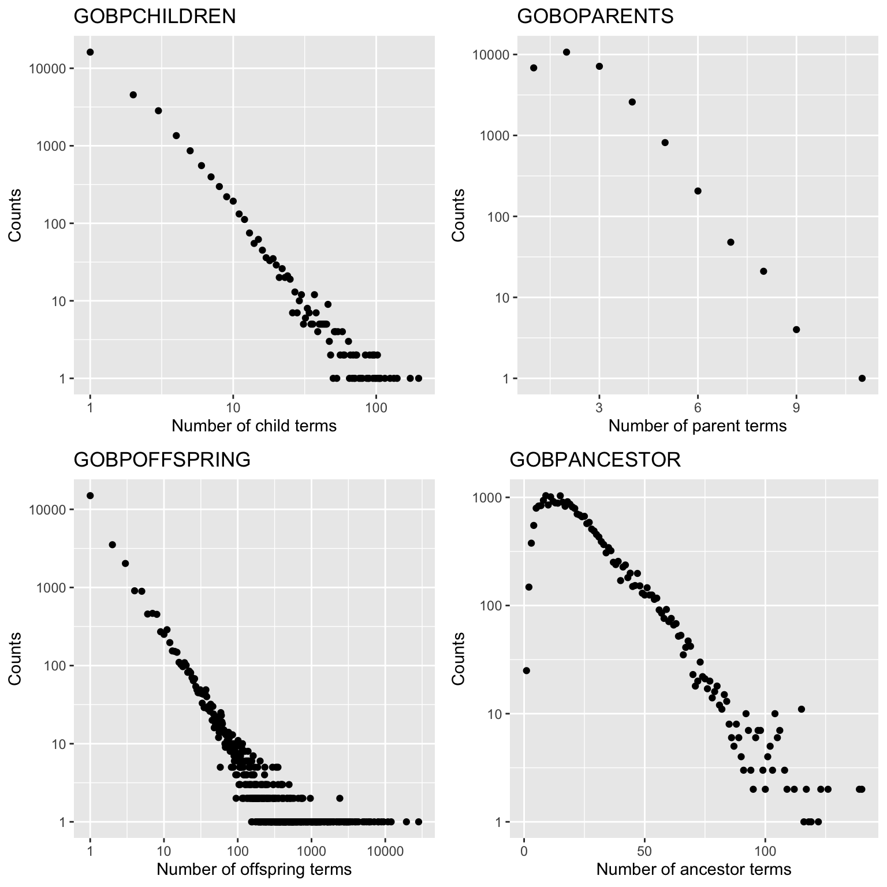
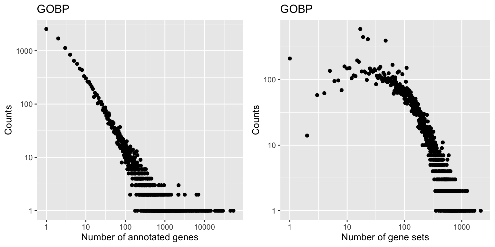

# Gene Set Databases

## Overview

Gene set enrichment analysis evaluates the associations of a gene list of interest to a collection of pre-defined gene sets,
where each gene set represents a specific biological attribute. Once the gene list is statistically significantly enriched in a gene set,
the cocludsion is made that the corresponding biological function is significantly affected. Thus choose
a proper type of gene sets is important to the studies. The construction of gene sets a very flexible. In most
cases, they are from public databases where xx efforts have already been to categorize genes into sets. Nevertheless, 
the gene sets can also be self-defineds from personal studies, such as a set of genes in a network module, or xxx. In this chapter,
we will introduce several major gene set databases and how to access the data in R.

## Gene Ontology

Gene Ontology (GO) is perhaps the most used gene sets database in current studies. The GO project was started in 1999. It aims
to construct biological functions in a well-organized form, which is both effcient for human-readable and machine-readable. It also
provides annotations between well-defined biological terms to multiple species, which gives a comprehensive knowledge for functional
studies.

GO has three namespaces, which are 1. Biological process, 2. cellular componet and 3. molecular function, which describe a gene or its product
protein from the three aspects. biological process describes what a gene's function, which is the major namespace, cellular components describes where
a gene's product has function in the cell and molecular function. Under each namespace, GO terms are organized in a hierarchical way, in a form
of a directed acyclic graph (DAG). In this structure, a parent term can have multiple child terms and a child term can have multiple
parent terms, but there is no loop in the xx. Also more on the top of the DAG, more general the corresponding term is.

GO has a rich resource that in current version (2022-07-01), there are 43558 GO terms, with more tham 7 million annotations to more than 5000 species.
This provides a powerful resouces for studying not only model species, but a huge number of other species, which normally other gene set 
databases do not support.


GO has two major parts. The first is the GO structure itself, which how to orgianize differnet biological terms, which is species-independent. The second 
is the GO annotation (GOA) which provides mappings between GO terms to genes or proteins for a specific species. Thus, a GO term can be linked to a set of genes, 
and this is called GO gene sets. One thing that should be noted is due to the DAG strucutre, a child term xx to its parent term, thus all genes annotated to
a GO terms are also annotated it its parent term.

The GO DAG structure also provides useful information to xxx. In most cases when we do gene set enrichmetn analysis, we normally do not consider
its GO structure, however, In Chapter xx we will discuss to visualize GO enrichment results with DAG and in chapter xx we will discuss to simplify GO 
terms by taking the inforamtion of DAG structures.

Bioconductor provides a nice of GO-related and reformatted resources as core packages, which is convinient to read, to process and to integrated 
into downstream analysis. More importantly, these annotation packages are always updated by bioconductor core teams and it is always make sure
the resouces are up-to-date in each BIoconductor release.

### The GO.db package

The first package I will introduce is the **GO.db** package. It is maintained
by the Bioconductor core team and it is frequently updated in every bioc
release. Thus, it always stores up-to-date data for GO and it can be treated
as the standard source to read and process GO data in R. **GO.db** contains detailed
information of GO terms as well as the hierarchical structure of the GO tree. The
data in **GO.db** is only focused on GO terms and their relations, and it is independent to specific organisms. 

**GO.db** is constructed by the low-level package **AnnotationDbi**, which defines
a general database interface for storing and precessing biological annotation data. Internally the GO data is represented
as an SQLite database with multiple tables. A large number of low-level functions defined in **AnnotationDbi**
can be applied to the objects in **GO.db** to get customized filtering on GO data. Expericenced readers
may go to the documentation of **AnnotationDbi** for more information.

First let's load the **GO.db** package.


```r
library(GO.db)
```

Simply printing the object `GO.db` shows the basic information of the package.
The two most important fields are the source file (`GOSOURCEURL`) and the date
(`GOSOURCEDATE`) to build the package.


```r
GO.db
# GODb object:
# | GOSOURCENAME: Gene Ontology
# | GOSOURCEURL: http://current.geneontology.org/ontology/go-basic.obo
# | GOSOURCEDATE: 2022-03-10
# | Db type: GODb
# | package: AnnotationDbi
# | DBSCHEMA: GO_DB
# | GOEGSOURCEDATE: 2022-Mar17
# | GOEGSOURCENAME: Entrez Gene
# | GOEGSOURCEURL: ftp://ftp.ncbi.nlm.nih.gov/gene/DATA
# | DBSCHEMAVERSION: 2.1
```

`GO.db` is a database object created by **AnnotationDbi**, thus, the general
method `select()` can be applied to retrieve the data by specifying a vector
of "keys" which is a list of GO IDs, and a group of "columns" which are the
fields where the values are retrieved. In the following code, we extracted the
values of `"ONTOLOGY"` and `"TERM"` for two GO IDs. The valid columns names
can be obtained by `columns(GO.db)`.


```r
select(GO.db, keys = c("GO:0000001", "GO:0000002"), 
    columns = c("ONTOLOGY", "TERM"))
#         GOID ONTOLOGY                             TERM
# 1 GO:0000001       BP        mitochondrion inheritance
# 2 GO:0000002       BP mitochondrial genome maintenance
```

However, we don't really need to use the low-level function `select()` to
retrieve the data. In **GO.db**, there are several tables that have already
been compiled and can be used directly. These tables are represented as
objects in the package. The following command prints all the variables that
are exported in **GO.db**. Note, in the interactive R terminal, users can also
see the variables by typing `GO.db::` with two continuous tabs.


```r
ls(envir = asNamespace("GO.db"))
#  [1] "GO"            "GO.db"         "GOBPANCESTOR"  "GOBPCHILDREN" 
#  [5] "GOBPOFFSPRING" "GOBPPARENTS"   "GOCCANCESTOR"  "GOCCCHILDREN" 
#  [9] "GOCCOFFSPRING" "GOCCPARENTS"   "GOMAPCOUNTS"   "GOMFANCESTOR" 
# [13] "GOMFCHILDREN"  "GOMFOFFSPRING" "GOMFPARENTS"   "GOOBSOLETE"   
# [17] "GOSYNONYM"     "GOTERM"        "GO_dbInfo"     "GO_dbconn"    
# [21] "GO_dbfile"     "GO_dbschema"
```


Before I introduce the GO-related objects, I first briefly introduce the
following four functions `GO_dbInfo()`, `GO_dbconn()`, `GO_dbfile()` and
`GO_dbschema()` in **GO.db**. These four functions can be executed without
argument. They provides information of the database, e.g., `GO_dbfile()`
returns the path of the database file.


```r
GO_dbfile()
# [1] "/Users/guz/Library/R/x86_64/4.2/library/GO.db/extdata/GO.sqlite"
```

If readers are interested, they can use external tools to view the `GO.sqlite`
file to see the internal representation of the database tables. However, for
other readers, the internal representation of data is less important.
**GO.db** provides an easy interface for processing the GO data, as data
frames or lists.

First let's look at the variable `GOTERM`. It contains basic information of
every individual GO term, such as GO ID, the namespace and the definition.


```r
GOTERM
# TERM map for GO (object of class "GOTermsAnnDbBimap")
```

`GOTERM` is an object of class `GOTermsAnnDbBimap`, which is a child class of
a more general class `Bimap` defined in `AnnotationDbi`. Thus, many low-level
functions defined in **AnnotationDbi** can be applied to `GOTERM` (see the
documentation of `Bimap`). However, as suggested in the documentation of
`GOTERM`, we do not need to directly work with these low-level classes, while
we just simply convert it to a list.


```r
gl = as.list(GOTERM)
```

Now `gl` is a normal list of GO terms. We can check the total number of GO
terms in current version of **GO.db**.


```r
length(gl)
# [1] 43705
```

We can get a single GO term by specifying the index.


```r
term = gl[[1]]  ## also gl[["GO:0000001"]]
term
# GOID: GO:0000001
# Term: mitochondrion inheritance
# Ontology: BP
# Definition: The distribution of mitochondria, including the
#     mitochondrial genome, into daughter cells after mitosis or meiosis,
#     mediated by interactions between mitochondria and the cytoskeleton.
# Synonym: mitochondrial inheritance
```

The output after printing `term` includes several fields and the corresponding
values. Although `gl` is a normal list, its elements are still in a special
class `GOTerms` (try typing `class(term)`). There are several "getter"
functions to extract values in the corresponding fields. The most important
functions are `GOID()`, `Term()`, `Ontology()`, and `Definition()`.


```r
GOID(term)
# [1] "GO:0000001"
Term(term)
# [1] "mitochondrion inheritance"
Ontology(term)
# [1] "BP"
Definition(term)
# [1] "The distribution of mitochondria, including the mitochondrial genome, into daughter cells after mitosis or meiosis, mediated by interactions between mitochondria and the cytoskeleton."
```

So, to get the namespaces of all GO terms, we can do:


```r
sapply(gl, Ontology)
```

Besides being applied to the single GO terms, these "getter" functions can be
directly applied to the global object `GOTERM` to extract information of all
GO terms simultaneously.


```r
head(GOID(GOTERM))
#   GO:0000001   GO:0000002   GO:0000003   GO:0000006 
# "GO:0000001" "GO:0000002" "GO:0000003" "GO:0000006"
```

Now let's go back to the object `GOTERM`. It stores data for all GO terms, so
essentially it is a list of elements in a certain format. `GOTERM` or its
class `GOTermsAnnDbBimap` allows subsetting to obtain a subset of GO terms.
There are two types of subset operators: single bracket `[` and double
brackets `[[` and they have different behaviors.

Similar as the subset operators for list, the single bracket `[` returns a
subset of data but still keeps the original format. Both numeric and character
indices are allowed, but more often, character indices as GO IDs are used.


```r
# note you can also use numeric indices
GOTERM[c("GO:0000001", "GO:0000002", "GO:0000003")]
# TERM submap for GO (object of class "GOTermsAnnDbBimap")
```

The double-bracket operator `[[` is different. It degenerates the original
format and directly extracts the element in it. Note here only a single
character index is allows:


```r
# note numeric index is not allowed
GOTERM[["GO:0000001"]]
# GOID: GO:0000001
# Term: mitochondrion inheritance
# Ontology: BP
# Definition: The distribution of mitochondria, including the
#     mitochondrial genome, into daughter cells after mitosis or meiosis,
#     mediated by interactions between mitochondria and the cytoskeleton.
# Synonym: mitochondrial inheritance
```

Directly applying `Ontology()` on `GOTERM`, it is easy to count number of GO
terms in each namespace.


```r
table(Ontology(GOTERM))
# 
#        BP        CC        MF universal 
#     28336      4183     11185         1
```

Interestingly, besides the three namespaces `"BP"`, `"CC"` and `"MF"`, there
is an additionally namespace `"universal"` that only contains one term. As
mentioned before, the three GO namespaces are isolateted. However, some tools
may require all GO terms are connected if the relations are represented as a
graph. Thus, one pseudo "universal root term" is added as the parent of root
nodes in the three namespaces. In **GO.db**, this special term has an ID
`"all"`.


```r
which(Ontology(GOTERM) == "universal")
#   all 
# 43705
GOTERM[["all"]]
# GOID: all
# Term: all
# Ontology: universal
# Definition: NA
```

**GO.db** also provides variables that contains the relations between GO
terms. Take biological process namespace as an example, there are the
following four variables (similar for other two namespaces, but with `GOCC`
and `GOMF` prefix).

- `GOBPCHILDREN`
- `GOBPPARENTS`
- `GOBPOFFSPRING`
- `GOBPANCESTOR`


`GOBPCHILDREN` and `GOBPPARENTS` contain parent-child relations.
`GOBPOFFSPRING` contains all offspring terms of GO terms (i.e., all downstream
terms of a term in the GO tree) and `GOBPANCESTOR` contais all ancestor terms
of a GO term (i.e. all upstream terms of a term). The information in the four
variables are actually redudant, e.g., all the other three objects can be
constructed from `GOBPCHILDREN`. However, these pre-computated objects and it
will save time in downstream analysis.

The four variables are in the same format (objects of the `AnnDbBimap` class).
Taking `GOBPCHILDREN` as an example, we directly convert it to a list.


```r
lt = as.list(GOBPCHILDREN)
head(lt)
# $`GO:0000001`
# [1] NA
# 
# $`GO:0000002`
#      part of 
# "GO:0032042" 
# 
# $`GO:0000003`
#          isa          isa      part of          isa          isa          isa 
# "GO:0019953" "GO:0019954" "GO:0022414" "GO:0032504" "GO:0032505" "GO:0075325" 
#          isa 
# "GO:1990277" 
# 
# $`GO:0000011`
# [1] NA
```

`lt` is a simple list of vectors where each vector are child terms of a
specific GO term, e.g., `GO:0000002` has a child term `GO:0032042`. The
element vectors in `lt` are also named and the names represent the relation of
the child term to the parent term. When the element vector has a value `NA`,
e.g. `GO::0000001`, this means the GO term is a leaf in the GO tree, and it
has no child term.

Some downstream analysis, e.g., network analysis, may expect the relations to
be represented as two columns. In this case, we can use the general function
`toTable()` defined in **AnnotationDbi** to convert `GOBPCHILDREN` to a data
frame.


```r
tb = toTable(GOBPCHILDREN)
head(tb)
#        go_id      go_id RelationshipType
# 1 GO:0032042 GO:0000002          part of
# 2 GO:0019953 GO:0000003              isa
# 3 GO:0019954 GO:0000003              isa
# 4 GO:0022414 GO:0000003          part of
```

Unfortunately, the first two columns in `tb` have the same name. A good idea
is to add meaningful column names to it.


```r
colnames(tb)[1:2] = c("child", "parent")
```

With `tb`, we can calculate the fraction of different relations of GO terms.


```r
tb = toTable(GOBPCHILDREN)
table(tb[, 3])
# 
#                  isa negatively regulates              part of 
#                52089                 2753                 5048 
# positively regulates            regulates 
#                 2742                 3197
```

Note, only `GOBPPARENTS` and `GOBPANCESTOR` contain the universal root term `"all"`.


```r
lt = as.list(GOBPPARENTS)
lt[["GO:0008150"]]  # GO:0008150 is "biological process"
#   isa 
# "all"
```





Relations in `GOBPCHILDREN` or `GOBPPARENTS` can be used to construct
the GO graph. In the remaining part of this section, I will
demonstrate some explorary analysis to show interesting attributes of
the GO graph.

Remember `toTable()` returns the relations between GO terms as a data
frame, thus, it can be used as "edge list" (or adjacency list). In the
following code, we use **igraph** package for network analysis. The
function `graph.edgelist()` construct a graph object from a two-column
matrix where the first column is the source of the link and the second
column is the target of the link.


```r
library(igraph)
tb = toTable(GOBPCHILDREN)
g = graph.edgelist(as.matrix(tb[, 2:1]))
```

We can extract GO term with the highest in-degree. This is the term with the largest number of parents. This value can also be get from `GOBPPARENTS`.
Please note `which.max()` only returns one index of the max value, but it does not mean it is the only max value.


```r
d = degree(g, mode = "in")
d_in = d[which.max(d)]
d_in
# GO:0106110 
#         11
GOTERM[[ names(d_in) ]]
# GOID: GO:0106110
# Term: vomitoxin biosynthetic process
# Ontology: BP
# Definition: The chemical reactions and pathways resulting in the
#     formation of type B trichothecene vomitoxin, also known as
#     deoxynivalenol, a poisonous substance produced by some species of
#     fungi and predominantly occurs in grains such as wheat, barley and
#     oats.
# Synonym: deoxynivalenol biosynthetic process
# Synonym: DON biosynthetic process
# Synonym: vomitoxin anabolism
# Synonym: vomitoxin biosynthesis
# Synonym: vomitoxin formation
# Synonym: vomitoxin synthesis
```

We can calculate GO term with the highest out-degree. This is the term with the largest number of children. This value can also be get from `GOBPCHILDREN`.


```r
d = degree(g, mode = "out")
d_out = d[which.max(d)]
d_out
# GO:0048856 
#        198
GOTERM[[ names(d_out) ]]
# GOID: GO:0048856
# Term: anatomical structure development
# Ontology: BP
# Definition: The biological process whose specific outcome is the
#     progression of an anatomical structure from an initial condition to
#     its mature state. This process begins with the formation of the
#     structure and ends with the mature structure, whatever form that
#     may be including its natural destruction. An anatomical structure
#     is any biological entity that occupies space and is distinguished
#     from its surroundings. Anatomical structures can be macroscopic
#     such as a carpel, or microscopic such as an acrosome.
# Synonym: development of an anatomical structure
```

We can explore some long-disatnce attributes, such as the distance from the root term to every term in the namespace.
The distance can be thought as the depth of a term in the GO tree.


```r
dist = distances(g, v = "GO:0008150", mode = "out")
table(dist)
# dist
#    0    1    2    3    4    5    6    7    8    9   10   11 
#    1   30  564 3601 7498 7992 4962 2414 1021  208   40    5
```

We can also extract the longest path from the root term to the leaf terms.


```r
d = degree(g, mode = "out")
leave = names(d[d == 0])
sp = shortest_paths(g, from = "GO:0008150", to = leave, mode = "out")
i = which.max(sapply(sp$vpath, length))
path = sp$vpath[[i]]
Term(GOTERM[names(path)])
#                                                                                         GO:0008150 
#                                                                               "biological_process" 
#                                                                                         GO:0008152 
#                                                                                "metabolic process" 
#                                                                                         GO:0009893 
#                                                         "positive regulation of metabolic process" 
#                                                                                         GO:0031325 
#                                                "positive regulation of cellular metabolic process" 
#                                                                                         GO:0032270 
#                                        "positive regulation of cellular protein metabolic process" 
#                                                                                         GO:0045862 
#                                                               "positive regulation of proteolysis" 
#                                                                                         GO:0010952 
#                                                        "positive regulation of peptidase activity" 
#                                                                                         GO:0010950 
#                                                    "positive regulation of endopeptidase activity" 
#                                                                                         GO:2001056 
#                                      "positive regulation of cysteine-type endopeptidase activity" 
#                                                                                         GO:0043280 
#        "positive regulation of cysteine-type endopeptidase activity involved in apoptotic process" 
#                                                                                         GO:0006919 
#                 "activation of cysteine-type endopeptidase activity involved in apoptotic process" 
#                                                                                         GO:0008635 
# "activation of cysteine-type endopeptidase activity involved in apoptotic process by cytochrome c"
```


### Link GO terms to genes

As introduced in the previous section, **GO.db** only contains data for GO terms.
GO also provides gene annotated to GO terms, by manual curation or computation prediction.
Such annotations are represented as mapping between GO IDs and gene IDs from external databases,
which are usually synchronized between major public databases such NCBI.
To obtains genes in each GO term in R, Bioconductor provides a family of packages with name
**org.\*.db**. Let's take human for example, the corresponding package is **org.Hs.eg.db**.
**org.Hs.eg.db** which is a standard way
to contains mappings from Entrez gene IDs to a variaty of other databases. 


```r
library(org.Hs.eg.db)
```

In this package, there are two database table objects for mapping between GO IDs and genes:

- `org.Hs.egGO2EG`
- `org.Hs.egGO2ALLEGS`

The difference between the two objects is `org.Hs.egGO2EG` contains genes that are *directly annotated* to every GO term, while
`org.Hs.egGO2ALLEGS` contains genes that directly assigned to the GO term, *as well as* genes assigned to all its offspring GO terms.


Again, `org.Hs.egGO2ALLEGS` is a database object. There are two ways to obtain gene annotations to GO terms. The first is to 
convert `org.Hs.egGO2ALLEGS` to a list of gene vectors.


```r
lt = as.list(org.Hs.egGO2ALLEGS)
lt[3:4]
# $`GO:0000012`
#         IGI         IDA         IDA         IDA         NAS         IDA 
#       "142"      "1161"      "2074"      "3981"      "7014"      "7141" 
#         IEA         IGI         IMP         IMP         IBA         IDA 
#      "7515"      "7515"      "7515"     "23411"     "54840"     "54840" 
#         IBA         IDA         IMP         IMP         IEA 
#     "55775"     "55775"     "55775"    "200558" "100133315" 
# 
# $`GO:0000017`
#    IDA    IMP    ISS    IDA 
# "6523" "6523" "6523" "6524"
```

In this case, each element vector actually is a GO gene set. Note here the genes are in Entrez IDs, which are digits
but in character mode. Node this is important to save the Gene IDs explicitely as characters to get rid of potential error
due to indexing. We will emphasize it again in later text.

Also the gene vector has names which are teh evidence to 

`org.Hs.egGO2ALLEGS` is a database object, thus `toTable()` can be directly applied to convert it as a table.


```r
tb = toTable(org.Hs.egGO2ALLEGS)
head(tb)
#   gene_id      go_id Evidence Ontology
# 1       1 GO:0008150       ND       BP
# 2       2 GO:0000003      IEA       BP
# 3       2 GO:0001553      IEA       BP
# 4       2 GO:0001867      IDA       BP
```

Now there is an additional column `"Ontology"`.

With `tb`, we can look at the distribution of number of genes in GO gene sets.



Biocondutor core team maintaines **org.\*.db** for 18 organisms


|Package          |Organism    |Package             |Organism            |
|:----------------|:-----------|:-------------------|:-------------------|
|`org.Hs.eg.db`   |Human       |`org.Ss.eg.db`      |Pig                 |
|`org.Mm.eg.db`   |Mouse       |`org.Gg.eg.db`      |Chicken             |
|`org.Rn.eg.db`   |Rat         |`org.Mmu.eg.db`     |Rhesus monkey       |
|`org.Dm.eg.db`   |Fruit fly   |`org.Cf.eg.db`      |Canine              |
|`org.At.tair.db` |Arabidopsis |`org.EcK12.eg.db`   |E coli strain K12   |
|`org.Sc.sgd.db`  |Yeast       |`org.Xl.eg.db`      |African clawed frog |
|`org.Dr.eg.db`   |Zebrafish   |`org.Ag.eg.db`      |Malaria mosquito    |
|`org.Ce.eg.db`   |Nematode    |`org.Pt.eg.db`      |Chimpanzee          |
|`org.Bt.eg.db`   |Bovine      |`org.EcSakai.eg.db` |E coli strain Sakai |

The **org.\*.db** provided by Bioconductor should be enough for most of the analysis. However, there may be users
who mainly work on non-model organism or microbomens where there is no such pre-compiled package on Bioconductor. 
In this case, they may use the **biomaRt** package to ...


The BioMart (https://www.ensembl.org/info/data/biomart) is a web-based sevice from Ensembl database which can be used to extract a huge umber of xxx. 
The companion R package **biomaRt** provides a programatical interface to directly access BioMart purely in R. Using **biomaRt** to extract GO gene sets is complex
and I will demonstrate step by step.

1. Connect to a mart (database). 


```r
library(biomaRt)
ensembl = useEnsembl(biomart = "genes")
```

By default, it uses the newest mart... To use 


```r
listEnsemblGenomes()
```


```r
ensembl_fungi = useEnsemblGenomes("fungi_mart")
```


2. select a dataset for a specific organism. To find a valid value of dataset, `listDatasets(ensembl)`. The
dataset is in the first column and should have suffix of `"_eg_gene"` or `"_gene_ensembl"`. In the following
example, we choose the dataset `"amelanoleuca_gene_ensembl"` which is giant panda.


```r
dataset = "amelanoleuca_gene_ensembl"
ensembl = useDataset(dataset = dataset, mart = ensembl)
```

3. get all genes for the organism. Having configured the xxx, we use the core function `getBM()` to get teh xxx
Again, we need a proper value for the `attributes` argument. `listAttributes(ensembl)`. It returns a long table, users
can need to filter xxx.


```r
tb_go = getBM(attributes = c("ensembl_gene_id", "go_id", "namespace_1003"), 
    mart = ensembl)
```

4. merge xxx


```r
tb = tb_go[tb_go$namespace_1003 == "biological_process", , drop = FALSE]
gs = split(tb$ensembl_gene_id, tb$go_id)

bp_terms = keys(GOBPOFFSPRING)
gs2 = lapply(bp_terms, function(nm) {
    go_id = c(nm, GOBPOFFSPRING[[nm]])
    unique(unlist(gs[go_id]))
})
names(gs2) = bp_terms
gs2 = gs2[sapply(gs2, length) > 0]
```

For some organisms, the table might be huge. Since the data is retrieved from Ensembl server via internet, 
large table might be corrupted during data transfering. A safer way is to split genes into blocks and downloaded
the annotation xxx. Readers can take it as an excise .


```r
library(rGREAT)
lt = getGeneSetsFromBioMart("amelanoleuca_gene_ensembl", "bp")
```

## KEGG pathways

Kyoto Encyclopedia of Genes and Genomes (KEGG) is a comprehensive database of genomic and molecular data for variaty of 
organisms. Its sub-database the pathway database is a widely used gene set database used in current studies. 
In KEGG, pathways are manually curated and number of genes in pathways are intermediate


KEGG provides its data via a REST API (https://rest.kegg.jp/). There are several commands that can be used to retrieve specific types of data.
For example, to get the mapping between human genes and KEGG pathways, users can use the `link` command:


```r
df1 = read.table(url("https://rest.kegg.jp/link/pathway/hsa"), 
    sep = "\t")
head(df1)
#          V1            V2
# 1 hsa:10327 path:hsa00010
# 2   hsa:124 path:hsa00010
# 3   hsa:125 path:hsa00010
# 4   hsa:126 path:hsa00010
```

In the example, `url()` construct a connection object that directly transfer data from the remote URL. In output, the first column contains Entrez ID
(users may remove the hsa: prefix for downstream analysis) and the second columncontains KEGG pathways IDs (users may remove the "path:" previx).

To get the full name of pathways, use the `list` command:


```r
df2 = read.table(url("https://rest.kegg.jp/list/pathway/hsa"), 
    sep = "\t")
head(df2)
#              V1                                                              V2
# 1 path:hsa00010             Glycolysis / Gluconeogenesis - Homo sapiens (human)
# 2 path:hsa00020                Citrate cycle (TCA cycle) - Homo sapiens (human)
# 3 path:hsa00030                Pentose phosphate pathway - Homo sapiens (human)
# 4 path:hsa00040 Pentose and glucuronate interconversions - Homo sapiens (human)
```

There are two Bioconductor packages for retrieving pathway data from KEGG. Both of them are based on KEGG REST API. The first one is the package **KEGGREST** which
implements a full interface to access KEGG data in R. All the API from KEGG REST service are suppoted in **KEGGREST**. For example, to get the mapping
between genes and pathways, the function `keggLink()` can be used.


```r
library(KEGGREST)
pathway2gene = keggLink("pathway", "hsa")
head(pathway2gene)
#       hsa:10327         hsa:124         hsa:125         hsa:126 
# "path:hsa00010" "path:hsa00010" "path:hsa00010" "path:hsa00010"
```

The returned object `pathway2gene` is a named vector, where the names corresponding to the source and the values correspond to the target. Readers can try to
execute `keggLink("hsa", "pathway")` to compare the results.

The named vectors are not common for downstream gene set analysis. A more used format is a data frame. We can simply converted them as:


```r
p2g_df = data.frame(gene_id = gsub("hsa:", "", names(pathway2gene)),
    pathway_id = gsub("path:", "", pathway2gene))
head(p2g_df)
#   gene_id pathway_id
# 1   10327   hsa00010
# 2     124   hsa00010
# 3     125   hsa00010
# 4     126   hsa00010
```

In the pathway ID, the prefix in letters corresponds to the organism, e.g. `hsa` for human. Users can go to the KEGG website to find the prefix for their organisms.
Programmitically, `keggList("organims")` can be used which lists all supported organisms and their prefix in KEGG.

Last but not the least, another useful function in **KEGGREST** is `keggGet()` which implements the `get` command from REST API. With this function users can download
images and KGML of pathways.


```r
keggGet("hsa", "image")
keggGet("hsa", "kgml")
```

However, the conf file is not supported by `keggGet()`. Users need to directly read from the URL


```r
read.table(url("https://rest.kegg.jp/get/hsa05130/conf"),
    sep = "\t")
```

The conf file contains coordinate of genes or nodes in the image. It is useful if users want to highlght genes in the image.

The second Bioconductor pacakge **clusterProfiler** has a simple function `download_KEGG()` which accepts the prefix of a organism and returns a list of two data frames,
one for the mapping between genes and pathways and the other for the full name of pathways.


```r
lt = clusterProfiler::download_KEGG("hsa")
head(lt$KEGGPATHID2EXTID)
#       from    to
# 1 hsa00010 10327
# 2 hsa00010   124
# 3 hsa00010   125
# 4 hsa00010   126
head(lt$KEGGPATHID2NAME)
#       from                                       to
# 1 hsa00010             Glycolysis / Gluconeogenesis
# 2 hsa00020                Citrate cycle (TCA cycle)
# 3 hsa00030                Pentose phosphate pathway
# 4 hsa00040 Pentose and glucuronate interconversions
```

The two packages mentioned above do not provide data for teh network representation of pathways. In Chapter I will demonstrate how to read and process pathways as networks. Here
we simply treat pathways as lists of genes and we ignore the relations of genes .

## Reactome pathways

Reactome is another popular pathway database. It organise pathways in an hierarchical category, which contains pathways and sub pathways
or pathway components. Currently there are xx pathways. The up-to-date pathway data can be direclty found at https://reactome.org/download-data.

There is a **reactome.db** on Bioconductor. Similar as other annotation packages. Users can type `reactome.db::` with two continuous tabs to see the objects
supported in the package. In it, the important objects are 

- `reactomePATHID2EXTID` contains mappings between reacotme pathway IDs and gene entrez IDs
- `reactomePATHID2NAME` contains pathway names


```r
library(reactome.db)
tb = toTable(reactomePATHID2EXTID)
head(tb)
#          DB_ID gene_id
# 1 R-HSA-109582       1
# 2 R-HSA-114608       1
# 3 R-HSA-168249       1
# 4 R-HSA-168256       1
p2n = toTable(reactomePATHID2NAME)
head(p2n)
#           DB_ID
# 1   R-BTA-73843
# 2 R-BTA-1971475
# 3 R-BTA-1369062
# 4  R-BTA-382556
#                                                                     path_name
# 1                                              1-diphosphate: 5-Phosphoribose
# 2 Bos taurus: A tetrasaccharide linker sequence is required for GAG synthesis
# 3                           Bos taurus: ABC transporters in lipid homeostasis
# 4                          Bos taurus: ABC-family proteins mediated transport
```

In the previous code, we use the function `toTable()` to retrieve the data as data frames. Readers may try `as.list()` on the two objects and compare the output.

Reactome also contains pathway for multiple organisms. In the reactome ID, teh second section contains the organism, e.g. in previous output `HSA`. 


```r
table( gsub("^R-(\\w+)-\\d+$", "\\1", p2n[, 1]) )
# 
#  BTA  CEL  CFA  DDI  DME  DRE  GGA  HSA  MMU  MTU  PFA  RNO  SCE  SPO  SSC  XTR 
# 1691 1299 1653  979 1473 1671 1703 2585 1710   13  595 1697  809  816 1656 1576
```

Again, **reactome.db** only contains pathways as list of genes. 

## MSigDB

Molecular signature xxx is a manually 


```r
library(msigdbr)
```

Which species are supported. Please note MSigDB only provides gene sets for human,
while **msigdbr** supports more species by annotating the homologous genes.


```r
msigdbr_species()
# # A tibble: 20 × 2
#    species_name                    species_common_name                          
#    <chr>                           <chr>                                        
#  1 Anolis carolinensis             Carolina anole, green anole                  
#  2 Bos taurus                      bovine, cattle, cow, dairy cow, domestic cat…
#  3 Caenorhabditis elegans          <NA>                                         
#  4 Canis lupus familiaris          dog, dogs                                    
#  5 Danio rerio                     leopard danio, zebra danio, zebra fish, zebr…
#  6 Drosophila melanogaster         fruit fly                                    
#  7 Equus caballus                  domestic horse, equine, horse                
#  8 Felis catus                     cat, cats, domestic cat                      
#  9 Gallus gallus                   bantam, chicken, chickens, Gallus domesticus 
# 10 Homo sapiens                    human                                        
# 11 Macaca mulatta                  rhesus macaque, rhesus macaques, Rhesus monk…
# 12 Monodelphis domestica           gray short-tailed opossum                    
# 13 Mus musculus                    house mouse, mouse                           
# 14 Ornithorhynchus anatinus        duck-billed platypus, duckbill platypus, pla…
# 15 Pan troglodytes                 chimpanzee                                   
# 16 Rattus norvegicus               brown rat, Norway rat, rat, rats             
# 17 Saccharomyces cerevisiae        baker's yeast, brewer's yeast, S. cerevisiae 
# 18 Schizosaccharomyces pombe 972h- <NA>                                         
# 19 Sus scrofa                      pig, pigs, swine, wild boar                  
# 20 Xenopus tropicalis              tropical clawed frog, western clawed frog
```

To obtain all gene sets:


```r
all_gene_sets = msigdbr() # by default it is human
dim(all_gene_sets)
# [1] 4331807      15
```


```r
head(all_gene_sets)
# # A tibble: 4 × 15
#   gs_cat gs_subcat gs_name gene_…¹ entre…² ensem…³ human…⁴ human…⁵ human…⁶ gs_id
#   <chr>  <chr>     <chr>   <chr>     <int> <chr>   <chr>     <int> <chr>   <chr>
# 1 C3     MIR:MIR_… AAACCA… ABCC4     10257 ENSG00… ABCC4     10257 ENSG00… M126…
# 2 C3     MIR:MIR_… AAACCA… ABRAXA…   23172 ENSG00… ABRAXA…   23172 ENSG00… M126…
# 3 C3     MIR:MIR_… AAACCA… ACTN4        81 ENSG00… ACTN4        81 ENSG00… M126…
# 4 C3     MIR:MIR_… AAACCA… ACTN4        81 ENSG00… ACTN4        81 ENSG00… M126…
# # … with 5 more variables: gs_pmid <chr>, gs_geoid <chr>,
# #   gs_exact_source <chr>, gs_url <chr>, gs_description <chr>, and abbreviated
# #   variable names ¹​gene_symbol, ²​entrez_gene, ³​ensembl_gene,
# #   ⁴​human_gene_symbol, ⁵​human_entrez_gene, ⁶​human_ensembl_gene
# # ℹ Use `colnames()` to see all variable names
```


```r
as.data.frame(head(all_gene_sets))
#   gs_cat      gs_subcat        gs_name gene_symbol entrez_gene    ensembl_gene
# 1     C3 MIR:MIR_Legacy AAACCAC_MIR140       ABCC4       10257 ENSG00000125257
# 2     C3 MIR:MIR_Legacy AAACCAC_MIR140    ABRAXAS2       23172 ENSG00000165660
# 3     C3 MIR:MIR_Legacy AAACCAC_MIR140       ACTN4          81 ENSG00000130402
# 4     C3 MIR:MIR_Legacy AAACCAC_MIR140       ACTN4          81 ENSG00000282844
#   human_gene_symbol human_entrez_gene human_ensembl_gene  gs_id gs_pmid
# 1             ABCC4             10257    ENSG00000125257 M12609        
# 2          ABRAXAS2             23172    ENSG00000165660 M12609        
# 3             ACTN4                81    ENSG00000130402 M12609        
# 4             ACTN4                81    ENSG00000282844 M12609        
#   gs_geoid gs_exact_source gs_url
# 1                                
# 2                                
# 3                                
# 4                                
#                                                                     gs_description
# 1 Genes having at least one occurence of the motif AAACCAC in their 3' untransla..
# 2 Genes having at least one occurence of the motif AAACCAC in their 3' untransla..
# 3 Genes having at least one occurence of the motif AAACCAC in their 3' untransla..
# 4 Genes having at least one occurence of the motif AAACCAC in their 3' untransla..
```

All categories of gene sets:


```r
as.data.frame(msigdbr_collections())
#    gs_cat       gs_subcat num_genesets
# 1      C1                          299
# 2      C2             CGP         3384
# 3      C2              CP           29
# 4      C2     CP:BIOCARTA          292
# 5      C2         CP:KEGG          186
# 6      C2          CP:PID          196
# 7      C2     CP:REACTOME         1615
# 8      C2 CP:WIKIPATHWAYS          664
# 9      C3       MIR:MIRDB         2377
# 10     C3  MIR:MIR_Legacy          221
# 11     C3        TFT:GTRD          518
# 12     C3  TFT:TFT_Legacy          610
# 13     C4             CGN          427
# 14     C4              CM          431
# 15     C5           GO:BP         7658
# 16     C5           GO:CC         1006
# 17     C5           GO:MF         1738
# 18     C5             HPO         5071
# 19     C6                          189
# 20     C7     IMMUNESIGDB         4872
# 21     C7             VAX          347
# 22     C8                          700
# 23      H                           50
```

E.g., we want to extract genesets in C2 category and CP:KEGG sub-category:


```r
gene_sets = msigdbr(category = "C2", subcategory = "CP:KEGG")
gene_sets
# # A tibble: 16,283 × 15
#    gs_cat gs_sub…¹ gs_name gene_…² entre…³ ensem…⁴ human…⁵ human…⁶ human…⁷ gs_id
#    <chr>  <chr>    <chr>   <chr>     <int> <chr>   <chr>     <int> <chr>   <chr>
#  1 C2     CP:KEGG  KEGG_A… ABCA1        19 ENSG00… ABCA1        19 ENSG00… M119…
#  2 C2     CP:KEGG  KEGG_A… ABCA10    10349 ENSG00… ABCA10    10349 ENSG00… M119…
#  3 C2     CP:KEGG  KEGG_A… ABCA12    26154 ENSG00… ABCA12    26154 ENSG00… M119…
#  4 C2     CP:KEGG  KEGG_A… ABCA13   154664 ENSG00… ABCA13   154664 ENSG00… M119…
#  5 C2     CP:KEGG  KEGG_A… ABCA2        20 ENSG00… ABCA2        20 ENSG00… M119…
#  6 C2     CP:KEGG  KEGG_A… ABCA3        21 ENSG00… ABCA3        21 ENSG00… M119…
#  7 C2     CP:KEGG  KEGG_A… ABCA4        24 ENSG00… ABCA4        24 ENSG00… M119…
#  8 C2     CP:KEGG  KEGG_A… ABCA5     23461 ENSG00… ABCA5     23461 ENSG00… M119…
#  9 C2     CP:KEGG  KEGG_A… ABCA6     23460 ENSG00… ABCA6     23460 ENSG00… M119…
# 10 C2     CP:KEGG  KEGG_A… ABCA7     10347 ENSG00… ABCA7     10347 ENSG00… M119…
# # … with 16,273 more rows, 5 more variables: gs_pmid <chr>, gs_geoid <chr>,
# #   gs_exact_source <chr>, gs_url <chr>, gs_description <chr>, and abbreviated
# #   variable names ¹​gs_subcat, ²​gene_symbol, ³​entrez_gene, ⁴​ensembl_gene,
# #   ⁵​human_gene_symbol, ⁶​human_entrez_gene, ⁷​human_ensembl_gene
# # ℹ Use `print(n = ...)` to see more rows, and `colnames()` to see all variable names
```


## UniProt keywords


```r
library(UniProtKeywords)
gl = load_keyword_genesets(9606)
```

## Other databases

Other pathway databases, ...

- DO
- Mesh
- pathway common
- other ...

## Gene ID map

To perform gene set enrichment analysis, there are always two sources of data, one from genes and one from gene sets. Thus,
the gene IDs in the two sources may not be the same. Thus 

Thanks to the Bioconductor annotation ecosystem, the **org.\*.eg.db** family packages provide annotation sources of genes
from various databases, take **org.Hs.eg.db** package as an example

The second widely used package for gene ID coversion is **biomart** package which uses the service from ensemble biomart service.

There are also helper functions implemented in packages using xxx. `bitr()` uses org.db packages for gene ID coversion. it returns 
a two-column data from for the mapping. However, users need to set the type of , the values can be obtained by `columns(org.Hs.eg.db)`

In the comparion package of this book, we have implemented a function `convert_to_entrez_id()`, which automatically recognize 
the input gene ID type and convert to Entrez ID since almost all gene set database provide genes in Entrez IDs. The function will
be used through this book. It can recognize the following input types:

1. a character vector
2. a numeric vector with gene names as names
3. a matrix with gene names as row names.

For the last two scenarios, if multple genes are mapped to a single Entrez ID, the corresponding elements rows are averaged.


## Data structure 

Currently there is no widely-accepted standard format for general gene set representation. As has been demonstrated,
gene sets can be represetnted as a two-column data frame where each row contains a gene in a gene set. ALternatively, which
can be easily converted from teh two-column data frame is as a list where each element in the list is a vector of genes.


In the early days of bioconductor when dealling with microarray data, there is a **GSEAbase** package from bioconductor core team,
which xxx. 

BiocSet
