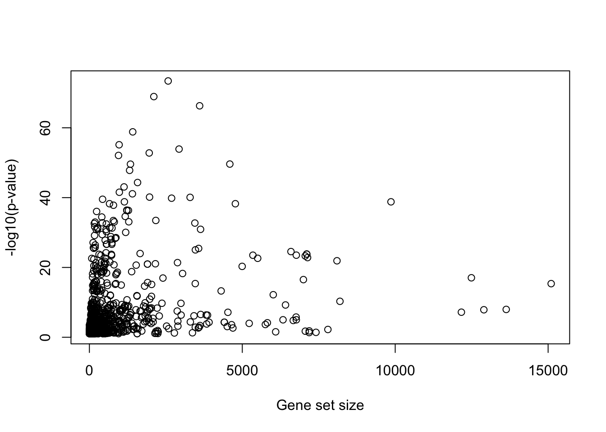

# Over-Representation Analysis

## Overview

Over-representation analysis (ORA) uses a simplified model for gene set
enrichment anlaysis. It directly works on the counts of genes in different categories,
i.e., whether genes are in the list of interest and whether genes are in the gene set.
Because of its simplicity, ORA is the mostly used method for gene set enrichment analysis.
In this chapter, we will introduce different tests for ORA and the implementations in R.
We will also point out the limitations of ORA of which users need to be careful when they
apply ORA on their datasets.

## What is over-representation?

In many cases, ORA is applied to a list of differentially expressed
genes, thus, to make readers read this chapter more naturally, we use
"differentially expressed genes" to represent the list of genes of interest. but please
keep in mind that the differential genes is just a special case of the gene list. In applications,
it can any kind of gene lists.

For a gene denoted as $G$, it has two attributes: whether it is differentially expressed
(DE) and whether it belongs to a gene set. The two relations can be represented in
a Venn Diagram (Figure \@ref(fig:ora_venn)). We denote $p_1$ as the
probability of $G$ being differentially expressed, and $p_2$ as the
probability of $G$ being in the gene set, then we have

$$ p_1 = n_{\mathrm{diff}}/n $$
$$ p_2 = n_{\mathrm{set}}/n $$


where $n_{\mathrm{diff}}$ is the number of DE genes, $n_{\mathrm{set}}$ is the
number of genes in the gene set, and $n$ is the total number of genes in the
study. Assume the two attributes of $G$ are independent, i.e., whether genes
are DE has no preference on whether genes are in the gene set, then the
expected number of DE genes also in the gene set is $n p_1 p_2$. Denote the
observed number of DE genes in the gene set as $m$, we can calculate a ratio $r =
m/n p_1 p_2$. If there are more observed genes in the gene set than expected,
i.e., $r > 1$, we say DE genes are over-represented in the gene set, or
identically, we can say genes in the gene set are over-represented in DE genes. And when $r < 1$, we say DE genes are down-represented
in the gene set.

A quick calculation shows

$$ r = \frac{m}{n p_1 p_2} = \frac{m n}{n_{\mathrm{diff}} n_{\mathrm{set}}} $$

We can look at the problem from a slightly different aspect. We treat $p_1$ which was previously defined as 
the "background probability" of a gene being DE. We also calculate the probability
of a genes being DE but only in the gene set,  which we term it as "foreground probability" and denote it as $p^\mathrm{fore}_1$:

$$ p^\mathrm{fore}_1 = m/n_{\mathrm{set}} $$

Then if the foreground probability is higher than background probability, i.e., $p^\mathrm{fore}_1 > p_1$ 
or $p^\mathrm{fore}_1 / p_1 > 1$, we can say DE genes are over-represented in the gene set. It is easy to see

$$ \frac{P'_1}{P_1} = \frac{m n}{n_{\mathrm{diff}} n_{\mathrm{set}}} $$.

Similarly, we can treat $p_2$ as the "background probability" of a genes being in the gene set, 
and we calculate the "foreground probability" of a gene being in the gene set, but only in the DE genes, denoted as $p^\mathrm{fore}_2$:

$$ p^\mathrm{fore}_2 = m/n_{\mathrm{diff}}$$

It is easy to see $p^\mathrm{fore}_2/p_2$ is identical to $p^\mathrm{fore}_1/p_1$


The score $r$ can be used to measures whether DE genes are
over-represented in a gene set, where a higher value of $r$ implies there is stronger
over-representation. Under the statistical procedures, we need to statistical test to calculate a p-value
for the over-representation to assign a "signficance level" for the enrichment.
Although $r$ is able to measure the over-representation, its distribution with analytical form is hard to obtain.
In the next section, we introduce the
specific distributions or statistical tests for calculating p-values. 


## Statistical tests

### Hypergeometric distribution


Hypergeometric distribution is a xxx for discrete events. We will first briefly introduce the
form of hypergenometric and then we map xxx to the ORA analysis.

The problem can be formulated as follows. Assume there are $N$ balls in a bag, where there are $K$ red balls, and 
$N - K$ blue balls. If randomly picking $n$ balls without replacement from there (once a ball is picked, it will be put back), what is the probability of having $k$ red balls out of $n$ balls?

Also we assume it is independent to pick any ball, then, we can have the following numbers:

- Total number of combinations of picking $n$ balls from the bag: $\binom{N}{n}$.
- Number of combinations of pick $k$ red balls from $K$ red balls: $\binom{K}{k}$.
- Number of combinations of picking $n-k$ blue balls from $N-K$ blue balls: $\binom{N-K}{n-k}$.

Since picking red balls and picking blue balls are independent, the number of combinations of picking $n$ balls which contain $k$ red
and $n-k$ blue balls is $\binom{K}{k} \binom{N-K}{n-k}$, and the probability denoted as $P_{\mathrm{hyper}}$ is calculated as:

$$ P_{\mathrm{hyper}} = \frac{\binom{K}{k} \binom{N-K}{n-k}}{\binom{N}{n}}$$.

Let's denote the number of red balls as a random variable $X$, then $X$ follows the hypergenometric distribution with parameters 
$N$, $K$ and $n$, written as $X \sim \mathrm{Hyper}(N, K, n)$.


Now we can map to ORA analysis. Before that, we use commonly used denotations in literatures.

|   | In the gene set  | Not in the gene set  |  Total   |
|---|---|---|----|
| DE genes| $n_{11}$ | $n_{12}$ |  $n_{1+}$ |
| Non-DE genes| $n_{21}$ | $n_{22}$ |  $n_{2+}$ |
| Total| $n_{+1}$ | $n_{+2}$ |  $n$ |

ORA basically has the same form as the ball problem. We just need to change the terms while the 
statistical model is unchanged. E.g. we change red balls to DE genes and blue balls to non-DE genes.
balls to pick is the genes in the gene set. The full map is in Table x.

|    |    |    |     |
|---|---|----|-----|
|Total balls | $N$ | Total genes | $n$ |
|  Red balls | $K$ | DE genes |  $n_{1+}$ |
| Blue balls | $N-K$ | non-DE genes | $n_{2+}$ |
| Balls to pick | $n$ | genes in gene set | $n_{+1}$ |
| Red balls that are picked | $k$ | DE genes in the gene set | $n_{11}$ |
| Blue balls that are picked | $n-k$ | non-DE genes in the gene set | $n_{21}$ |

Specifically for ORA, denote number of DE genes in a gene set as a random variable $X$, then

$$ X \sim \mathrm{Hyper}(n, n_{1+}, n_{+1}) $$

If $n_{11}$ is big, whether a gene id DE and whether a gene is in the gene set is highly dependent, or 
in other words, DE genes are over-represented in the gene set. For the random variable $X$, the p-value
is calculated as $Pr(X \geq n_{11})$ which is the probability of X no less than $n_{11}$. If the p-value is
very small, and we observed $X = n_{11}$, we can say, a rare event happens and the p-value is signficant.

$$ Pr( X >= n_11 ) = 1 - Pr(X < n_11) = 1 - \sum_{x \in {0, .., {n_11 - 1}}} p(x, n_{+1}, n_{1+}, n)$$

### Binomial distribution

When $n_{1+}$ or $n_{+1}$ or $n$ is large, the
hypergenometric distribution can be approximated to a Binomial test. Now we
need to change the question a little bit. Now we only look at the genes in the gene set.
In a gene set with $n_{+1}$ genes, each gene can be a DE genes with probabilty $p_{diff}$.
What is the probability of observing $n_{11}$ DE genes. First $p_{\mathrm{diff}}$ is estimated as

$$p_{\mathrm{diff}} = n_{1+}/n $$

The probelm can be thought as pick ball $n_{+1}$ times, the number of picking $n_{11}$ balls is $\binom{n_{+1}}{n_{11}}$.
The probability of all $n_{11}$ balls are all DE is $p_{\mathrm{diff}}^{n_{11}}$ and the other $n_{+1} - n_{11}$ balls 
are not DE is $(1-p_{\mathrm{diff}})^{n_{+1} - n_{11}}$, then the final probability is

$$ p =  \binom{n_{+1}}{n_{11}} p_{\mathrm{diff}}^{n_{11}} (1-p_{\mathrm{diff}})^{n_{+1} - n_{11}} $$

If again, denote the number of DE genes in the gene set as a random variable $X$, then $X \sim \mathrm{Binom}(n_{+1}, p_{\mathrm{diff}})$.

And p-value is calculated as $Pr(X \geq n_{11})$.

We can also do in other other direction, we look at DE genes and each gene has a probability being in the gene set.

$$p_{\mathrm{set}} = n_{+1}/n$$

And approximatedly, $X \sim \mathrm{Binom}(n_{1+}, p_{\mathrm{set}})$. But note, the two p-values are not identical.


### z-test

Let's look back Table xx, if the two events "genes are DE" and "gene is in the gene set" are independent, then the probability
of a gene being DE in the gene set should be identical to the probability of a gene being DE not in the gene set, which are
the following two probabilities:

$$ p_1 = n_{11}/n_{+1} $$
$$ P_2 = n_{12}/n_{+2} $$

For genes in the gene set, number of DE genes actually follow a Binomilal distribution $\mathrm{Binom}(n_{+1}, p_1)$,
and for genes not in the gene set, number of DE genes also follow a Binomial distribution: $\mathrm{Binom}(n_{+2}, p_2)$.
Now the problem is to test whether the two Binomial distribution is idential. The null hypothesis is $p_1 = p_2$, then
when $n_{+1}$ and $n_{+2}$ are large, the following z-score:

$$z = \frac{p_1 - p_2}{\sqrt{p(1-p)} \sqrt{\frac{1}{n_{1+}} + \frac{1}{n_{2+}}}}$$

where $p = \frac{n_{11}+n_{12}}{n_{+1} + n_{+2}} = \frac{n_{1+}}{n}$. $z$ follows a standard normal distribution $N(0,1)$.

It easy to see the test is idential is $p_1$ and $p_2$ are calculated as the probabilities of a genes being in 
the gene set, for DE genes and non-DE genes.


### Fisher's exact test

Fisher's exact test can be used to 

### Chi-square test

Pearson's Chi-square test can also be applied to test whether there are dependencies on categorized data. The Chi-square
statistic measures the relative sum of squares of the difference between observed values and expected in categories:

$$ \chi^2 = \sum_i \frac{ (O_i - E_i)^2 }{E_i} $$

where $O_i$ is the observed value in category $i$ and $E_i$ is the expected value in category $i$.

If we apply it to the 2x2 contigency table, actually the data is splt into four non-intersected categories, DE/set, DE/not in set, 
non-DE/in set and non-DE/not in set. Let's take the first category, e.g. genes are DE and also in the set,
the observed value is simply $n_{11}$. The expected value is $n p_{1+} p_{+1}$ which assumes whether a gene
is DE and whether a gene is in the set is independent, where $p_{1+} = n_{1+}/n$ and $p_{+1} = n_{+1}/n$. And if
we write all four categories, we have

$$ \chi^2 = \sum_{i=1}^2 \sum_{j=1}^2 \frac{(n_{ij} - n p_{i+} p_{+j})^2}{n p_{i+} p_{+j}} $$

where $p_{i+} = n_{i+}/n$ and $p_{+j} = n_{+j}/n$.

If $n$ is large, the $\chi^2$ statistic can be approximated as followinng $\chi^2$ distribution with degree of freedom of 1.

Simply calcus reveals that the value of the $\chi^2$ is the square of the z-statistic.

## Calculate in R

To demonstrate the different distributions and tests, we use a data fro EBI Altas database
with accession ID E-GEOD-101794. In the difffernetial expression analysis, there are 968 
egnes that are differential under cutoff FDR < 0.05, and total number of genes are 38592, we 
use the gene set named "HALLMARK_KRAS_SIGNALING_DN" fro MsigDb database which contains 200 genes.
The 2x2 contigency table is as follows

|     | In the gene set | Not in the gene set |    Total |
|-----|-----------------|---------------------|----------|
| DE  |   14            |       954           |     968  |
|Noe DE |    186        |       37438         |    37624 |
|Total|    200          |       38392         |    38592 |

The function `phyper()` calculates the p-value from hypergeometric distribution. The usage of
`phyer()` is:

```r
phyper(q, m, n, k)
```

In ORA, `q` is the number of differnetial genes in the gene set, `m` is the size of the gene set,
`n` is the number of genes not in the gene set, `k` is the number of differnetial genes. since the hypergeometric can also be calcualted from the other dimension, `m` can be the number of differneital genes, `n` is the number of non-diff genes and `k` is the number of genes in the gene set.

By default `phyper()` calculates the probabilty of Pr(X <= q)


```r
1 - phyper(14 - 1, 200, 38392, 968)
# [1] 0.0005686084
```

Note it is the same as 


```r
phyper(14 - 1, 200, 38392, 968, lower.tail = FALSE)
# [1] 0.0005686084
```


```r
1 - phyper(14 - 1, 968, 37624, 200)
# [1] 0.0005686084
```

P-value from Binominal distribution can be calcualted with the function `pbinom()`. The usage is

```r
pbinom(q, size, prob)
```


```r
1 - pbinom(14 - 1, 200, 968/38592)
# [1] 0.0005919725
```


```r
1 - pbinom(14 - 1, 968, 200/38592)
# [1] 0.0006924557
```


To calculate the z-test, we first calculate p1 and p2


```r
p1 = 14/200
p2 = 954/38392
p = 968/38592

z = abs(p1 - p2)/sqrt(p * (1-p))/sqrt(1/200 + 1/38392)
```

Since z follows a standard normal distribution, we can use `pnorm()` to calcualte p-value:


```r
2*pnorm(z, lower.tail = FALSE)
# [1] 4.647219e-05
```

We can also try to calculate the p-valeu from other other direction. similarly, 


```r
p1 = 14/968
p2 = 186/37624
p = 200/38592

z = abs(p1 - p2)/sqrt(p * (1-p))/sqrt(1/968 + 1/37624)
2*pnorm(z, lower.tail = FALSE)
# [1] 4.647219e-05
```

The two p-values are identical.


Fisher's exact test can be directly performed by the function `fisher.test()`. The input is the 2x2 contigency table without the margins.


```r
cm = matrix(c(14, 186, 954, 37438), nrow = 2)
cm
#      [,1]  [,2]
# [1,]   14   954
# [2,]  186 37438
fisher.test(cm)
# 
# 	Fisher's Exact Test for Count Data
# 
# data:  cm
# p-value = 0.0005686
# alternative hypothesis: true odds ratio is not equal to 1
# 95 percent confidence interval:
#  1.577790 5.106564
# sample estimates:
# odds ratio 
#   2.953612
```

`fisher.test()` generates many other results, here the odd ratio is the statistic of fisher exact test. The odd ratio is defined as

$$ \mathrm{odd ratio} = \frac{n_{11}}{n_{21}} / \frac{n_{11}}{n_{22}} = \frac{n_{11}n_{22}}{n_{12}n_{21}} $$

which is the ratio of fraction of DE in the gene set and not in the gene set. If odd ratio is larger than 1, over-representation.

Last, the Chi-square test can be applied with the function `chisq.test()`. Similarly the input is the 2x2 contigency table without the margins. Note here we also set `correct = FALSE` so that ...


```r
chisq.test(cm, correct = FALSE)
# 
# 	Pearson's Chi-squared test
# 
# data:  cm
# X-squared = 16.587, df = 1, p-value = 4.647e-05
```


```r
z^2
# [1] 16.58685
```

Since there are several ways to perform the test, it would be interesting to test which method runs faster.


```r
library(microbenchmark)

microbenchmark(
    hyper = 1 - phyper(13, 200, 38392, 968),
    fisher = fisher.test(cm),
    binom = 1 - pbinom(13, 968, 200/38592),
    chisq = chisq.test(cm, correct = FALSE),
    ztest = {
        p1 = 14/200
        p2 = 954/38392
        p = 968/38592

        z = abs(p1 - p2)/sqrt(p*(1-p))/sqrt(1/200 + 1/38392)
        2*pnorm(z, lower.tail = FALSE)
    },
    times = 1000
)
# Unit: nanoseconds
#    expr    min       lq       mean   median       uq     max neval
#   hyper   1031   1516.0   2329.873   2260.0   2732.5   19968  1000
#  fisher 540446 598454.5 758361.569 673342.0 766916.0 9210045  1000
#   binom    892   1378.0   2464.715   2211.5   2911.5   17332  1000
#   chisq  41682  54386.5  65848.841  60956.5  72679.0  220583  1000
#   ztest   1972   3069.5   4950.159   4497.0   5584.0   47668  1000
```

We can see from the benchmark result, hypergeometric and bionimal distribution-based method are the fastest. As a comparison,
Chi-square test and fisher's method run slow, especially for fisher's exact method. The reason is the latter two also include
many other calculations besides p-values. This benchmark results actually tells us, if in the future readers want to implement 
ORA analysis by their own, hypergeometric and bimonial methods should be considered firstly.

|   Method | p-value |
|----------|---------|
| Hypergeometric distribution | 0.0005686 (exact p-value) |
| Fisher's exact test |  0.0005686 (exact p-value) |
| Binomial distribution | 0.0005920 / 0.0006924 |
| z-test | 0.0000465 |
| Chi-square test | 0.0000465 |


## Current tools

There are many tools that implement ORA analysis compared to other gene set enrichment analysis tools which will
introduced in later chapters, mainly because it runs fast, the method is simply to understand. All most all the ORA
web-based tools are in a two-step analysis. 1. upload the gene lists and setting parameters and 2. see the results. 
In this section, we will go through three web-based ORA tools, as well as one Bioconductor package.


```r
load("data/demo_ora.RData")
```


```r
library(clusterProfiler)
```

**You need to make sure the gene IDs are Entrez IDs.** The following function
helps to automatically convert gene IDs to Entrez IDs. The input can be a vector
of genes or a gene expression matrix.


We convert the diff genes `diff_gene` to Entrez IDs. Note some genes are lost 
due to the conversion.


```r
head(diff_gene)
# [1] "FGR"    "NIPAL3" "LAP3"   "CASP10"
diff_gene = convert_to_entrez_id(diff_gene)
# testing org.Hs.egENSEMBL...
# testing org.Hs.egREFSEQ...
# testing org.Hs.egSYMBOL...
#   gene id might be SYMBOL (p = 1.000)
head(diff_gene)
# [1] "2268"  "57185" "51056" "843"
length(diff_gene)
# [1] 963
```

Next we perform ORA on different gene sets

1. GO enrichment


```r
library(org.Hs.eg.db)
tb = enrichGO(gene = diff_gene, ont = "BP", OrgDb = org.Hs.eg.db)
head(tb)
#                    ID                   Description GeneRatio   BgRatio
# GO:0006959 GO:0006959       humoral immune response    70/849 317/18800
# GO:0002443 GO:0002443   leukocyte mediated immunity    80/849 457/18800
# GO:0002253 GO:0002253 activation of immune response    73/849 386/18800
# GO:0006909 GO:0006909                  phagocytosis    65/849 310/18800
#                  pvalue     p.adjust       qvalue
# GO:0006959 3.286195e-29 1.664786e-25 1.327969e-25
# GO:0002443 4.867621e-26 9.919090e-23 7.912271e-23
# GO:0002253 5.873918e-26 9.919090e-23 7.912271e-23
# GO:0006909 7.862052e-26 9.957289e-23 7.942741e-23
#                                                                                      geneID
# GO:0006959 6556/729/2920/2219/4069/54209/730249/6347/3458/5967/729230/722/725/5266/6590/5..
# GO:0002443 2268/4843/7305/57823/729/50943/7037/3383/54209/50487/51311/10312/57379/10384/8..
# GO:0002253 2268/7305/11119/729/50943/2219/58484/54209/3055/80381/10384/2633/8013/722/725/..
# GO:0006909 2268/23221/7305/6556/2219/54209/10326/3055/1089/6347/3458/4688/729230/722/725/..
#            Count
# GO:0006959    70
# GO:0002443    80
# GO:0002253    73
# GO:0006909    65
```

2. KEGG enrichment


```r
tb = enrichKEGG(gene = diff_gene, organism = "hsa")
head(tb)
#                ID                                                   Description
# hsa04060 hsa04060                        Cytokine-cytokine receptor interaction
# hsa04061 hsa04061 Viral protein interaction with cytokine and cytokine receptor
# hsa04657 hsa04657                                       IL-17 signaling pathway
# hsa04380 hsa04380                                    Osteoclast differentiation
#          GeneRatio  BgRatio       pvalue     p.adjust       qvalue
# hsa04060    50/444 295/8163 2.729086e-13 8.432876e-11 7.382896e-11
# hsa04061    27/444 100/8163 1.587721e-12 2.453029e-10 2.147601e-10
# hsa04657    25/444  94/8163 1.564758e-11 1.611701e-09 1.411027e-09
# hsa04380    29/444 128/8163 2.724722e-11 2.104848e-09 1.842773e-09
#                                                                                    geneID
# hsa04060 53832/608/2920/3595/3589/5008/1440/6354/6347/55801/3458/3552/7850/9173/8809/88..
# hsa04061 53832/2920/6354/6347/8809/8807/729230/6372/51554/3569/4283/56477/3577/2921/637..
# hsa04657 5743/2920/1440/6354/6347/3458/727897/6372/3553/2354/3569/4322/6279/3934/4314/6..
# hsa04380 7305/54209/10326/54/11024/3458/3552/6772/2274/4688/8503/3553/2354/10288/7006/2..
#          Count
# hsa04060    50
# hsa04061    27
# hsa04657    25
# hsa04380    29
```
3. Reactome enrichment


```r
library(ReactomePA)
tb = enrichPathway(gene = diff_gene)
head(tb)
#                          ID                         Description GeneRatio
# R-HSA-6798695 R-HSA-6798695            Neutrophil degranulation    72/591
# R-HSA-6783783 R-HSA-6783783            Interleukin-10 signaling    21/591
# R-HSA-380108   R-HSA-380108 Chemokine receptors bind chemokines    22/591
# R-HSA-449147   R-HSA-449147           Signaling by Interleukins    64/591
#                 BgRatio       pvalue     p.adjust       qvalue
# R-HSA-6798695 482/10891 1.650320e-15 1.823604e-12 1.735442e-12
# R-HSA-6783783  47/10891 6.254910e-15 3.455838e-12 3.288766e-12
# R-HSA-380108   59/10891 1.330760e-13 4.901632e-11 4.664664e-11
# R-HSA-449147  473/10891 6.856512e-12 1.894111e-09 1.802541e-09
#                                                                                         geneID
# R-HSA-6798695 2268/64386/5329/7305/55/6556/2219/4680/4069/5836/10326/10562/3614/10493/10312/..
# R-HSA-6783783 5743/2920/3383/7076/1440/6347/942/3552/7850/729230/3553/3569/3557/2919/3627/57..
# R-HSA-380108  2920/6354/6347/729230/6372/51554/4283/56477/58191/3577/2921/6374/5196/2919/362..
# R-HSA-449147  4843/53832/3082/6196/5743/2920/3595/3383/3589/5008/3055/7076/1440/6347/595/558..
#               Count
# R-HSA-6798695    72
# R-HSA-6783783    21
# R-HSA-380108     22
# R-HSA-449147     64
```
4. DO enrichment


```r
library(DOSE)
tb = enrichDO(gene = diff_gene, ont = "DO")
head(tb)
#                  ID         Description GeneRatio  BgRatio       pvalue
# DOID:403   DOID:403       mouth disease    52/504 188/8007 9.623979e-21
# DOID:3388 DOID:3388 periodontal disease    44/504 139/8007 3.169110e-20
# DOID:1091 DOID:1091       tooth disease    47/504 162/8007 8.987014e-20
# DOID:850   DOID:850        lung disease    85/504 499/8007 3.419382e-18
#               p.adjust       qvalue
# DOID:403  7.574072e-18 3.717895e-18
# DOID:3388 1.247045e-17 6.121386e-18
# DOID:1091 2.357593e-17 1.157275e-17
# DOID:850  6.727633e-16 3.302403e-16
#                                                                                     geneID
# DOID:403  4843/6401/3082/50943/5743/3595/5243/4069/3589/5008/7076/4210/5054/9126/6354/63..
# DOID:3388 4843/6401/3082/50943/5743/3595/5243/4069/3589/5008/7076/5054/9126/6354/6347/34..
# DOID:1091 4843/6401/3082/50943/5743/3595/5243/4069/3589/5008/7076/5054/9126/6354/6347/54..
# DOID:850  4843/5329/6556/3082/50943/5743/3383/3589/3055/5054/6347/374/595/7450/59341/345..
#           Count
# DOID:403     52
# DOID:3388    44
# DOID:1091    47
# DOID:850     85
```

5. MSigDB enrichment

There is no built-in function specific for MSigDB gene sets, but there is a universal function `enrichr()` which accepts
manually-specified gene sets. The gene sets object is simply a two-column data frame:

- the first column is the gene set ID
- the second column is the gene ID


```r
library(msigdbr)
gene_sets = msigdbr(category = "H")
map = gene_sets[, c("gs_name", "entrez_gene")]

tb = enricher(gene = diff_gene, TERM2GENE = map)
head(tb)
#                                                                    ID
# HALLMARK_INTERFERON_GAMMA_RESPONSE HALLMARK_INTERFERON_GAMMA_RESPONSE
# HALLMARK_INFLAMMATORY_RESPONSE         HALLMARK_INFLAMMATORY_RESPONSE
# HALLMARK_INTERFERON_ALPHA_RESPONSE HALLMARK_INTERFERON_ALPHA_RESPONSE
# HALLMARK_TNFA_SIGNALING_VIA_NFKB     HALLMARK_TNFA_SIGNALING_VIA_NFKB
#                                                           Description GeneRatio
# HALLMARK_INTERFERON_GAMMA_RESPONSE HALLMARK_INTERFERON_GAMMA_RESPONSE    55/348
# HALLMARK_INFLAMMATORY_RESPONSE         HALLMARK_INFLAMMATORY_RESPONSE    54/348
# HALLMARK_INTERFERON_ALPHA_RESPONSE HALLMARK_INTERFERON_ALPHA_RESPONSE    33/348
# HALLMARK_TNFA_SIGNALING_VIA_NFKB     HALLMARK_TNFA_SIGNALING_VIA_NFKB    49/348
#                                     BgRatio       pvalue     p.adjust
# HALLMARK_INTERFERON_GAMMA_RESPONSE 200/4383 1.471098e-17 6.914161e-16
# HALLMARK_INFLAMMATORY_RESPONSE     200/4383 7.383369e-17 1.735092e-15
# HALLMARK_INTERFERON_ALPHA_RESPONSE  97/4383 9.355985e-14 1.465771e-12
# HALLMARK_TNFA_SIGNALING_VIA_NFKB   200/4383 1.524722e-13 1.791549e-12
#                                          qvalue
# HALLMARK_INTERFERON_GAMMA_RESPONSE 5.264982e-16
# HALLMARK_INFLAMMATORY_RESPONSE     1.321234e-15
# HALLMARK_INTERFERON_ALPHA_RESPONSE 1.116153e-12
# HALLMARK_TNFA_SIGNALING_VIA_NFKB   1.364225e-12
#                                                                                                              geneID
# HALLMARK_INTERFERON_GAMMA_RESPONSE 51056/57823/10797/3430/5743/3383/10135/6354/6347/6648/942/6772/29126/7130/8103..
# HALLMARK_INFLAMMATORY_RESPONSE     6401/5329/2769/490/3383/5008/7076/4210/366/3249/6324/10135/3696/5054/1440/6354..
# HALLMARK_INTERFERON_ALPHA_RESPONSE 51056/3430/135112/3659/6737/94240/8638/10906/2766/834/10561/83666/7453/10410/8..
# HALLMARK_TNFA_SIGNALING_VIA_NFKB   5329/490/5743/2920/3383/10135/5054/6347/374/595/6648/1839/3552/5341/8013/1958/..
#                                    Count
# HALLMARK_INTERFERON_GAMMA_RESPONSE    55
# HALLMARK_INFLAMMATORY_RESPONSE        54
# HALLMARK_INTERFERON_ALPHA_RESPONSE    33
# HALLMARK_TNFA_SIGNALING_VIA_NFKB      49
```


## Limitations of ORA

ORA analysis is simply and it runs fast. Thus, currently, there are many online tools support it. However, there are many limiations.

### different tools generate inconsistent results

There are a lot of tools, but using the same gene set database, results from tools
normally do not agree very well. The reasons are:

1. Different versions of annotation databases.
2. How they process redundant terms
3. Different default cutoffs
4. Different methodd for control p-values
5. differnet background genes.

### sensitive to the selection of background genes.

Genome / all protein-coding gene / all genes measured?
The selection mainly affects the value in the blue cells.
Note the ORA actually compares diff gene in the set to the ‘other gene’, and we actually assume ‘other genes’ are not diff nor in the set, thus, “other genes” are not useless.
Select a “large” background may increase false positives.
Select a “small” background may miss some positives, but it has low false positives.
Also some arguments: If genes are not measured, they should not be put into the analysis.


```r
1 - phyper(13, 200, 38392, 968)
# [1] 0.0005686084
1 - phyper(13, 200, 38392 - 10000, 968)
# [1] 0.008444096
1 - phyper(13, 200, 38392 - 20000, 968)
# [1] 0.1606062
1 - phyper(13, 200, 38392 + 10000, 968)
# [1] 5.473547e-05
1 - phyper(13, 200, 38392 + 20000, 968)
# [1] 7.140953e-06
```

In general, with larger background set, the p-value becomes significant. ORA 


### Preference of larger gene sets

There is a trend that large gene sets may have more significant p-values. 
This is actually expected because as the sample size increases, the test power also increases. Under the context of hypergeometric test or Binomial test, number of genes is the “sample size”.


```r
1 - pbinom(52, 100, 0.5)
# [1] 0.3086497
1 - pbinom(52, 1000, 0.5)
# [1] 1
1 - pbinom(52, 10000, 0.5)
# [1] 1
```


```r
tb = read.table("data/david_result.txt", sep = "\t", header = TRUE)
plot(tb$Pop.Hits, -log10(tb$PValue), xlab = "Gene set size", ylab = "-log10(p-value)")
```




### Imbalanced contigency table

In real-world scenario, as show in xx. There are many gene sets with small number of genes,
which makes the 2x2 contigency imbalanced.


```r
library(grid)
grid.newpage()
pushViewport(viewport(x = 0, width = 0.5, just = "left"))
pushViewport(viewport(xscale = c(-1.5, 1.5), yscale = c(-1.5, 1.5), width = 0.9, height = 0.9))
grid.rect()
grid.circle(x = -0.4, y = 0, r = 1, default.units = "native")
grid.circle(x = 0.4, y = 0, r = 1, default.units = "native")
grid.text("gene set", x = -0.5, y = -1.1, just = "top", default.units = "native")
grid.text("DE genes", x = 0.5, y = -1.1, just = "top", default.units = "native")
grid.text("Theretical", x = -1.4, y = 1.4, default.units = "native", just = c("left", "top"))
popViewport()
popViewport()

pushViewport(viewport(x = 0.5, width = 0.5, just = "left"))
pushViewport(viewport(xscale = c(-1.5, 1.5), yscale = c(-1.5, 1.5), width = 0.9, height = 0.9))
grid.rect()
grid.circle(x = -0.75, y = 0, r = 0.3, default.units = "native")
grid.circle(x = 0.3, y = 0, r = 1.2, default.units = "native")
grid.text("gene set", x = -0.8, y = -1.1, just = "top", default.units = "native")
grid.text("DE genes", x = 0.9, y = -1.1, just = "top", default.units = "native")
grid.text("Real-world", x = -1.4, y = 1.4, default.units = "native", just = c("left", "top"))
popViewport()
popViewport()
```


In many cases when the gene set is small, the enrichment anlaysis will be sensitive to the value of number of 
DE genes in the gene set, i.e., the valeu of $n_{11}$. 


```r
1 - phyper(13, 200, 38392, 968)
# [1] 0.0005686084
1 - phyper(13 - 3, 200, 38392, 968)
# [1] 0.01263274
1 - phyper(13 + 3, 200, 38392, 968)
# [1] 1.35041e-05
```

In DE analysis, normally we set a cutoff of adjusted p-values for filter the significant DE genes, since
the p-values are sensitive to $n_{11}$, actually xxx

### Theoretical reasons

1. the assumption 
