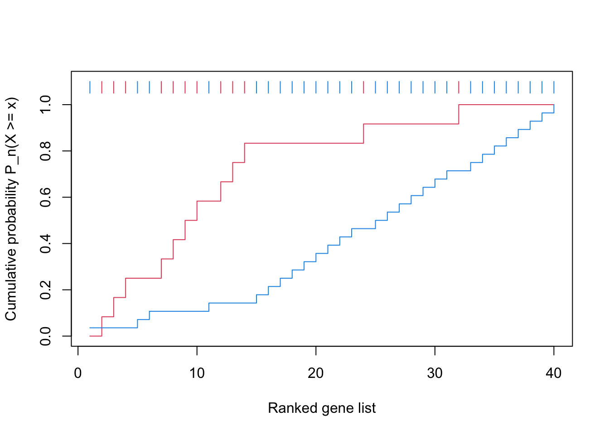
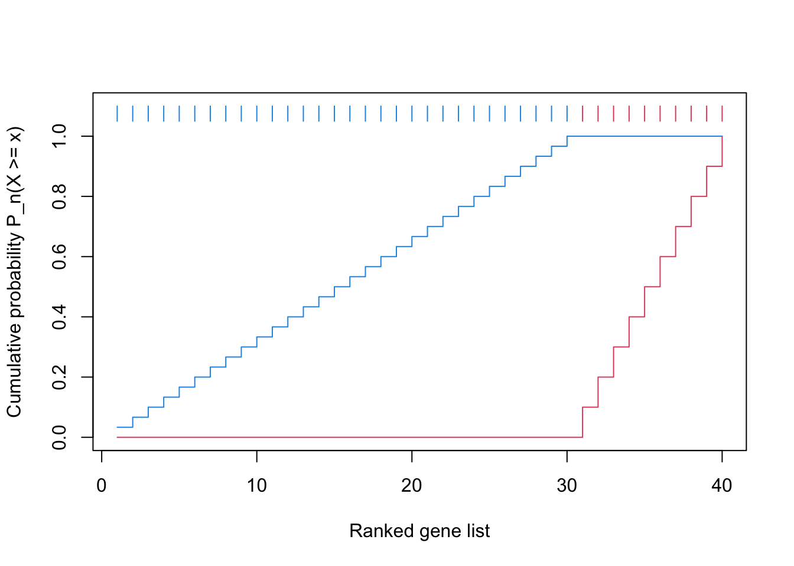
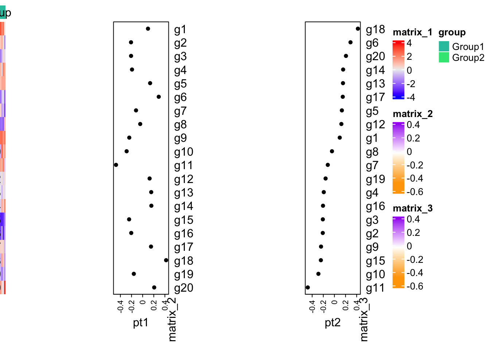
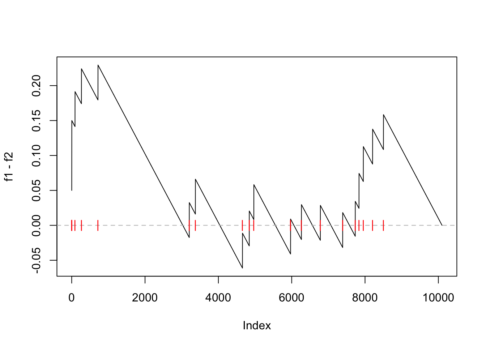
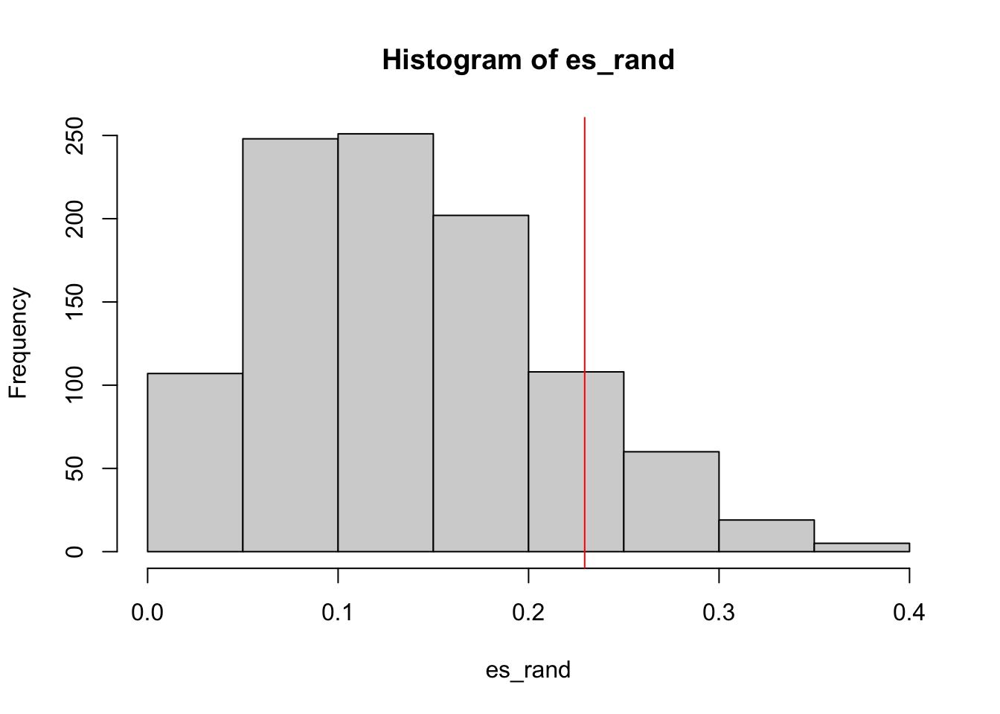
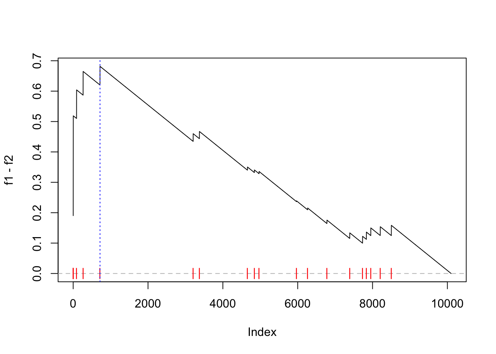
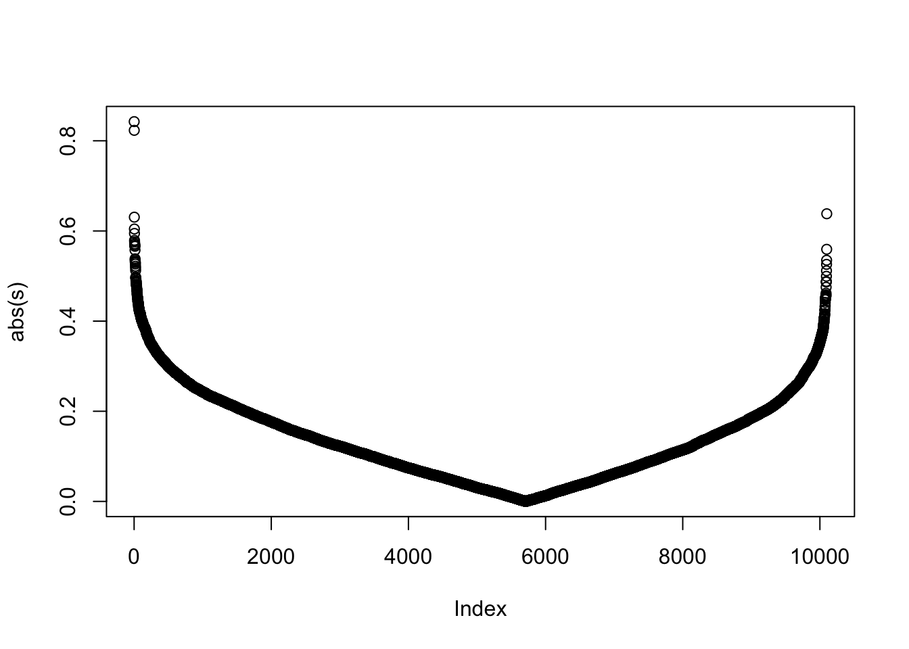

# The GSEA method


## Overview

The tool GSEA is the mostly used for gene set enrichment analysis. In a study, genes are very moderate change,
that after filter by p-values from DE anlaysis, no signficant genes are left. Thus ORA anlaysis cannot be applied to it. 
Mootha developed a new method which takes all genes in to consideration and test teh significance of gene sets by evaluating the 
accumulated effect of genes' diffenetial expression. It successfully xxx . In this chapter xxx

## The GSEA method, version one

ORA analysis actually applies a binary conversion on genes where genes pass the cutoff are set as 1 and others are set as 0. This
binary transformation over-simplifies the problem and a lot of information are lost, e.g. the differential expression, and 
genes around the cutoff can be optionally set to 1 or 0 by object choise of cutoffs.

The GSEA method was first proposed in 2003. Authors worked on a dataset where all genes only had intermediate expression change,
where with normal differential gene expression methods, there is no significant gene left under normal cutoffs, thus 
ORA analysis is impossible to perform. Mootha developed a new method named GSEA which convert genes to the rank of the differential
expression. Compared to ORA, GSEA v1 can distingush the differnet expression changes.


```
ORA, differenital expression -> 1111100000
GSEA   -> 1 2 3 4 5 6 ...
```

## GSEA v1, step 1

To make is simply to discuss, we assume the expression data is from a two-condition comparison, e.g. tumor vs normal or treatment vs control.
We assume there are repeated samples in both conditions. The first step of GSEA is to reduce the original matrix to gene-level scores,, i.e. for a row with m1+m2 values,
reduce it to a single value which measures the differnetial expression in the conditions. In GSEA, it proposed to use the signial to noise ratio ($(\mu_1 - \mu_2)/(\sigma_1 + \sigma_2)$
which actually does not taken account of the sample size. However, larger S2N absolute value, the more differential the gene is expressed.

After obtaining the gene-level score, a rank transformation is applied which is applied to the gene-level scores. all genes are sorted from the highest
to the lowest to form a sorted gene list.

## GSAE v1, step 2

With the sorted gene list, for a specific gene set, an enrichment score can be calculated. The genes in the ranked list are put into two groups, in the gene set
and not in the gene set. Denote there are total $n$ genes, $n_k$ is the number of genes in the gene set and $p$ is a certain position in the ranked list. For 
genes in the gene set, we calcualte the fraction denoted as $F_{1p}$ at the position $p$:

$$ F_{1p} = \frac{1}{n_k}\sum_{i=1}^p I(g_i \in G) $$

where $I()$ is a identify function, $g_i$ is the gene at position $i$ and $G$ is the set of genes in the gene set. Similarly, for genes not in the gene set, we calculate a second fraction denoted as $F_{2p}$
at position $p$:

$$ F_{2p} = \frac{1}{n - n_k}\sum_{i=1}^p I(g_i \notin G) $$

As can be seen, $F_{1p}$ and $F_{2p}$ are actually the cummulative probability of genes in the two sets. Then at position $p$, the difference at the two cummulative probalibyy is
calculated, and the maximal difference is defined as the enrichmetn score (ES):

$$ ES = max_{p \in {1..n}} (F_{1p} - F{2p}) $$


According to the definition, actaully the ES is exactly teh Kolmogorov-Smirnov statistic and use for test whether two CDFs are the same. Till now, since ES is a statistic
with known sources, the p-value can be directly from the KS test. However, KS test is not a powerful test and in the orignal paper, which will also be demonstrated later, 
the null hypothesis is constructed via permuation-based test.

According to the definition, ES is actaully directional, which is always non-negative. When ES score is large, the gene sets are more enriched on the top of the ranked gene list, which shows higher expression in group 1, if we assume positive different means high expression in group 1. To obtain the down-regulation, the denifition of ES can be changed a little bit:

$$ ES_{down} = min_{p \in {1..n}} (F_{1p} - F{2p}) $$


In this case, $ES_{down}$ is non-positive and a larger absolute value mean s...

To capture both the two directional change, 

$$ k = argmax_p(|F_{1p} - F_{2p}|) $$
$$ ES_{bidirectional} = |F_{1k} - F_{2k}| or$$

## Permutation-based test

Once we have the definition of the ES statistic which measures differential expression for genes in a gene set, we need a null hypothesis distribution of ES to calculate p-values.
KS-test can be directly used to calcualte p-values, but here GSEA uses a more robust way to construct the null distribution of ES by sample permutation.

In the two-contidional data, if genes in the gene set are differneital expressed to the conditions, we can say the gene expression relates to the condition. A randomly case, is 
the gene expression is independent to the conditions and with the observed value we want to reject the null hypothesis. Since the input matris is normally complex, and unlike the
the t-test which can have a anatical form with the normality assumption, to obtain a analytical form of ES is difficult. However, to destroy the relation of gene expression
and conditions, a simple but power way is to random sample the sample labels or the condition labels. If fixed the matrix, but random assign the xx of which same is group 1 and which
samle is group 2. In this rando setting, it actally means the gene expression has no relation to the condition because the conditions are randomly assigned. The permuation is
a random assignment process which randomly shuffle the xxx of labels, but keeps the number of samples in the two groups unchanged. 

sample permutation can be simply done with the `sample()` function. Assume we have a condition desigh with 10 samples of 5 group A and 5 group B:


```r
cmp = rep(c("A", "B"), each = 5)
sample(cmp, length(cmp))
#  [1] "B" "A" "B" "A" "A" "B" "B" "B" "A" "A"
```

Each sample permutation generates a new experimental design where the condition is independent to gene expression, thus a ES can be calculated with step 1 and 2. teh sample permutation
will be execulted to a large number of times to gain enough "random" ES for form the null distribution. The number of permulations normally is large and it is recommended to not less than 1000. The null distribution of ES is from the random ES scores and p-value is defined as the probability of ES being euqla to or larger than the observed one:


The p-value can be easily calculated as:

$$ p = \frac{1}{K}\sum I(ES_r \geq ES) $$

Sample permutation is a powerful and a general way in statistics. In Chapter xx, we will demonstrate it is used to construct a non-parametric null distribution for any kind of gene set level statistics. Also in Chapter x, we will also introduce permuation data by genes.

## The GSEA method, version 2

The first version of GSEA successfully discovered affected biological functions that show moderate expression chagnes. However, in a study, reseachers pointed
several limitations of the algorithm. The main argument is under the GSEA algorithm, although it can distinguish the different levels of differential expression,
genes have equal distance to neighbouring genes in the ranked list, and there are the following two consiquences:

1. genes with higher differnetial expression are more important
2. genes in the middle of hte gene list are normally have very small change or even no change. However, an assumulation in the middle can also cause an enrichment.

Due to the gene-level score is not an uniform distribution while xxx, In 2005, Subrammian imporved the GSEA algorithm by taking the gene-level score as the weight, 
in this case, the differential genes are enhanced and genes with weak differneital expression are suppressed. And it forms the current standard GSEA algorithm.

Recall how we define $F_{1p}$ and $F_{2p}$. The new GSEA changes the definition of $F_{1p}$ as:

$$ F_{1p} = \frac{1}{n_r}\sum_{i=1}^p I(g_i \in G) \cdot |r_j|^a $$
$$ where n_r = \sum_{i=1}^n I(g_i \in G) \cdot |r_j|^a $$

Note $F_{2p}$ for the genes not in the genes is unchanged. The power $a$ reflects the importance of the differential expression. By default, GSEA set $a = 1$. When
$a = 0$, it reduces to the original version of GSEA.

Similarlly the ES score is the same as in the origial version, for the one-directional or two-directinoal.

Now the form of ES is changed, thus, it becomes the so-called "weighted KS statistics". It is difficult to perform the test. Again, we perform the sample-permutation
that in every permutations, the new ES score is calclated .

## Compare the two GSEA

It would be interesting to compare the two versions of GSEA to see how the weight helps to xxx and also the power of the test. 

## Permutations

To construct the null distribution, we introduced to randonly suffle samples to break the relation of xxx. There is actually a second way to construct "random dataset"
by gene permutation, which randomly shuffle the genes or identially, randoly shuffle whether genes is in the gene set or not. This is a way to break the relation of differnetial expression
and the xx of genes in the gene sets. If assume most of the genes are not differneitally expressed, the the randomized gene sets will mostly not show differneital expression.
In sample permutation, the gene-level scores need to be calculated in every permutatin, as a comparison, in gene permutation, the gene-level scores can only
be calculated once and can be repeated used. In some of current tools which implements GSEA algorithm, teh null distribution is generated by gene permutation. Without
going to deep, we wold like to mention, the two permutation methods, although they all produce ramdom dataset, they correspond to two complete different things. and with
some specific datasets, the two xxx may give complete different p-values (or conclusions)

## Other aspects of GSEA

### The direction of GSEA

### Leading edge genes

### Normalized enrichment score

Because teh enrichment score is averaged from all genes in a gene set, in general, large significant gene sets may only have a small ES scores. Thus, the ES cannot reflect
the degree of the enrichment and cannot be compariable between gene sets. The normalized 

## Compare ORA and GSEA

Since ORA and GSEA are the mostly used methods for gene set enrichmetn anlaysis, it would be interesting to apply the two methods on a same dataset to compare xxx


```r
x = 1:40
gs = c(F, T, T, T, F, F, T, T, T, T, F, T, T, T, F, F, F, F, F, F, F, F, F, T, F, F, F, F, F, F, F, T, F, F, F, F, F, F, F, F)


gsea_cdf = function(x, gs, ...) {
	f1 = cumsum(gs)/sum(gs)

	f2 = cumsum(!gs)/sum(!gs)

	n = length(x)
	plot(1:n, f1, type = "s", col = 2, ylim = c(0, 1.1),
		xlab = "Ranked gene list", ylab = "Cumulative probability P_n(X >= x)", ...)
	lines(1:n, f2, type = "s", col = 4)

	segments(1:n, 1.05, 1:n, 1.1, col = ifelse(gs, 2, 4))
}

gsea_cdf(x, gs)
```



```r

gs = c(rep(T, 10), rep(F, 30))
gsea_cdf(x, gs)
```


```r

gs = c(rep(F, 30), rep(T, 10))
gsea_cdf(x, gs)
```



```r

gs = sample(c(T, F), 40, replace = TRUE)
gsea_cdf(x, gs)
```


```r
set.seed(54)
mean_diff1 = rnorm(20)

m1 = do.call(rbind, lapply(1:20, function(i) {
	c(rnorm(10, mean = mean_diff1[i]), rnorm(10, mean = -mean_diff1[i]))
}))
rownames(m1) = paste0("g", 1:20)

x1 = rowMeans(m1)

x2 = sort(x1, decreasing = TRUE)

fa = c(rep("Group1", 10), rep("Group2", 10))
library(ComplexHeatmap)
ht_list = Heatmap(m1, top_annotation = HeatmapAnnotation(group = fa), cluster_rows = FALSE, cluster_columns = FALSE) +
	Heatmap(x1, col = c("orange", "white", "purple"), left_annotation = rowAnnotation(pt1 = anno_points(x1, width = unit(2, "cm")))) +
	Heatmap(x2, col = c("orange", "white", "purple"), left_annotation = rowAnnotation(pt2 = anno_points(x2, width = unit(2, "cm"))))

draw(ht_list, ht_gap = unit(4, "cm"), auto_adjust = FALSE)
```



Prepare the data. Here we read three types of data:

1. the phenotype/condition data
2. the gene expression matrix
3. the gene set

The gene expression data is saved in `.gct` format and experimental condition/phenotype
is saves in `.cls` format. Both formats are very simple, and you can try to write your own
code to parse them.

Gene sets are saved in "`.gmt` format. It is also a simple format. You can try to parse
it by your own.


```r
library(CePa)
condition = read.cls("data/P53.cls", treatment = "MUT", control = "WT")$label
expr = read.gct("data/P53_collapsed_symbols.gct")

ln = strsplit(readLines("data/c2.symbols.gmt"), "\t")
gs = lapply(ln, function(x) x[-(1:2)])
names(gs) = sapply(ln, function(x) x[1])

geneset = gs[["p53hypoxiaPathway"]]
```

- `expr`
- `condition`
- `geneset`

This gene set is very small:


```r
length(geneset)
# [1] 20
```

Note here gene IDs in the expression matrix and in the gene sets are all gene
symbols, thus no more adjustment needs to be done here.


The gene-level difference score is set as signal-to-noise ratios, which is:

- mean in group 1
- mean in group 2
- sd in group 1
- sd in group 2

$$ \frac{\mu_1 - \mu_2}{\sigma_1 + \sigma_2} $$

We calculate the gene-level difference score in `s`:


```r
s = apply(expr, 1, function(x) {
	x1 = x[condition == "WT"]
	x2 = x[condition == "MUT"]
	(mean(x1) - mean(x2))/(sd(x1) + sd(x2))
})
```

- s: gene-level difference score

Sort the gene scores from the highest to the lowest (to make it into a ranked list):


```r
s = sort(s, decreasing = TRUE)
```

Next we first implement the original GSEA method, which was proposed in Mootha et al., 2003.


```r
## original GSEA
l_set = names(s) %in% geneset
f1 = cumsum(l_set)/sum(l_set)

l_other = !names(s) %in% geneset
f2 = cumsum(l_other)/sum(l_other)
```

Here `f1` is the cumulative probability function of genes in the set and `f2` is the cumulative probability function of genes not in the set.

We first plot the CDF of two distributions.


```r
n = length(s)
plot(1:n, f1, type = "l", col = "red")
lines(1:n, f2, col = "blue")
```


The reason why the blue locates almost on the diagonal is the gene set is very small.

Next the difference of cumulative probability (`f1 - f2`) at each position of the ranked gene list.
Let's call it "the GSEA plot".


```r
plot(f1 - f2, type = "l")
abline(h = 0, lty = 2, col = "grey")
points(which(l_set), rep(0, sum(l_set)), pch = "|", col = "red")
```



The enrichment score (ES) defined as `max(f1 - f2)` is:


```r
es = max(f1 - f2)
es
# [1] 0.2294643
```

And the position in the "GSEA plot":


```r
plot(f1 - f2, type = "l")
abline(h = 0, lty = 2, col = "grey")
points(which(l_set), rep(0, sum(l_set)), pch = "|", col = "red")
abline(v = which.max(f1 - f2), lty = 3, col = "blue")
```


The statistic `es` actually is the Kolmogorov-Smirnov statistics, thus, we can
directly apply the KS test:


```r
ks.test(which(l_set), which(l_other))
# 
# 	Asymptotic two-sample Kolmogorov-Smirnov test
# 
# data:  which(l_set) and which(l_other)
# D = 0.22946, p-value = 0.244
# alternative hypothesis: two-sided
```

However, we can see the p-value is not significant, this is because KS test is not
a powerful test. Next we construct the null distribution by sample permutation.

In the next code chunk, the calculation of ES score is wrapped into a function,
also we use `rowMeans()` and `rowSds()` to speed up the calculation of gene-level
scores.


```r
library(matrixStats)
# expr: the complete expression matrix
# condition: the condition labels of samples
# cmp: a vector of two, cmp[1] - cmp[2] > 0 means up-regulation
# geneset: A vector of genes
calculate_es = function(expr, condition, cmp, geneset) {

	m1 = expr[, condition == cmp[1]]  # only samples in group 1
	m2 = expr[, condition == cmp[2]]  # only samples in group 2

	s = (rowMeans(m1) - rowMeans(m2))/(rowSds(m1) + rowSds(m2)) # a gene-level difference socre (S2N ratio) 

	s = sort(s, decreasing = TRUE)  # ranked gene list

	l_set = names(s) %in% geneset
	f1 = cumsum(l_set)/sum(l_set)   # CDF for genes in the set

	l_other = !l_set
	f2 = cumsum(l_other)/sum(l_other)  # CDF for genes not in the set

	max(f1 - f2)
}
```

The ES score calculated by `calculate_es()`:


```r
es = calculate_es(expr, condition, cmp = c("WT", "MUT"), geneset = geneset)
es
# [1] 0.2294643
```

We randomly permute sample labels or we randomly permute `condition`. We do it
1000 times. The ES scores in null distributions are saved in `es_rand`.


```r
set.seed(123)
es_rand = numeric(1000)
for(i in 1:1000) {
	es_rand[i] = calculate_es(expr, sample(condition), 
	    cmp = c("WT", "MUT"), geneset = geneset)
}
```

p-value is calculated as the proportion of `es` being equal to or larger than in values in `es_rand`.


```r
sum(es_rand >= es)/1000
# [1] 0.129
```

0.129

The null distribution of ES:


```r
hist(es_rand)
abline(v = es, col = "red")
```




Next we implement the improved GSEA (Subramanian et al., PNAS, 2005) where gene-level scores are taken as the weight.

We directly modify `calculate_es()` to `calculate_es_v2()` where there is only two lines new, which we highlight in the code chunk:


```r
calculate_es_v2 = function(expr, condition, cmp, geneset, plot = FALSE, power = 1) {

    m1 = expr[, condition == cmp[1]]
    m2 = expr[, condition == cmp[2]]

    s = (rowMeans(m1) - rowMeans(m2))/(rowSds(m1) + rowSds(m2))

    s = sort(s, decreasing = TRUE)

    l_set = names(s) %in% geneset
    # f1 = cumsum(l_set)/sum(l_set)  # <<-- the original line
    s_set = abs(s)^power   # <<-- here
    s_set[!l_set] = 0
    f1 = cumsum(s_set)/sum(s_set)  ## <<- here

    l_other = !l_set
    f2 = cumsum(l_other)/sum(l_other)

    if(plot) {
        plot(f1 - f2, type = "l")
        abline(h = 0, lty = 2, col = "grey")
        points(which(l_set), rep(0, sum(l_set)), pch = "|", col = "red")
        abline(v = which.max(f1 - f2), lty = 3, col = "blue")
    }

    max(f1 - f2)
}
```

Now we calculate the new ES score and make the GSEA plot:


```r
es = calculate_es_v2(expr, condition, cmp = c("WT", "MUT"), plot = TRUE, 
    geneset = geneset)
```



We can also check when `power = 0` and `power = 2`:


```r
par(mfrow = c(1, 2))
calculate_es_v2(expr, condition, cmp = c("WT", "MUT"), plot = TRUE, power = 0, 
    geneset = geneset)  # same as the original GSEA
# [1] 0.2294643
title("power = 0")
calculate_es_v2(expr, condition, cmp = c("WT", "MUT"), plot = TRUE, power = 2, 
    geneset = geneset)
# [1] 0.8925371
title("power = 2")
```


```r
par(mfrow = c(1, 1))
```

Similarly, we randomly permute samples to obtain the null distribution of ES:


```r
es_rand = numeric(1000)
for(i in 1:1000) {
	es_rand[i] = calculate_es_v2(expr, sample(condition), 
	    cmp = c("WT", "MUT"), geneset = geneset)
}
```

The new p-value:


```r
sum(es_rand >= es)/1000
# [1] 0
```

1/1000, < 0.001

And the null distribution of ES:


```r
hist(es_rand, xlim = c(0, 1))
abline(v = es, col = "red")
```


We can see the improved GSEA is more powerful than the original GSEA, because the 
original GSEA equally weights genes and the improved GSEA weights genes based on their differential expression,
which increases the effect of diff genes. Let's plot the weight of genes:


```r
plot(abs(s))
```




---------------------------------------------------

Null distribution can also be constructed by gene permutation. It is very
easy to implement:


```r
# s: a vector of pre-calcualted gene-level scores
# s should be sorted
calculate_es_v2_gene_perm = function(s, perm = FALSE, power = 1) {
	
	if(perm) {
	    # s is still sorted, but the gene labels are randomly shuffled
		names(s) = sample(names(s))  ## <<- here
	}

	l_set = names(s) %in% geneset
	s_set = abs(s)^power
	s_set[!l_set] = 0
	f1 = cumsum(s_set)/sum(s_set)

	l_other = !l_set
	f2 = cumsum(l_other)/sum(l_other)

	max(f1 - f2)
}
```

Good thing of gene permutation is the gene-level scores only need to be calculated
once and can be repeatedly used.


```r
# pre-calculate gene-level scores
m1 = expr[, condition == "WT"]
m2 = expr[, condition == "MUT"]

s = (rowMeans(m1) - rowMeans(m2))/(rowSds(m1) + rowSds(m2))
s = sort(s, decreasing = TRUE)  # must be pre-sorted
```

We calculate the null distribution of ES from gene permutation:


```r
es = calculate_es_v2_gene_perm(s)
es_rand = numeric(1000)
for(i in 1:1000) {
	es_rand[i] = calculate_es_v2_gene_perm(s, perm = TRUE)
}

sum(es_rand >= es)/1000
# [1] 0
```

also < 0.001

The null distribution of ES from gene permutation:


```r
hist(es_rand, xlim = c(0, 1))
abline(v = es, col = "red")
```


